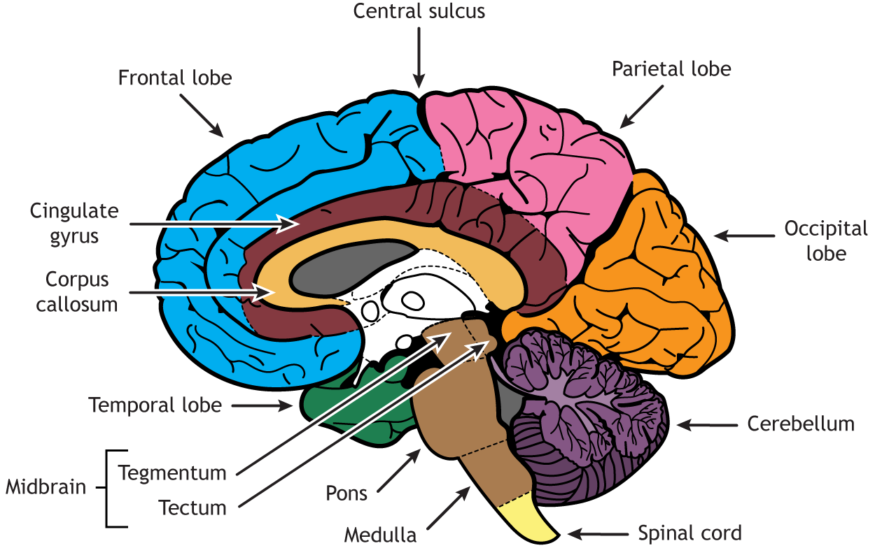

# Introduction to Neurology / Investigations of the Central Nervous System

*Dr. Chidomere, R.I., MBBS, FMCPaed — Paediatrician / Child Neurologist*
*Paediatrics, topics 10 & 11 — also covers System Examinations (CNS)*

## Objectives

1. To know the **clinical approach to neurological cases** via history taking and physical examination
2. To know the **relevant investigations**

## Outline

Introduction · Anatomy of the nervous system · History · Physical examination · Special diagnostic procedures · Relevant investigations · Further reading

## Introduction

**Neurology** is the branch of medicine concerned with the **study and treatment of disorders of the nervous system**.

The **nervous system** is a complex, sophisticated system that **regulates and coordinates body activities**.

It comprises:

- The **central nervous system** (brain and spinal cord)
- The **peripheral nerves**

The **brain** is the most complicated and intricate system that exists. It **processes and creates almost every aspect of our conscious experience**.

## Anatomy of the nervous system

The brain has **4 regions**:

1. **Cerebrum**
2. **Diencephalon** (thalamus, hypothalamus, subthalamus, epithalamus)
3. **Brainstem** (midbrain, pons & medulla)
4. **Cerebellum**

### Cerebrum

The **cerebral hemispheres constitute the greatest mass of brain tissue**.

The outer layers are formed by the **cellular grey matter known as the cerebral cortex**.

**Consciousness** depends on interaction between **intact cerebral hemispheres** and the **activating (or arousal) system that lies in the diencephalon and upper brainstem**.

> **Either extensive disease of the cerebral cortex OR damage to the activating system may impair consciousness to the point of coma.**

### Cerebellum

Primarily concerned with **coordination and balance**. It **refines movements**.

### Brainstem

Continues down to the spinal cord, and is **crucial for vital functions** — **breathing, heart rate, blood pressure and sleep-wake cycles**.

It has **three sections**: **midbrain, pons and medulla**.

### Spinal cord

A **cylindrical mass of nervous tissue encased within the bony vertebral column**.

It contains **long tracts** that connect the brain with the peripheral nervous system.

It also **mediates reflex activity** — an involuntary bodily response involving **3 basic components**: a **receiving apparatus**, a **nerve centre**, and a **responding apparatus**.

## History taking in neurology

> **A detailed history is the cornerstone of neurologic assessment.**

**Informants** should be the **parents**, and **older children (> 3–4 years) should be questioned**.

### The conventional order of clerking in medicine

1. Presenting complaint (c/o or PC)
2. History of the presenting complaint (HPC)
3. Past medical history
4. Past surgical history
5. Pregnancy / perinatal / postnatal history
6. Immunization
7. Developmental milestones
8. Family and social history
9. Drug history / allergy

### 1. Chief complaint

The history should begin with the **chief complaint and its significance in the context of normal development**.

### 2. History of the presenting complaint

Should provide a **chronologic outline of the patient's symptoms**, with attention paid to:

- **Location**
- **Quality**
- **Intensity**
- **Duration**
- **Associated features**
- **Alleviating or exacerbating factors**

### 3. Complete birth history

Particularly if a **congenital or perinatal disorder** is suspected.

**Pregnancy** — ask about common complications such as **pregnancy-induced hypertension, pre-eclampsia, gestational diabetes, vaginal bleeding, infections, and falls**.

Also inquire about:

- **Drug** (prescription, herbal, illicit) or **alcohol** use
- **Fetal movement** — reduced or absent might indicate **neuromuscular disorders**
- Any **abnormal ultrasound or amniocentesis** results

**Gestational age at birth and mode of delivery** — SVD, vacuum- or forceps-assisted, C/S (elective or emergency, and the indication).

The **presence or absence of fetal distress**, any **resuscitation**, **birth weight**, and complicated hospital stay.

> If the infant had **jaundice**, it is important to determine **both the degree of jaundice and how it was managed**.

### 4. Developmental history

**A major component of the neurologic history.**

Careful evaluation of a child's **domains of development** — **social, cognitive, language and motor skills (fine and gross)** — is required to distinguish normal development from either an **isolated** or a **global** (i.e. in two or more domains) developmental delay.

> **A static abnormality in development from birth** suggests a **congenital, intrauterine, or perinatal** cause.
>
> **A loss of skills (regression) over time** strongly suggests an **underlying degenerative disease of the CNS**, such as an **inborn error of metabolism**.

### Screening scheme for developmental delay

| Age (mo) | Gross motor | Fine motor | Social skills | Language skills |
|---|---|---|---|---|
| **3** | Supports weight on forearms | Opens hands spontaneously | Smiles appropriately | Coos, laughs |
| **6** | Sits momentarily | Transfers objects | Shows likes and dislikes | Babbles |
| **9** | Pulls to stand | Pincer grasp | Plays pat-a-cake, peek-a-boo | Imitates sounds |
| **12** | Walks with 1 hand held | Releases an object on command | Comes when called | 1–2 meaningful words |
| **18** | Walks upstairs with assistance | Feeds self from spoon | Mimics actions of others | At least 6 words |
| **24** | Runs | Builds a tower of 6 blocks | Plays with others | 2- to 3-word sentences |

### 5. Family and social history

**Family history** — history of **neurologic disease including developmental delay, and inherited disorders**, for **all first- and second-degree relatives**.

**Miscarriages or fetal deaths** (gender, gestational age at the time of demise).

**Ethnic backgrounds** — are parents related to each other?

> The **incidence of metabolic and degenerative disorders of the CNS is increased significantly in children of consanguineous marriages**.

**Social history** should detail the child's **current living environment** and the child's **relationship with other family members**.

Any **recent stressors** — divorce, remarriage, birth of a sibling, or death of a loved one — because they can affect the child's behaviour.

**Academic and social performance**, paying particular attention to any **abrupt changes**. The latest report card can be assessed.

**Peer relationships** can be evaluated by having the child name his or her best friends.

> **Any child who is unable to name at least two or three playmates might have abnormal social development.**

### 6. Review of systems

It is **essential** to perform a review of systems.

> Abnormalities of the CNS often manifest with **vague, non-focal symptoms that may be misattributed to other organ systems** — e.g. **vomiting, constipation, urinary incontinence**.

## Physical examination

The examination should be conducted in a **non-threatening, child-friendly setting**.

The child should be **allowed to sit where the child is most comfortable**, whether on a parent's lap or on the floor of the examination room.

The physician should **approach the child slowly**, reserving any **invasive, painful, or discomforting tests for the end** of the examination (e.g. measurement of head circumference, gag reflex).

> **The more that the examination seems like a game, the more the child will cooperate.**

### General observation

The child's:

- **Appearance**
- **Behaviour**
- **Mental state**
- **Abnormal posture or motor function**
- **Head** — size, shape, fontanels, OFC

**Examination begins during the interview.** Observe the child's appearance and movements, **dysmorphic facies**, abnormality of motor function such as **hemiparesis or gait disturbance**.

The child's behaviour while playing and interacting with parents may also be telling. **A normal child usually plays independently early in the visit but then engages in the interview process.**

### Size of the head

**Microcephaly** — a small head frequently reflects a **small brain**. Cause: **perinatal or postnatal insult to the brain**.

**Macrocephaly** — most commonly **familial**, but may be from a **disturbance of growth, chromosomal defect, storage disorder or hydrocephalus**.

### The shape of the head

**Craniosynostosis** — **premature closure of cranial sutures**, causing a variety of abnormal head shapes.

**Chronic subdural haemorrhages** — **square or box-like shape**, due to long-standing presence of fluid in the subdural space.

**Plagiocephaly** (flattening of the skull) — can be seen in normal infants, but may be particularly prominent in **hypotonic or weak infants**, who are less mobile.

### Fontanels

**Anterior fontanel** — **diamond-shaped**, at the junction of the **frontal and parietal bones**, measures **2 × 2 cm**, closes **9–18 months**.

**Posterior fontanel** — **triangular shape**, at the junction of the **parietal and occipital bones**, closes **6–8 weeks**.

**A bulging fontanel** indicates **increased ICP** — also vigorous crying in a normal infant.

**A very small or absent anterior fontanel at birth** might indicate **craniosynostosis or microcephaly**.

### Occipitofrontal circumference (OFC)

**OFC reflects brain growth.** It should be measured and documented.

**The average rate of head growth:**

**A healthy premature infant:** 0.5 cm in the first 2 weeks, 0.75 cm in the 3rd week, and 1.0 cm in the 4th week and every week thereafter until the 40th week of development.

**An average term infant:** measures **34–35 cm at birth**; increases by **2 cm/month for the 1st 3 months**, **1 cm/month for the 2nd 3 months**, **0.5 cm/month for the last 6 months**; thereafter **0.25 cm/month from 1–3 years**, then **0.5 cm/year up to 6 years**. **After 6 years it ceases to be relevant.**

## The sequence of central nervous system examination

1. **Higher function**
2. **Cranial nerves**
3. **Motor functions** — posture, nutrition of muscle, DTR, power, superficial reflexes
4. **Sensory** — light touch, pain, temperature, joint position, vibration, stereognosis, Romberg's sign
5. **Autonomic function** — rest and exercise pulse and BP
6. **Soft neurologic signs** — neck stiffness, Kernig's sign and Brudzinski's sign
7. **Cerebellar function** — intention tremor, nystagmus, dysdiadochokinesia
8. **Gait** — hemiparetic, ataxia (cerebellar and sensory), spastic, steppage, myopathic, or waddling

> **The examiner's assessment of candidates will be based on: overall attention to sequence · composure · speed of performance.**

### Instruments for neurologic examination

- **Inelastic measuring tape**
- **Pen torch**
- **Tuning fork (256 Hz)**
- **Tendon hammer**
- **Cotton wool**

## Higher function

**Consciousness** — conscious, lethargic, obtundation, stupor, coma.

**Intelligence & memory** — alertness for a younger child; simple arithmetic for an older child.

**Speech** — inability to speak (**aphasia**, due to damage to **Broca's area**) or inability to speak properly (**dysarthria**, due to damage to the articulation system).

**Orientation** — of time, place and person.

**Cerebral dominance** — left or right. Most people are left.

## Cranial nerves

| | Nerve |
|---|---|
| 1 | Olfactory |
| 2 | Optic |
| 3 | Oculomotor |
| 4 | Trochlear |
| 5 | Trigeminal |
| 6 | Abducent |
| 7 | Facial |
| 8 | Auditory |
| 9 | Glossopharyngeal |
| 10 | Vagus |
| 11 | Accessory |
| 12 | Hypoglossal |

### Cranial nerve function testing

- **Visual acuity, field of vision, colour vision & ocular fundi** — CN 2
- **Pupillary reactions** — CN 2, 3
- **Extraocular movements** — CN 3, 4, 6
- **Corneal reflexes and jaw movements** — CN 5
- **Facial movements** — CN 7
- **Hearing** — CN 8
- **Swallowing and rise of the palate** — CN 9, 10
- **Voice** — CN 10; **Speech** — CN 5, 7, 10, 12
- **Tongue movement** — CN 12

## Motor system examination

### Tests to assess tone of the muscle

| Test | Normal | Hypotonia | Hypertonia |
|---|---|---|---|
| Palpation of muscles | Normal | **Flabby** | **Rigid** |
| Posture of limb | Normal | **Limp** | **Stiff** |
| Resistance to passive movement | Normal | **Decreased** | **Increased** |
| Range of passive movement | Normal | **Increased** | **Decreased** |

> Patients with either **spasticity or rigidity** might exhibit **opisthotonos** — defined as **severe hyperextension of the spine caused by hypertonia of the paraspinal muscles**.

### Muscle power — graded 0 to 5

| Grade | Movement |
|---|---|
| **0** | None |
| **1** | Flickering movement |
| **2** | Movement possible after elimination of gravity (horizontal movement) |
| **3** | Movement possible against gravity but not against resistance |
| **4** | Movement possible against gravity and against some resistance |
| **5** | Normal power |

### Grading of reflexes

| Reflexes | Grade |
|---|---|
| Absent reflexes | **0** |
| Sluggish reflexes (seen with reinforcement) | **1+ (+)** |
| Normal | **2+ (++)** |
| Brisk | **3+ (+++)** |
| Brisk with clonus | **4+ (++++)** |

## Special diagnostic procedures — lumbar puncture

**Lumbar puncture (LP) and cerebrospinal fluid (CSF) examination** is a clinical procedure in which a **needle is inserted into the spinal canal**, most commonly to **collect CSF for diagnostic testing**.

- LP is also known as **spinal tap**
- It is an **invasive procedure, hence requires consent**
- **Strict asepsis is required**
- It can also be for **therapeutic purposes**
- It has **indications and contraindications**

### Summary of requirements for LP procedure

1. Indications
2. Rule out contraindications
3. Vital signs
4. Pre-procedure concomitant RBS
5. Position
6. Needle insertion point / needle type
7. Asepsis
8. Pain control
9. Specimen collection

### Indications for lumbar puncture

- **Meningitis**
- **Encephalitis** (autoimmune, infectious)
- **Idiopathic intracranial hypertension** (previously referred to as pseudotumor cerebri)
- Often helpful in assessing **subarachnoid haemorrhage (SAH)**; **demyelinating, degenerative, and collagen vascular diseases**; and **intracranial neoplasms**

### Contraindications to lumbar puncture

1. **Suspected mass lesion of the brain**, especially in the **posterior fossa** or **above the tentorium** and causing **shift of the midline**
2. **Suspected mass lesion of the spinal cord**
3. **Symptoms and signs of impending cerebral herniation** in a child with probable meningitis
4. **Critical illness** (on rare occasions)
5. **Skin infection at the site** of the lumbar puncture
6. **Thrombocytopenia with a platelet count of < 20 × 10⁹/L**

### LP procedure

**Position** — **lateral decubitus or seated position** with the **neck and legs flexed to enlarge the intervertebral spaces**, while **shoulders and hips are straight to prevent rotating the spine**.

**Needle insertion point** — the appropriate interspace is **L3–L4 or L4–L5**, identified by drawing an **imaginary line from the iliac crest downward perpendicular to the vertebral column**.

**Asepsis** — the physician dons a **mask, gown, and sterile gloves**. The skin is thoroughly prepared with a cleansing agent, and sterile drapes applied.

**Pain control** — the skin and underlying tissues are anaesthetized by injecting a **local anaesthetic (e.g. 1% lidocaine)** at the time of the procedure, or by applying a **eutectic mixture of lidocaine and prilocaine (EMLA)** to the skin **30 minutes before** the procedure.

**Needle** — a **22-gauge, 1.5- to 3.0-inch, sharp, bevelled spinal needle with a properly fitting stylet**, introduced in the **midsagittal plane and directed slightly cephalad**.

## Investigations of the central nervous system

### Neuroradiologic procedures

**Skull X-rays** — have **limited diagnostic utility**. They can demonstrate **fractures, bony defects, intracranial calcifications, or indirect evidence of increased ICP**.

**Cranial ultrasonography** — the **imaging method of choice** for detecting **intracranial haemorrhage, periventricular leukomalacia, and hydrocephalus** in **infants with patent anterior fontanels**.

**Cranial CT** — a valuable diagnostic tool in the evaluation of **many neurologic emergencies**, as well as some non-emergent conditions.

**Brain MRI** — a **non-invasive** procedure that is well suited for detecting a variety of abnormalities, including those of the **posterior fossa and spinal cord**.

**Other neuroradiologic procedures:**

- Cranial **CT angiography**, **MR angiography** and **MR venography**
- **Proton MR spectroscopy (MRS)**
- **Catheter angiography**
- **Positron emission tomography (PET)** — provides unique information on **brain metabolism and perfusion** by measuring **blood flow, oxygen uptake, and/or glucose consumption**

### Electroencephalography (EEG)

EEG is for the **diagnosis of epilepsy and brain dysfunction**.

### Evoked potentials

An **evoked potential** is an **electrical signal recorded from the CNS following the presentation of a specific visual, auditory, or sensory stimulus**.

### Genetic and metabolic testing

Children with **intellectual disability or developmental delay** are often evaluated with **metabolic and/or genetic testing**.

## Suggested reading

- Nelson Textbook of Paediatrics — Kliegman, Stanton, St. Geme, Schor and Behrman
- Textbook of Paediatrics and Child Health in a Tropical Region — Azubuike and Nkanginieme
