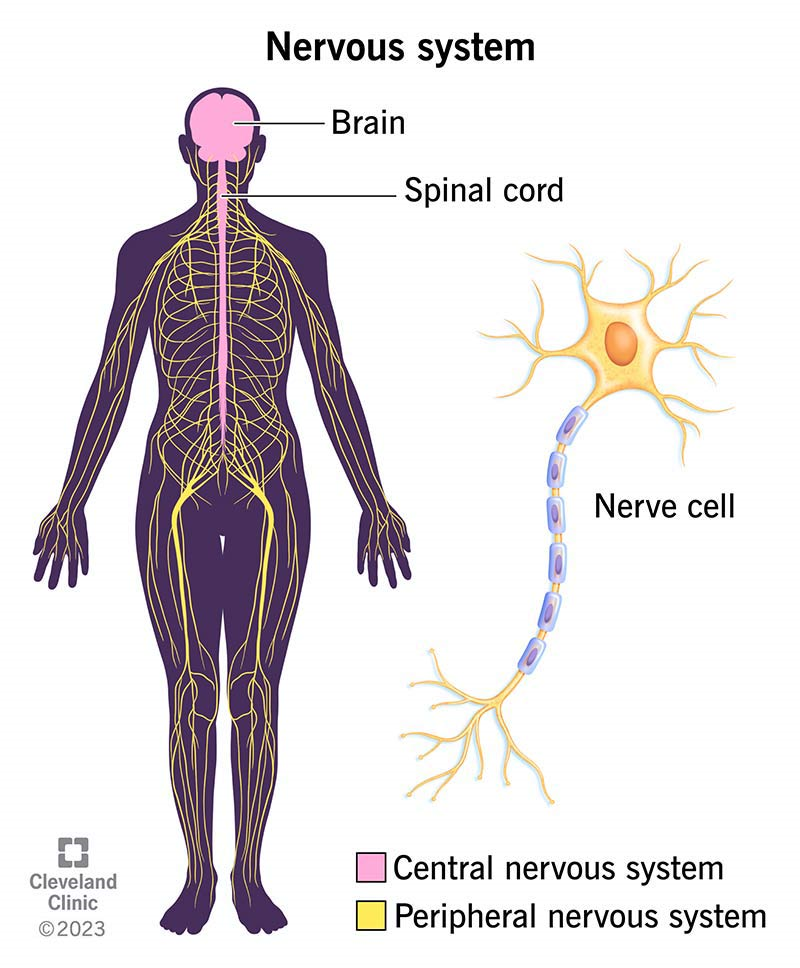
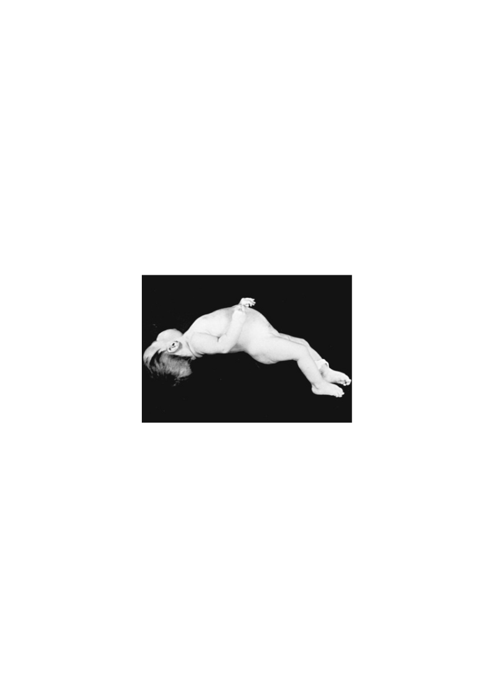

# Introduction to Neurology / CNS Examination — Simplified

**One line:** the history tells you what is wrong, the examination tells you where, and the investigations confirm it.

---

## The two objectives

1. The **clinical approach** via **history taking and physical examination**
2. The **relevant investigations**

---

# ANATOMY — 4 regions of the brain

1. **Cerebrum**
2. **Diencephalon** — thalamus, hypothalamus, subthalamus, epithalamus
3. **Brainstem** — midbrain, pons, medulla
4. **Cerebellum**

---

| Region | Job |
|---|---|
| **Cerebrum** | Greatest mass; outer **grey matter = cerebral cortex** |
| **Cerebellum** | **Coordination and balance** — refines movements |
| **Brainstem** | **Vital functions** — breathing, HR, BP, sleep-wake |
| **Spinal cord** | Long tracts + **reflex activity** |

---

## CONSCIOUSNESS — the key concept

> Consciousness depends on **intact cerebral hemispheres** PLUS the **activating (arousal) system in the diencephalon and upper brainstem**.

**So coma can come from EITHER:**

- **Extensive disease of the cerebral cortex**, OR
- **Damage to the activating system**

> **Two different lesions, one outcome.**

---

## The reflex arc — 3 components

**Receiving apparatus → nerve centre → responding apparatus**

---

# HISTORY

> **A detailed history is the CORNERSTONE of neurologic assessment.**

**Informants:** the parents — and **children over 3–4 years should be questioned themselves**.

---

## The 9-point clerking order

1. Presenting complaint
2. History of presenting complaint
3. Past medical history
4. Past surgical history
5. **Pregnancy / perinatal / postnatal**
6. **Immunization**
7. **Developmental milestones**
8. Family and social history
9. Drug history / allergy

---

## HPC — the 6 things to ask about a symptom

**Location · Quality · Intensity · Duration · Associated features · Alleviating or exacerbating factors**

---

## Birth history — what to ask

**Pregnancy:** PIH, pre-eclampsia, gestational diabetes, vaginal bleeding, infections, falls

**Drugs:** prescription, herbal, illicit — and alcohol

**Fetal movement:** reduced or absent → think **neuromuscular disorders**

**Delivery:** gestational age, mode (SVD, vacuum, forceps, C/S — elective or emergency, and why)

**After birth:** fetal distress, resuscitation, birth weight, complicated stay

> **Jaundice: ask the DEGREE and HOW IT WAS MANAGED** — because kernicterus causes permanent neurological damage.

---

## DEVELOPMENTAL HISTORY — the highest-yield section

**Four domains:** **social · cognitive · language · motor (fine and gross)**

**Isolated delay** = one domain · **Global delay** = **two or more** domains

---

> **THE DISTINCTION THAT MATTERS MOST:**
>
> **STATIC abnormality from birth** → congenital, intrauterine or perinatal cause
>
> **LOSS of skills (REGRESSION)** → **degenerative disease of the CNS**, e.g. **inborn error of metabolism**

---

### Milestones table

| Age | Gross motor | Fine motor | Social | Language |
|---|---|---|---|---|
| **3 mo** | Supports weight on forearms | Opens hands spontaneously | Smiles appropriately | Coos, laughs |
| **6 mo** | Sits momentarily | Transfers objects | Likes and dislikes | Babbles |
| **9 mo** | Pulls to stand | **Pincer grasp** | Pat-a-cake, peek-a-boo | Imitates sounds |
| **12 mo** | Walks with 1 hand held | Releases object on command | Comes when called | **1–2 words** |
| **18 mo** | Walks upstairs with assistance | Feeds self from spoon | Mimics others | **At least 6 words** |
| **24 mo** | **Runs** | **Tower of 6 blocks** | Plays with others | **2–3 word sentences** |

---

## Family and social history

**Family:** neurologic disease and developmental delay in **first- AND second-degree relatives** · miscarriages/fetal deaths · **ethnic background**

> **CONSANGUINITY** — metabolic and degenerative CNS disorders are **significantly increased** in children of related parents. **Always ask.**

**Social:** living environment · relationships · **recent stressors** (divorce, remarriage, new sibling, bereavement) · school performance and **abrupt changes** · peer relationships

> **A child who cannot name 2–3 playmates may have abnormal social development.**

---

## Review of systems — why it matters here

> CNS disease often shows up as **vague, non-focal symptoms misattributed to other systems** — **vomiting, constipation, urinary incontinence**.

---

# PHYSICAL EXAMINATION

## How to approach a child

- **Non-threatening, child-friendly setting**
- Let the child sit **where they are most comfortable** — parent's lap or the floor
- **Approach slowly**
- **Save the unpleasant tests for LAST** — head circumference, gag reflex

> **The more it seems like a game, the more the child cooperates.**

---

## General observation

**Appearance · behaviour · mental state · abnormal posture or motor function · head (size, shape, fontanels, OFC)**

> **The examination begins during the interview.** Watch for dysmorphic facies, hemiparesis, gait disturbance, and how the child plays.

---

## HEAD SIZE

**Microcephaly** → small head usually = **small brain**; from a **perinatal or postnatal insult**

**Macrocephaly** → most commonly **familial**; also growth disturbance, chromosomal defect, **storage disorder**, or **hydrocephalus**

---

## HEAD SHAPE

| Shape | Cause |
|---|---|
| Abnormal shapes | **Craniosynostosis** — premature suture closure |
| **Square / box-like** | **Chronic subdural haemorrhage** |
| **Flattening (plagiocephaly)** | Normal infants — but prominent in **hypotonic/weak** infants who move less |

---

## FONTANELS — learn these exactly

| | **ANTERIOR** | **POSTERIOR** |
|---|---|---|
| Shape | **Diamond** | **Triangular** |
| Location | Frontal + parietal | Parietal + occipital |
| Size | **2 × 2 cm** | — |
| Closes | **9–18 months** | **6–8 weeks** |

**Bulging fontanel** → **raised ICP** (or a vigorously crying normal infant)

**Very small or absent anterior fontanel at birth** → **craniosynostosis or microcephaly**

---

## OFC — reflects BRAIN GROWTH

**Term infant: 34–35 cm at birth**

| Period | Growth |
|---|---|
| 1st 3 months | **2 cm/month** |
| 2nd 3 months | **1 cm/month** |
| Last 6 months | **0.5 cm/month** |
| 1–3 years | **0.25 cm/month** |
| Up to 6 years | **0.5 cm/year** |
| **After 6 years** | **Ceases to be relevant** |

**Premature infant:** 0.5 cm in first 2 weeks · 0.75 cm in 3rd week · **1.0 cm in 4th week and weekly thereafter** until 40 weeks

---

# THE 8-STEP CNS EXAMINATION SEQUENCE

1. **Higher function**
2. **Cranial nerves**
3. **Motor** — posture, muscle nutrition, DTR, power, superficial reflexes
4. **Sensory** — light touch, pain, temperature, joint position, vibration, stereognosis, **Romberg's sign**
5. **Autonomic** — rest and exercise pulse and BP
6. **Soft neurologic signs** — neck stiffness, **Kernig's**, **Brudzinski's**
7. **Cerebellar** — intention tremor, nystagmus, **dysdiadochokinesia**
8. **Gait** — hemiparetic, ataxic (cerebellar and sensory), spastic, steppage, myopathic, waddling

---

> **You are marked on: attention to SEQUENCE · COMPOSURE · SPEED.**

---

## The 5 instruments

**Inelastic measuring tape · pen torch · tuning fork (256 Hz) · tendon hammer · cotton wool**

---

## HIGHER FUNCTION

**Consciousness levels:** conscious → lethargic → obtundation → stupor → **coma**

**Speech:**

- **APHASIA** — inability to speak → damage to **Broca's area**
- **DYSARTHRIA** — cannot speak properly → damage to the **articulation system**

**Also:** intelligence & memory · orientation (time, place, person) · **cerebral dominance** — most people are left

---

## THE 12 CRANIAL NERVES

**1** Olfactory · **2** Optic · **3** Oculomotor · **4** Trochlear · **5** Trigeminal · **6** Abducent · **7** Facial · **8** Auditory · **9** Glossopharyngeal · **10** Vagus · **11** Accessory · **12** Hypoglossal

---

### What tests which nerve

| Test | Nerve(s) |
|---|---|
| Visual acuity, fields, colour, fundi | **2** |
| Pupillary reactions | **2, 3** |
| Extraocular movements | **3, 4, 6** |
| Corneal reflex, jaw movements | **5** |
| Facial movements | **7** |
| Hearing | **8** |
| Swallowing, rise of palate | **9, 10** |
| Voice | **10** |
| Speech | **5, 7, 10, 12** |
| Tongue movement | **12** |

---

## MOTOR — assessing TONE

| Test | Hypotonia | Hypertonia |
|---|---|---|
| Palpation | **Flabby** | **Rigid** |
| Posture of limb | **Limp** | **Stiff** |
| Resistance to passive movement | **Decreased** | **Increased** |
| Range of passive movement | **Increased** | **Decreased** |

> **OPISTHOTONOS** — severe hyperextension of the spine from **hypertonia of the paraspinal muscles**. Seen with **spasticity or rigidity**.

---

## POWER — 0 to 5

| Grade | Movement |
|---|---|
| **0** | None |
| **1** | Flicker |
| **2** | Possible **with gravity eliminated** |
| **3** | Against **gravity** but not resistance |
| **4** | Against gravity **and some resistance** |
| **5** | Normal |

---

## REFLEXES — 0 to 4+

| Grade | Meaning |
|---|---|
| **0** | Absent |
| **1+** | Sluggish (seen with reinforcement) |
| **2+** | **Normal** |
| **3+** | Brisk |
| **4+** | **Brisk with clonus** |

---

# LUMBAR PUNCTURE

**A needle into the spinal canal to collect CSF.** Also called a **spinal tap**.

**Invasive → needs CONSENT · strict asepsis · can also be therapeutic**

---

## The 9 requirements

1. Indications
2. **Rule out contraindications**
3. Vital signs
4. Pre-procedure **RBS**
5. Position
6. Needle insertion point / type
7. Asepsis
8. Pain control
9. Specimen collection

---

## INDICATIONS

- **Meningitis**
- **Encephalitis** (autoimmune, infectious)
- **Idiopathic intracranial hypertension** (formerly pseudotumor cerebri)
- Helpful in: **subarachnoid haemorrhage** · demyelinating, degenerative and collagen vascular diseases · **intracranial neoplasms**

---

## CONTRAINDICATIONS — know these cold

1. **Suspected mass lesion of the BRAIN** — especially **posterior fossa** or **above the tentorium** causing **midline shift**
2. **Suspected mass lesion of the SPINAL CORD**
3. **Signs of impending cerebral HERNIATION** in a child with probable meningitis
4. **Critical illness**
5. **Skin infection at the site**
6. **Thrombocytopenia < 20 × 10⁹/L**

---

## PROCEDURE

**Position:** lateral decubitus or seated · **neck and legs FLEXED** (enlarges the spaces) · **shoulders and hips STRAIGHT** (prevents rotation)

**Site:** **L3–L4 or L4–L5** — found by a line from the **iliac crest** perpendicular to the vertebral column

**Asepsis:** mask, gown, sterile gloves, cleansing agent, sterile drapes

**Pain control:** **1% lidocaine** at the time, or **EMLA 30 minutes before**

**Needle:** **22-gauge, 1.5–3.0 inch, sharp bevelled spinal needle with stylet**, in the **midsagittal plane, directed slightly cephalad**

---

# INVESTIGATIONS

| Investigation | Best for |
|---|---|
| **Skull X-ray** | **LIMITED utility** — fractures, bony defects, intracranial calcification, indirect signs of raised ICP |
| **Cranial ultrasound** | **METHOD OF CHOICE** in infants with **patent anterior fontanel** — intracranial haemorrhage, periventricular leukomalacia, hydrocephalus |
| **Cranial CT** | **Neurologic EMERGENCIES** |
| **Brain MRI** | Non-invasive; best for **posterior fossa and spinal cord** |
| **EEG** | **Epilepsy** and brain dysfunction |
| **Evoked potentials** | Electrical signal after a **visual, auditory or sensory stimulus** |
| **PET** | **Brain metabolism and perfusion** — blood flow, oxygen uptake, glucose consumption |
| **Genetic/metabolic testing** | **Intellectual disability or developmental delay** |

**Also:** CT angiography · MR angiography · MR venography · proton MR spectroscopy · catheter angiography

---

## The 4 imaging choices in one line

> **Fontanel open → ULTRASOUND. Emergency → CT. Posterior fossa or cord → MRI. Fits → EEG.**
