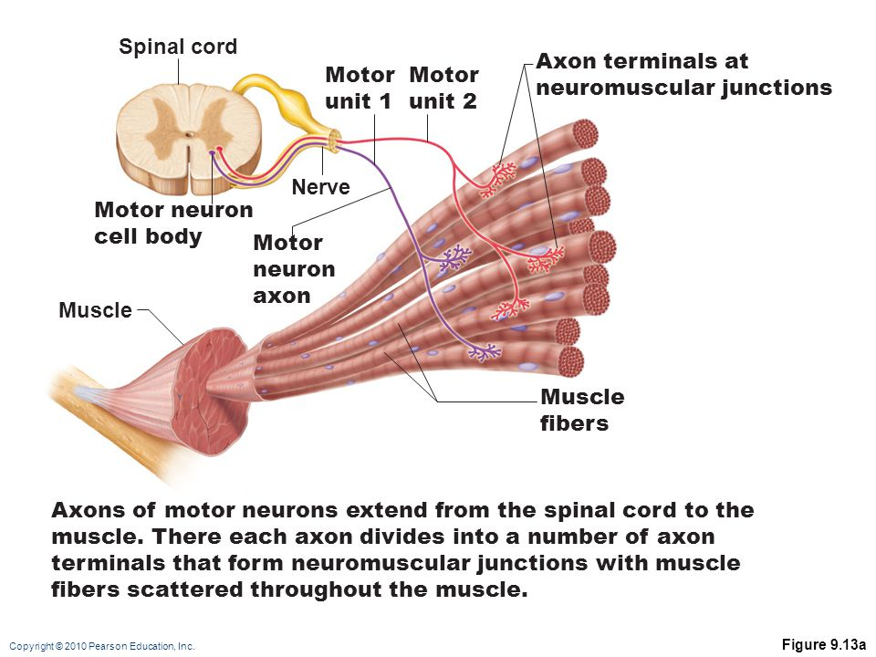
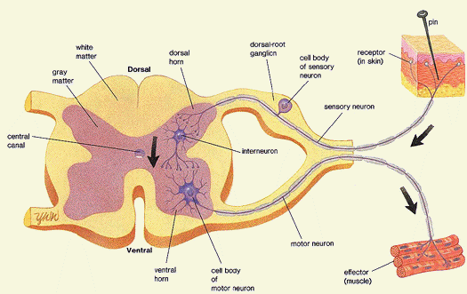
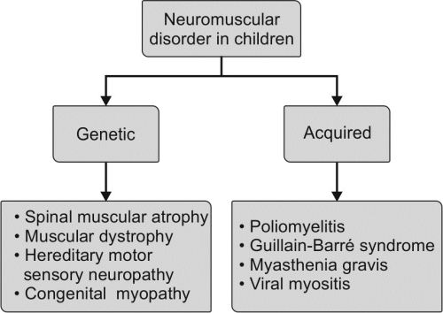
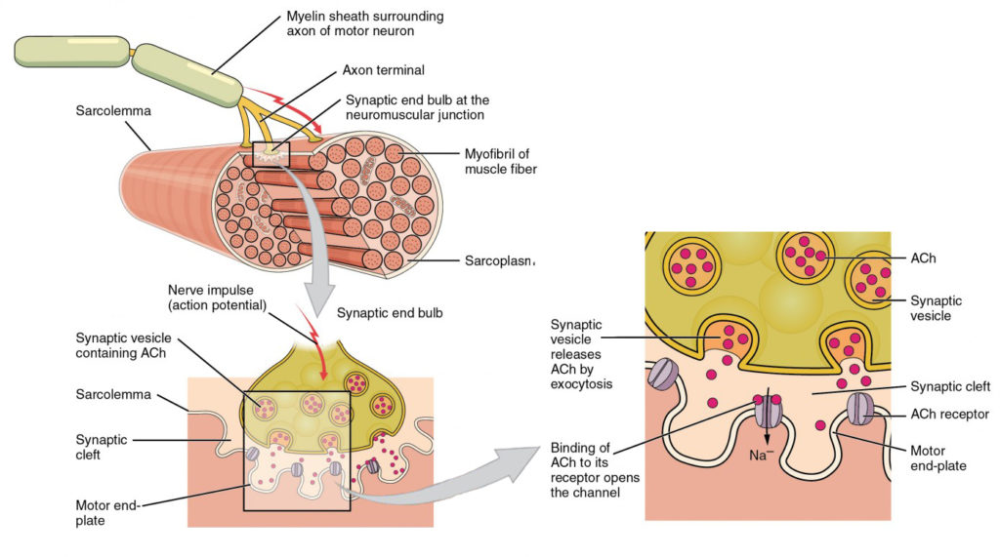
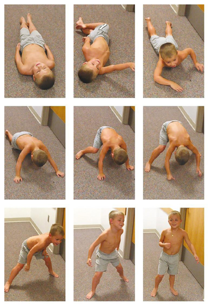
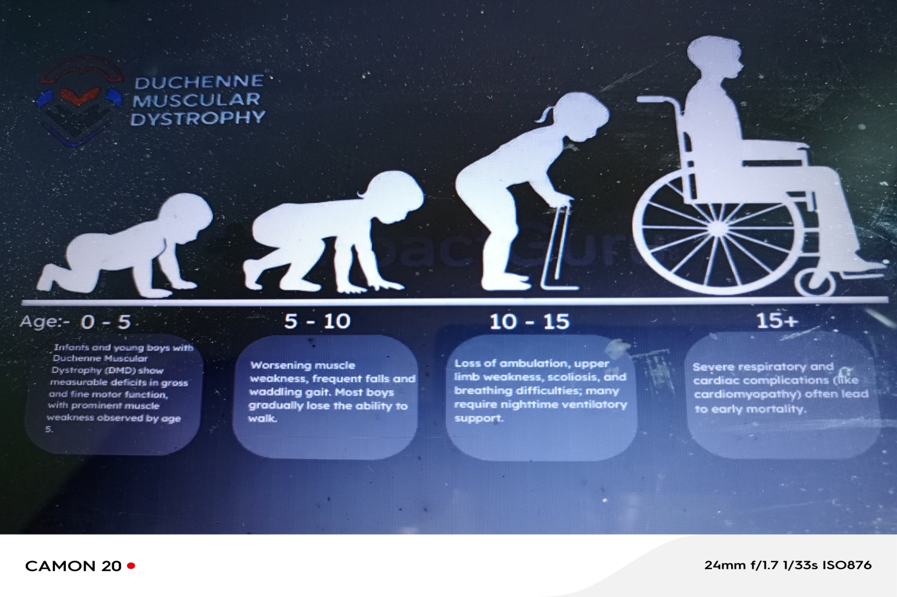

# Neuromuscular Disorders (NMD)

*Dr Chidomere R.I., Paediatrician/Child Neurologist — Paediatrics, topic 139*

## Outline

Introduction · The motor unit · Types & aetiology · Epidemiology · Pathophysiology · Diagnosis (history, Gowers sign, investigations, EMG/NCV) · Common NMDs — Bell's palsy, Myasthenia gravis, Muscular dystrophies (Duchenne)

## Introduction

**Neuromuscular disorder (NMD)** is a broad term for many diseases affecting the **motor unit — the functional unit of the muscle.** They impair skeletal muscle function either **directly** (pathologies of muscle) or **indirectly** (pathologies of nerves or the neuromuscular junction).

> NMDs are characterised by **motor weakness or unusual muscular fatigue**; in some, sensory disturbances and pain are prominent. Aetiologies are **genetic, degenerative, toxic-metabolic and immune-mediated.**

They account for the **greatest burden of chronic disability in children.** Many are treatable; others progress relentlessly. Quality of life may improve with timely, adequate treatment.

## The motor unit

Each muscle fibre has a single motor end-plate, though a motor neuron's axon branches to many fibres; when an impulse is transmitted, all connected fibres contract together. **A motor unit = a motor neuron and the muscle fibres it innervates.**

Any pathology interfering with a component of the motor unit causes an NMD:

- The **motor neuron** (cell body in the **anterior horn** of the spinal cord)
- The **sensory neuron** (cell body in the **dorsal root ganglion**)
- The **neuromuscular junction**
- The **muscle** itself

## Types, aetiology & epidemiology

NMDs are **acquired or genetic (gene mutation)**. Other causes: degeneration, autoimmunity, toxins, medications, malnutrition, metabolic derangements, hormone imbalance, infection, nerve compression/entrapment, compromised blood supply, trauma, and unknown factors.

- Overall paediatric prevalence **36.9 per 100,000**. Poliomyelitis has declined globally with immunisation.
- **In Nigeria: peripheral neuropathy is the most common type (63.0%)** (hospital-based, Oluwatosin et al 2021, Ile-Ife). **Acquired NMDs predominate**, possibly due to scarce electrophysiologic and genetic testing.

## Diagnosis

**History** — NMDs are usually **progressive** and often cause **postural abnormalities and deformities**. Parents seek help because of **frequent falls, difficulty climbing stairs, or inability to run or rise from the floor**. For acquired types, ask about preceding/ongoing acute illness. **Hypotonia** (diffuse/paralytic) affects torso and limbs. Symptoms: decreased strength, numbness, paraesthesia, muscle atrophy, myalgia, fasciculations; paucity of facial expression, limited ocular tracking, swallowing disorders.

**Examination — motor function:**

- **Inspection** — muscle atrophy, **Gower sign**, fasciculations.
- **Palpation** — tone (hypotonia), reflexes (reduced/absent), power (reduced).

> **Gowers sign** appears with weakness of the **pelvic girdle or proximal lower-limb muscles**: the child must use the **hands and arms to "walk" up their own body** from a squatting position.

**Investigations:**

- **Muscle enzymes — creatine kinase (CK):** normally **< 200 IU/L**. A rise to **at least 3× the upper limit** (sometimes > 1000 IU/L) suggests **congenital muscular dystrophy or infantile spinal muscular atrophy.**
- **EMG** — tests muscle response to stimulation/contraction; detects a **myopathic pattern** (disease of muscle only).
- **Nerve conduction velocity (NCV)** — detects **loss of motor nerve fibres (neuropathic/denervation pattern)** in motor-neuron disease.
- Combining EMG + NCV separates **demyelinating** neuropathies (marked latency prolongation, very low conduction velocities) from **axonal** neuropathies (decreased response, normal latency/velocity).
- **Muscle and nerve biopsy; CSF analysis; genetic testing** (important for inherited NMDs).

## Bell's palsy

**Acute dysfunction of the facial nerve** — the commonest cause of sudden facial weakness. An **isolated lower motor neurone facial nerve palsy** not associated with other cranial neuropathies.

- **Partial or complete paralysis of upper AND lower facial muscles**, **unilateral in > 99%**, either side, sexes equal. **Sudden onset** developing over hours to a few days. **Ear pain near the mastoid** is the first sign half the time; also neck pain and tingling around the lips.
- Commonly follows **upper respiratory tract infection** (post-infectious demyelination); viruses implicated — **HSV**, EBV, mumps, rubella. Results from **oedema and inflammation of the nerve within the facial canal** (temporal bone).
- **Diagnosis** — mainly clinical; **Bell's phenomenon** present; EMG for facial muscle activity.
- **Management** — mostly conservative: **eye drops** to keep the cornea moist, **prednisolone** (useful), **aciclovir** if HSV suspected. **Prognosis** — good in children; **> 85% recover completely**, most within 3 weeks.

## Myasthenia gravis (MG)

An **acquired autoimmune neuromuscular blockade**, characterised by **weakness of skeletal muscles and fatigability on exertion.**

- **Epidemiology** — US incidence 2/1,000,000; **female:male = 6:4**; all ages but uncommon in childhood; occurs in infancy as congenital or transient neonatal MG.
- **Clinical types:** **Acquired** (autoimmune); **Congenital** (in infants of non-myasthenic mothers, no remission, persists); **Transient** (infants of myasthenic mothers via transplacental antibodies, improves as antibodies disappear); **Familial** (rare, autosomal recessive, no AChR antibodies).
- **Pathophysiology:** antibodies target the **acetylcholine receptor (AChR)** at the NMJ → **fewer available receptors.** ACh release is normal but the postsynaptic membrane is **less responsive** → progressive muscular weakness.
- **Clinical features:** **fluctuating weakness increased by exertion**; **ptosis and diplopia**; proximal > distal limb weakness; spreads **ocular → facial → bulbar → truncal/limb.** Sensation and deep tendon reflexes **normal**; **no fasciculations, no sensory loss, no myalgia.** Bulbar weakness (nasal speech, regurgitation, dysphagia); respiratory muscle weakness may cause **fatal respiratory failure.** Ptosis increases on sustained upgaze (30–90 s); repetitive fist opening/closing fatigues hand muscles. May coexist with other autoimmune diseases (Graves, SLE, JRA).
- **Investigations:** **EMG — decremental response to repetitive stimulation** (reversed by a cholinesterase inhibitor); anti-AChR antibodies (inconsistent); **normal CK**; **chest X-ray/CT — enlarged thymus** (usually not thymoma); **Tensilon (edrophonium 0.2 mg/kg IV or neostigmine 0.4 mg/kg IM) test** — ptosis and ophthalmoplegia improve within seconds, lasting 1–2 min.
- **Treatment:** **cholinesterase inhibitors** (neostigmine, pyridostigmine) are first-line; **prednisolone** for long-term; **thymectomy** (most effective with high anti-AChR titres; ineffective in congenital/familial forms); **plasmapheresis** and **IVIG** for non-responders. Neonatal transient MG needs cholinesterase inhibitors only briefly.
- **Complications:** intercurrent infection (aminoglycosides like **gentamicin can precipitate myasthenic crisis**), acute respiratory failure, aspiration pneumonitis, malnutrition from dysphagia.

## Muscular dystrophies

Distinguished by **four obligatory criteria:** (1) a **primary myopathy**, (2) a **genetic basis**, (3) a **progressive course**, and (4) **degeneration and death of muscle fibres** at some stage. Common examples: **Duchenne, Becker, and limb-girdle.**

### Duchenne muscular dystrophy (DMD)

The **most common hereditary neuromuscular disease**, affecting all races; **X-linked recessive**; due to **deficiency of dystrophin** with excessive muscle-fibre necrosis. **Becker** is a milder form.

- **Clinical:** **boys exclusively**; rarely symptomatic at birth; early gross motor skills normal or slightly delayed. Hip-girdle weakness by the **2nd year**; an early **Gowers sign by age 3**, fully expressed by 5–6; a **Trendelenburg (waddling) gait**. Weakness progresses into the 2nd decade; distal muscles relatively spared. Respiratory involvement → weak cough, frequent chest infections; pharyngeal weakness → aspiration, nasal speech. Late: incontinence, contractures (ankles, knees, hips, elbows), scoliosis/lordosis.
- **Classic signs:** **calf pseudohypertrophy** with thigh wasting; hypertrophied tongue (no fasciculations); **gradual loss of deep tendon reflexes**. **Cardiomyopathy is a constant feature.** Intellectual impairment in all (significant in 20–30%). Wheelchair-bound by early adolescence; **death from respiratory failure and cardiac failure by ~18 years.**

- **Diagnosis:** **CK greatly elevated even at birth**; cardiac assessment (echo, ECG, CXR) periodically; **EMG — myopathic, no denervation**; normal nerve conduction; **muscle biopsy diagnostic**; immunohistochemistry for deficient/defective **dystrophin.**
- **Management:** physiotherapy with orthotics; anti-cardiac-failure regimen (digoxin, diuretics); antibiotics for chest infections; **steroid trial**; gene-based approaches to restore dystrophin.

## References

Nelson Textbook of Paediatrics; Azubuike & Nkanginieme, Paediatrics and Child Health in a Tropical Region; lecture material of Dr Chidomere R.I.
