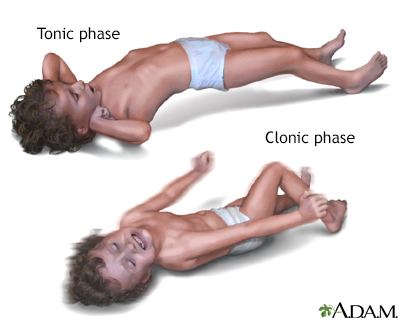
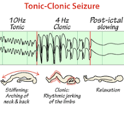
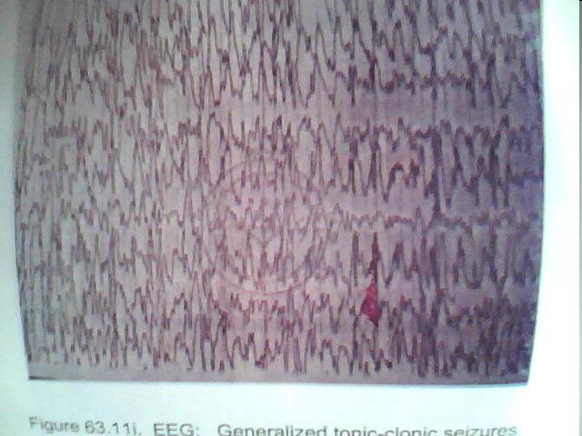
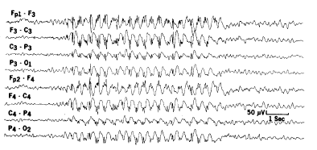
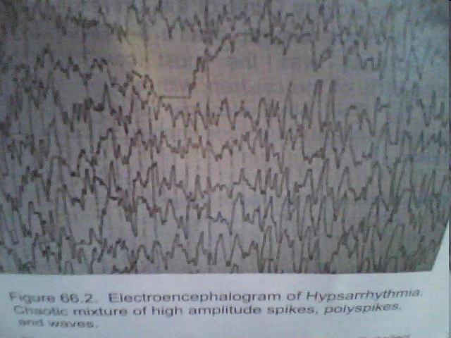

# Seizure Disorders

*Dr Chidomere R.I., MBBS, FMCPaed, Paediatrician/Child Neurologist — Paediatrics, topic 30*

## Objectives

To know what a seizure disorder is and its various types; the mechanisms of seizures; and the treatment and preventive measures.

## Outline

Definition of terms · Epidemiology · Classification · Aetiology · Pathophysiology · Clinical features · Diagnosis · Treatment · Seizure mimics · Status epilepticus · Febrile seizures · Prevention · References

## Definition of terms

- **Seizure** — a **discrete clinical event** (behavioural, emotional, motor or sensory) that reflects a **temporary physiologic dysfunction of the brain**, characterized by **excessive and hypersynchronous discharge of cortical neurons**.
- **Seizure disorder** — a general term including any of several disorders: **epilepsy, febrile seizures**, and possibly single seizures and symptomatic seizures secondary to metabolic, infectious or other aetiologies.
- **Febrile seizures** — seizures occurring between the ages of **6 and 60 months (peak 12–18 months)** with a temperature of **38°C (100.4°F) or higher**, that are **not** the result of CNS infection or metabolic imbalance, and occur in the **absence of a prior afebrile seizure**.
- **Provoked seizure** — occurs secondary to an acute problem (e.g. high fever, infection). With elimination of the stimulus, the seizure stops.
- **Unprovoked seizure** — no obvious stimulus; a brain disorder producing recurrent spontaneous paroxysmal discharges.
- **Epilepsy** — a **chronic disorder** characterized by seizures that **recur unpredictably in the absence of a consistent provoking factor**.
- **Epileptic syndrome** — a disorder manifesting as one or more specific seizure types, with a **specific age of onset** and a **specific prognosis**.
- **Genetic epilepsy** (formerly idiopathic) — seizures without an identifiable cause, in a patient with **normal neurologic findings and normal intelligence**.
- **Structural epilepsy** (formerly symptomatic) — an epilepsy syndrome caused by an **underlying structural brain disorder**.

**Convulsion (involuntary motor seizure):** tonic (sustained contraction), clonic (broken/jerky), tonic-clonic. Other forms: **sensory** (abnormal sensations), **autonomic** (salivation, palpitation), **psychic** (abnormal fear, often with altered consciousness).

## Epidemiology

- Seizures are the **most common neurological problem** affecting children worldwide
- Occur in **10% of children**; **fewer than 1/3 are caused by epilepsy**
- Cumulative **lifetime incidence of epilepsy is 3%** (over half begin in childhood)
- **Annual prevalence of epilepsy is lower, 0.5–0.8%** (many children outgrow it)
- Annual incidence: **40–70/100,000** in industrialized countries; **100–190/100,000** in resource-poor countries
- Rates are greatest in **early childhood**; slight male excess (**M:F = 1.5:1**); more common in **lower socio-economic groups**

## Classification

### By seizure type — 2017 ILAE operational classification

Divides seizures into **four categories** by the presumed mode of onset:

1. **Focal-onset**
2. **Generalized-onset**
3. **Unknown onset**
4. **Unclassified**

| Focal-onset | Generalized-onset | Unknown-onset |
|---|---|---|
| **Motor:** tonic, clonic, atonic, myoclonic, hyperkinetic, epileptic spasms, automatisms | **Motor:** tonic-clonic, tonic, clonic, atonic, myoclonic, myoclonic-atonic, myoclonic-tonic-clonic, epileptic spasms | **Motor:** tonic-clonic, epileptic spasms |
| **Non-motor:** behaviour arrest, sensory, cognitive, emotional, autonomic | **Non-motor (absence):** typical, atypical, myoclonic, eyelid myoclonia | **Non-motor:** behaviour arrest |
| **Awareness:** aware / impaired awareness | | |
| Focal to bilateral tonic-clonic (formerly secondary generalized) | | |

- **Generalized seizures** — clinical and EEG changes indicate **synchronous involvement of both hemispheres**
- **Focal seizures** — activation of a system of neurons **limited to part of one cerebral hemisphere**
- **Unknown onset** — insufficient information to determine focal or generalized
- **Unclassified** — unusual features, onset cannot be determined despite adequate workup

### By syndrome

Based on: **age of onset · aetiology (if known) · seizure type · genetics · natural history (drug response and remission) · EEG pattern**.

## Aetiology

> **A seizure is a symptom, not a specific diagnosis.**

**Congenital**

- **CNS malformation** — neurocutaneous syndromes (neurofibromatosis, tuberous sclerosis, Sturge-Weber), cerebral dysgenesis (porencephaly)
- **Genetic syndromes**, intrauterine infections

**Acquired**

- **Trauma** — birth trauma (causes both seizures and CP), asphyxia
- **Infections** — meningitis, encephalitis, cerebral malaria
- **Febrile seizure**
- **Metabolic** — deranged Na (high or low), low Ca, Mg, glucose
- **Toxic** — lead poisoning, drugs (intoxication, addiction or withdrawal)
- **CNS neoplasm**
- **Vascular** — AVM, CVA

## Pathophysiology

**Physiology of nerve impulse propagation:**

- **Excitation** — glutamate and aspartate
- **Inhibition** — GABA (gamma-aminobutyric acid)

Both excitatory and inhibitory mechanisms act to **allow appropriate firing and prevent inappropriate excitation** of the cell.

**Seizures occur due to:**

- **Excitation** of the neuron — by excessive, frequent or sustained activation of **glutamate** receptors, increasing brain excitability
- **Inhibition failure** — disruption in **GABA** production and its receptors
- Or a **combination** of both

Four sequential mechanistic processes: (1) underlying aetiology; (2) epileptogenesis; (3) epileptic state of increased excitability; (4) seizure-related neuronal injury.

## Clinical features

### Focal-onset (formerly partial) seizures

Have a **focus** (a localized part of the brain).

- **Simple partial** — mainly from frontal, parietal and occipital lobes
- **Complex partial** — mainly from the temporal lobe (also frontal, parietal)
- **EEG:** spikes and sharp waves; unilateral, bilateral or multifocal

**Focal onset, awareness intact (formerly simple partial):**

- Mostly **motor** activity — tonic or clonic (face, neck, extremities)
- **Versive seizures** are common — head turning and conjugate eye movement (indicating a lesion in the **opposite** frontal lobe)
- ± **aura** (warning); duration **10–20 sec**; **no automatism, no postictal phase, consciousness intact**

**Focal to bilateral (psychomotor/temporal lobe, formerly complex partial):**

- **Aura** indicating focal onset; **impaired consciousness**
- **Automatic behaviour** in 50–70%; duration **1–2 minutes**; a **postictal phase**; may generalize to a tonic-clonic convulsion

### Generalized tonic-clonic seizure (GTCS)

- The **commonest** clinical manifestation
- **Loss of tone and consciousness**; generalized tonic phase followed by **rhythmic clonic** contraction alternating with relaxation of all muscle groups
- ± autonomic effects — incontinence, apnoea, cyanosis
- **EEG (ictal):** burst of spikes and polyspikes at **10–15 Hz** in the tonic phase; **diffuse high-voltage slow waves** in the clonic phase

### Benign childhood epilepsy with centrotemporal spikes (Rolandic epilepsy)

- Usually in **primary school children**; **remits in adolescence**
- Responds to drugs; **DOC is carbamazepine**
- Almost always occurs **at night** (partial to generalized)
- **EEG:** central and temporal spikes on a normal background

### Absence seizure (simple or typical)

- **Sudden cessation of activity** with a blank facial expression
- Lasts **< 30 sec**; ± countless seizures/day
- Age of onset **5 years**; more in girls
- **No loss of tone, no postictal phase** — the child resumes pre-seizure activity; ± automatism
- **Atypical** — motor activity and loss of tone
- **EEG: 3/sec spike and generalized wave discharge**

### Infantile spasm (IS)

- Age of onset **4–8 months**
- Types: flexion, extension (least common), **mixed (commonest)**
- Lasts **< 1 sec**; several episodes/day
- Cause: **80–90% symptomatic** (pre/peri/postnatal), 10–20% cryptogenic
- **80–90% risk of mental retardation**
- **EEG: hypsarrhythmia** — chaotic pattern of high-voltage, bilaterally asynchronous slow-wave activity
- **West syndrome** — the triad of **infantile spasms, mental retardation and hypsarrhythmia**

## Diagnosis

> **The diagnosis of epilepsy is ultimately clinical.** It is based on a detailed description of events by the patient or an eyewitness.

Determine: is it epilepsy or are the seizures related to an **acute encephalopathy**; if epilepsy, **categorize** the seizure/syndrome; and find any **identifiable treatable aetiology**.

**Investigations**

- **FBC/ESR** (on clinical indication), **RBS**, **S/E/U/Cr** including **Ca and Mg**
- **Anticonvulsant blood levels** assay
- Blood and urine **amino acids**, urine **organic acids**
- **EEG** including awake and sleep tracings; special studies — 24-hour ambulatory, video-EEG, all-night recording
- **ECG** if a cardiac disorder is suspected
- **Skull X-rays** if abnormal head shape/size
- **Neuroimaging** (CT/MRI, PET, SPECT) — evidence of raised ICP, focal neurologic signs
- **LP** if infection is suspected and there are **no contraindications**

## Differential diagnosis / seizure mimics

Conditions sharing a sudden onset of abnormal consciousness, behaviour, posture, tone, sensation or autonomic function:

- **Breath-holding spells** (cyanotic and pallid)
- **Gastro-oesophageal reflux** (in small infants)
- **Benign paroxysmal vertigo**
- **Syncope** (simple and cough) — resembles the atonic type
- **Night terrors**, tics
- **Narcolepsy, cataplexy, sleep apnoea**
- **Hypoglycaemia**
- **Parasomnias** — night terrors, sleep walking, sleep talking, nocturnal enuresis
- **Prolonged QT syndrome** — sudden loss of consciousness during exercise or emotional stress
- **Pseudoseizures / psychogenic non-epileptic seizures (PNES)** — cause is psychological

## Treatment

**Stepwise approach:**

- **Step 1** — ABC of resuscitation (airway, ventilation, cardiac function, TPR, BP, RBS, quick history)
- **Step 2** — abort the seizure (using the status epilepticus guideline)
- **Step 3** — detailed evaluation (history and examination to elicit the cause)
- **Step 4** — treat any identifiable cause
- **Step 5** — for epilepsy or an epileptic syndrome, place on an appropriate anti-seizure medication (ASM) and continue follow-up in the neurology clinic

**Ketogenic diet** — high-fat, low-carbohydrate, low-protein diet for severe seizure disorders.

**Surgery** — for symptomatic localization-related epilepsy refractory to ASM; resection of lesions (tumour, AVM) or lobectomy (e.g. anterior temporal lobectomy).

### Antiepileptic drugs

| Drug | Type of epilepsy | Mechanism | Dose | Side effects |
|---|---|---|---|---|
| **Phenobarbitone** | GTC, partial | Opens Cl⁻ channel via GABA receptor | 3–5 mg/kg/day PO | Hyperkinesia, drowsiness |
| **Phenytoin** | GTC, partial, status | Blocks Na⁺-dependent channels & depolarization-dependent Ca²⁺ uptake | 5–10 mg/kg/day PO | Gum hypertrophy, acne, ataxia, nystagmus |
| **Carbamazepine** | GTC, partial | Same as phenytoin | 10–20 mg/kg/day PO | Rashes, ataxia, low Hb, neutropenia, hepatotoxicity |
| **Ethosuximide** | Typical absence | Blocks Ca²⁺ channel of thalamocortical circuitry | 20–30 mg/kg/day PO | Vomiting, rashes |
| **Na valproate** (broad spectrum) | GTC, absence, myoclonic | Blocks voltage-dependent Na⁺ channels & Ca²⁺-dependent K⁺ conductance | 20–30 mg/kg/day PO | Nausea, drowsiness, tremor, epigastric pain |
| **ACTH** | Infantile spasm | Suppresses CRH secretion by feedback | 20 U/day | High glucose, high BP, cushingoid facies |
| **Benzodiazepines** (clonazepam, diazepam, lorazepam) | GTC, myoclonic, absence, status | Bind a GABA site enhancing Cl⁻ channel opening | Clonazepam 0.1–0.2 mg/kg/day PO; diazepam 0.25–0.3 mg/kg IV or 0.5 mg/kg rectal; lorazepam 0.1 mg/kg IV | CNS depression |

## Status epilepticus

- **Old definition** — a seizure prolonged for **> 30 minutes**, or repeated seizures with no recovery of consciousness in between
- **Current definition** — a seizure lasting **longer than 5 minutes**, or more than one seizure within a 5-minute period without returning to normal consciousness

**Generalized tonic-clonic is the most alarming** because of the risk of hypoxia.

**Aetiology:** febrile seizure, non-compliance with drugs, stress including intercurrent infection, brain pathology (tumour, trauma, infection, infarction, drugs).

### Management of status epilepticus

- **ABC of resuscitation**; blood sugar estimation; IV line, blood sample for investigation
- **First line — benzodiazepines** (S/E: respiratory depression, hypotension): IV diazepam **0.1–0.3 mg/kg** (max 3 doses), IV lorazepam **0.05–0.1 mg/kg** slowly; for difficult IV access — rectal diazepam **0.2–0.5 mg/kg**, or buccal/nasal midazolam **0.5 mg/kg**
- **Second line** (if the seizure persists): phenytoin **15–20 mg/kg** (max 30; fosphenytoin preferred — S/E arrhythmia, ECG monitoring); phenobarbital **15–20 mg/kg**; Na valproate IV **20–40 mg/kg** over 10 min (max 1200 mg); levetiracetam **40 mg/kg** over 5 min (max 3 g)
- **Third line** (ICU care): induction of anaesthesia with thiopental, midazolam, pentobarbital or propofol; intubate and ventilate; continuous EEG and cardiopulmonary monitoring; treat any identifiable cause

## Febrile seizures

- Occur in **2–5% of neurologically healthy infants and children**; commoner in **males**
- **Hereditary** — tends to run in families (possibly autosomal dominant)
- Common causes of the fever: **malaria**, upper respiratory tract infection, otitis media, sore throat/pharyngitis

### Classification of febrile seizures

| Simple febrile seizure | Complex febrile seizure |
|---|---|
| Brief, **< 15 minutes** | **> 15 minutes** |
| Usually **single** episode in 24 hours | Usually **multiple** in 24 hours |
| **Generalized** | **Focal** |

### Diagnosis and management

> **Before diagnosing a febrile seizure, rule out intracranial infection.**

**Management:** ABCD of resuscitation; control the temperature with antipyretics; abort the seizure with **diazepam** (IV slowly to avoid respiratory arrest, 0.1–0.3 mg/kg; IV or rectal) or **intramuscular paraldehyde** (0.1 ml/kg).

**Investigate for the cause:** FBC, blood film for malaria parasites, and **lumbar puncture for CSF analysis** — to rule out meningitis, **especially in children < 18 months** who do not show the usual signs.

Treat the underlying cause. **Counsel parents** on fever management at home and reassure them that the disorder is **benign** but can recur.

### Risk factors for recurrence of febrile seizures

- **Major:** age < 1 year; duration of fever < 24 hr; fever 38–39°C
- **Minor:** family history of febrile seizures; family history of epilepsy; complex febrile seizure; daycare; male gender; lower serum sodium at presentation

### Risk of subsequent epilepsy after a febrile seizure

| Risk factor | Risk of subsequent epilepsy |
|---|---|
| Simple febrile seizure | **1%** |
| Recurrent febrile seizures | 4% |
| Complex febrile seizures (>15 min or recurrent in 24 hr) | 6% |
| Fever < 1 hr before the seizure | 11% |
| Family history of epilepsy | 18% |
| Complex febrile seizures (focal) | 29% |
| Neurodevelopmental abnormalities | 33% |

## Prevention

1. **General health promotion** — health education, good health-seeking behaviour, optimal infant feeding/nutrition, immunization, hygiene, female education
2. **Specific protection** — avoid triggers for those with a predisposition or family history
3. **Prompt diagnosis and treatment** — appropriate evidence-based management
4. **Limitation of disability** — compliance with ASM, treatment of identified treatable conditions
5. **Rehabilitation** — physiotherapy, special school, mobility devices, psychotherapy

## References

Nelson Textbook of Paediatrics (Kliegman, Stanton, St. Geme, Schor, Behrman); Textbook of Paediatrics and Child Health in a Tropical Region (Azubuike and Nkanginieme).
