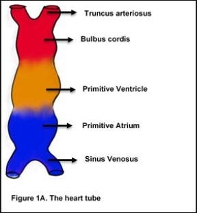
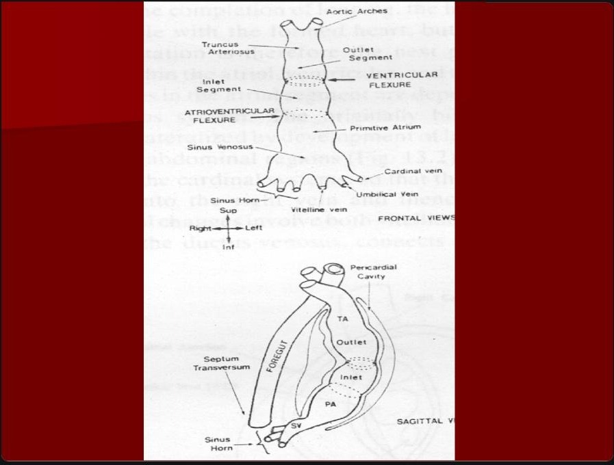
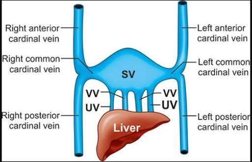
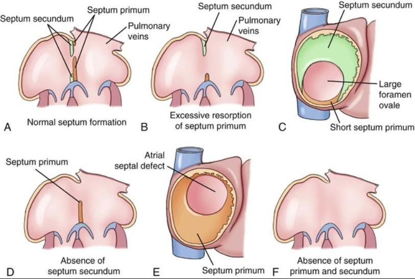
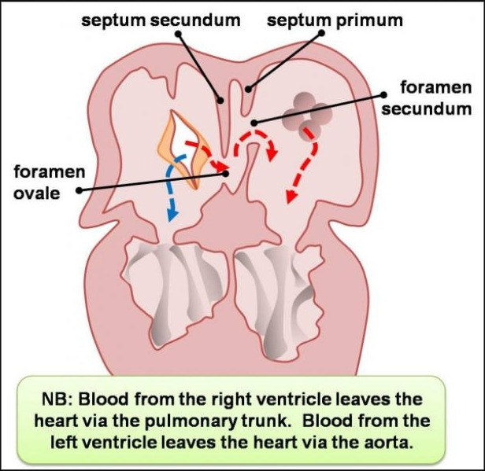
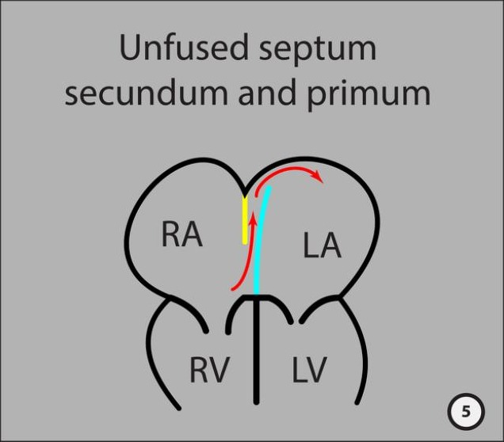
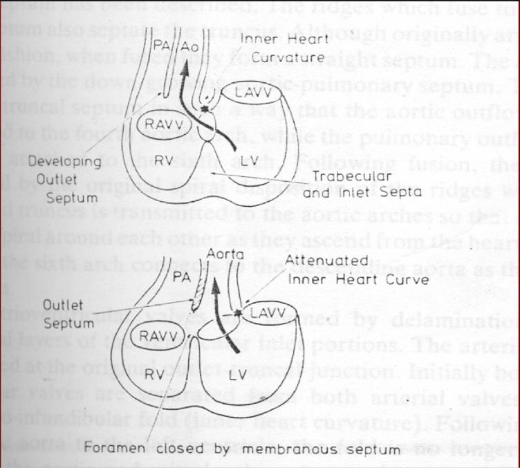
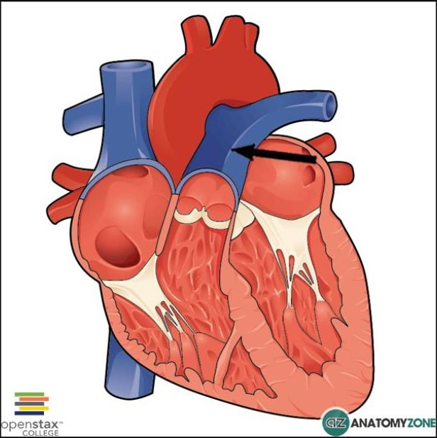
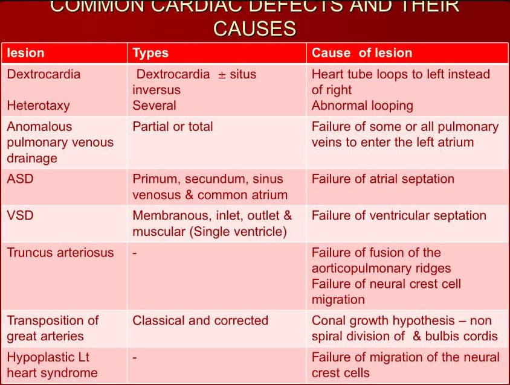
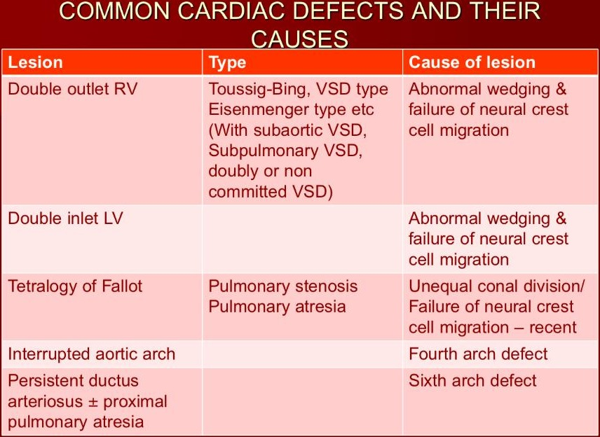

# Embryology of the Cardiovascular System

*Dr Stella Oji — Paediatrics*

## Outline

Introduction & timing · Sources of the CVS · The cardiogenic field · Formation & looping of the heart tube · Convergence & wedging · Veins of the heart · Atrial septation · Sinus venosus & right atrium · Pulmonary veins & conduction · Ventricular septation · Cono-truncal septation · Aortic arches · Common cardiac defects and their causes

## Introduction & timing

The **CVS (heart and blood vessels) is the earliest functional system in the body**, developing from **18 days to 12 weeks**.

**Why so early?** The tiny early embryo can meet its needs by **simple diffusion** of nutrients and oxygen. But around the **3rd week**, it grows **beyond the diffusion threshold** — the inner cells can no longer be reached fast enough. A **delivery system is needed**, so the CVS forms first, starting at **day 18**, and is largely complete by **12 weeks**.

## The five sources of the CVS

| Source | Contribution |
|---|---|
| **Splanchnic mesoderm** | Primordium (foundation) of the heart |
| **Paraxial & lateral mesoderm** | Blood vessel walls, connective tissue |
| **Otic placodes** | Minor (relates to ear; listed for completeness) |
| **Neural crest cells** | Outflow tract septation, great vessel walls |
| **Primordium of the labyrinth of the internal ear** | Minor/historical |

> **The two to remember:**
> - **Splanchnic mesoderm → heart muscle and lining**
> - **Neural crest cells → the outflow tract** (defects here cause **TGA, TOF, Truncus arteriosus**)

**Neural crest cells recur throughout this lecture** — they are responsible for some of the most important and most exam-tested congenital heart defects.

## The cardiogenic field

By the **3rd week**, cardiac progenitor cells called **myoblasts** cluster in the **cardiogenic field** (the area where the heart will form).

- **Myoblasts** — future heart-muscle cells; they organize into cord-like structures called **angioblastic cords**
- **Angioblastic cords** — hollow out and fuse to form the **primitive heart tube**
- **Position** — the cardiogenic field sits **anterior (in front) of the endodermal primitive pharynx**
- **Cephalad origin** — the heart starts forming **up near the head (cephalad)**, then **migrates downward** to the chest as the embryo folds craniocaudally in weeks 3–4

## Formation of the heart tube

By the **4th week**, the two angioblastic cords have hollowed and **fused into one straight tube — the primitive heart tube**. Before it can be shaped, it must be **anchored** at both ends:

| Anchor point | Structure |
|---|---|
| **Caudal end (bottom)** | **Septum transversum** (a block of mesoderm that later helps form the diaphragm) |
| **Cephalad end (top)** | **The (6) arterial arches** |

Dilatation of the tube becomes visible on **days 21–24**.

### The tube is already polarized

- **Venous end = caudal (bottom)** → will become the **atria**
- **Arterial end = cephalad (top)** → will become the **ventricles and outflow tract**

> This polarity seems backwards — veins at the bottom, arteries at the top — but the embryo is about to **loop and fold**, rearranging everything into the adult arrangement.

## Looping

**The problem:** a straight tube anchored at both ends inside a limited space (the pericardial cavity) is **growing rapidly but has nowhere to elongate**.

**The solution:** it **bends and loops on itself**, like a garden hose coiling when you push both ends together. This looping is **genetically programmed** and happens in a **specific direction** — the wrong direction gives **dextrocardia**.

### Stage 1 — Atrial looping

- **Site:** between the primitive atrium (PA) and the interventricular region (IV)
- **Angle:** a right-angle bend
- **Mechanism — differential growth:** the posterior-left side grows slowly, the anterior-right side grows fast; this unequal growth forces the bend

| Type | Result |
|---|---|
| **D-loop (dextro)** | Right ventricle ends up front and to the right — **NORMAL** |
| **L-loop (laevo)** | Left ventricle ends up front and to the left — **ABNORMAL** |

*(Note: the lecturer's slide labels these in a way that can confuse — the key point is that one direction is normal and the opposite produces a malpositioned heart / dextrocardia.)*

### Stage 2 — Ventricular looping

- **Site:** between the interventricular region (IV) and the outlet ventricle (OV)
- **Angle:** a dramatic **180° flexure**
- **Result:** the tube now resembles the definitive heart — you can identify where the chambers will be

> **What looping achieves:** the atria (which started at the bottom/venous end) are repositioned **behind and above the ventricles**; the ventricles become **anterior and inferior**. This is the adult arrangement — **atria on top/behind, ventricles below/in front**.

## Convergence and wedging

After looping, the heart looks roughly right — but the **inlets** (blood entering the atria) and **outlets** (blood leaving the ventricles) are **not yet aligned over their correct ventricles**. Two repositioning movements fix this before septation.

**Convergence** — the **AV canal (inlet)** and the **bulbus cordis (outlet)** move **closer together**, into the same plane, so they can connect to the right chambers (this happens while the AV canal is already septating).

**Wedging** — a two-part movement:

| Structure | Direction | Result |
|---|---|---|
| **AV canal** | shifts to the **right** | each AV orifice (mitral, tricuspid) sits over its own ventricle |
| **Bulbus cordis** | shifts to the **left** | half of the outlet sits over each ventricular outflow tract |

After wedging: **tricuspid over RV ✓, mitral over LV ✓, aorta wedged between the AV valves over the LV ✓, pulmonary trunk over the RV ✓.**

> **When convergence/wedging fail:**
> - **Double Outlet Right Ventricle (DORV)** — both aorta and pulmonary trunk over the RV (wedging failed)
> - **Double Inlet Left Ventricle (DILV)** — both AV valves drain into the LV (convergence abnormal)

## Veins associated with the heart

Three paired sets of veins drain into the **sinus venosus** (the most caudal part of the heart tube):

| Vein | Function | Adult fate |
|---|---|---|
| **Vitelline vein** | Returns deoxygenated blood from the **yolk sac** | **Hepatic veins and portal vein** |
| **Umbilical vein** | Carries **oxygenated** blood from the **placenta** | **Ductus venosus** → **ligamentum venosum** at birth |
| **Common cardinal vein** | Returns deoxygenated blood from the body | Forms the **SVC and IVC** (right-sided dominance) |

> **Umbilical vein carries oxygenated blood** — opposite of what a "vein" usually does — because in fetal life **the placenta is the lung**. The **ductus venosus** lets that oxygenated blood **bypass the liver** and go straight to the heart; at birth it closes to become the **ligamentum venosum**.

### The cardinal system — right-sided dominance

The cardinal system is paired (left and right), but the sides have **unequal fates**: the **right side largely persists** to form the major systemic veins; the **left side mostly regresses**. This is why adults have a **single SVC and IVC, both on the right**.

Each common cardinal vein = **anterior cardinal** (drains the head) + **posterior cardinal** (drains the lower body).

| Vessel | Adult structure |
|---|---|
| **Right anterior cardinal vein** | **Superior vena cava (SVC)** |
| **Left anterior cardinal vein** | Largely regresses |

The **IVC** has a complex origin — assembled from **four segments**: hepatic veins, right subcardinal vein, right supracardinal vein, and the subcardinal–supracardinal anastomosis. Failure of any segment gives a specific anomaly (**absent infrarenal IVC, interrupted IVC with azygos continuation, double IVC**).

> **Everything is right-sided** — SVC from the right anterior cardinal, IVC from right-sided vessels; the left equivalents disappear. This **right-sided dominance** is a consistent theme.

## Atrial septation

The atria **cannot be completely sealed** in fetal life — the fetus doesn't use its lungs, so oxygenated placental blood needs to **bypass the pulmonary circulation** and reach the left heart directly. Nature's solution: **divide the atria but leave a controlled hole — the foramen ovale** — that closes only at birth.

- **Septum primum** — grows **down from the roof** of the primitive atrium toward the **endocardial cushions**
- **Foramen primum** — the gap between the free edge of septum primum and the endocardial cushions (**first hole**; lets blood pass right → left while the septum grows)
- **Foramen secundum** — as septum primum reaches the floor and closes the foramen primum, **perforations appear higher up in septum primum** and coalesce into the **second hole** (so flow is maintained)
- **Septum secundum** — an **invagination of the roof**, growing down to the **right of septum primum**; it is **thicker and more muscular** (to withstand the high right-atrial pressure of fetal life)
- **Foramen ovale** — septum secundum grows down but **deliberately stops short**, leaving this gap

### The foramen ovale as a one-way valve

**In fetal life:** right atrial pressure > left (lungs not working) → pressure pushes septum primum **leftward**, opening the foramen ovale → blood flows **right → left**, bypassing the lungs ✓

**At birth:** first breath → lungs expand → pulmonary pressure drops → **left atrial pressure rises above right** → septum primum is pushed **rightward against septum secundum**, covering the foramen ovale → the two septa **fuse** → foramen ovale closes → becomes the **fossa ovalis**.

### The endocardial cushions

Masses of tissue in the AV canal region that: help close the foramen primum; contribute to the **mitral and tricuspid valves**; and contribute to the **membranous part of the interventricular septum**.

> **Failure of endocardial cushion development → AV septal defects (AVSD)** — common in **Down syndrome**.

### When atrial septation fails

| Defect | Type | Cause |
|---|---|---|
| **ASD secundum** | Most common ASD | Excessive resorption of septum primum / foramen ovale too large |
| **ASD primum** | Near AV valves | Failure of septum primum to fuse with the endocardial cushions |
| **Patent foramen ovale** | Common (25% of adults) | Septa form but never permanently fuse |
| **Common atrium** | No septation at all | Complete failure of atrial septation |

## Sinus venosus and the right atrium

The sinus venosus (the receiving chamber, with a **right and left horn**) has horns with **different fates**.

**Left sinus horn** shrinks → forms the **coronary sinus** (collects the heart's own venous blood, drains into the RA) and the **oblique vein of the left atrium** (a minor remnant).

**Right sinus horn** enlarges → absorbed into the RA wall to form the **smooth-walled sinus venarum** (where SVC and IVC open), and the **valve of the IVC (Eustachian valve)**.

### The two parts of the adult right atrium

| Part of RA | Origin | Texture |
|---|---|---|
| **Rough/trabeculated** (pectinate muscles) | Original primitive atrium | Rough |
| **Smooth** (sinus venarum) | Absorbed right sinus horn | Smooth |
| **Boundary** | **Crista terminalis** — a muscular ridge (externally: sulcus terminalis) | — |

### Clinical relevance

- **Persistent left superior vena cava (PLSVC)** — the left anterior cardinal vein fails to regress, leaving a **left SVC that drains into the coronary sinus** (which itself came from the left sinus horn). Usually there is **still a right SVC**, so blood still reaches the RA by a longer route — **most people are asymptomatic**; it is the **commonest thoracic venous anomaly**
- **Coronary sinus ASD (unroofed coronary sinus)** — the coronary sinus is open to the left atrium, creating a shunt

## Pulmonary veins & conduction

The **left atrium** gets its smooth wall by a **parallel but different** process — **absorbing the pulmonary veins**. The LA grows an outgrowth toward the lungs, meets the developing pulmonary veins, and **progressively absorbs** them, so **one trunk becomes four pulmonary vein openings** in the adult LA.

| Chamber | Source of smooth wall | Mechanism |
|---|---|---|
| **Right atrium** | Right sinus horn | Absorbed into the RA wall |
| **Left atrium** | Pulmonary veins | Absorbed into the LA wall |

Both atria end up with **smooth posterior walls and rough anterior walls** (the rough part from the original primitive atrium).

### Conduction system

Specialised cells in the **right atrium near the sinus venosus** form the **AV node** (receives the atrial signal, delays it before the ventricles) and the **Purkinje fibres** (rapidly conduct through the ventricular walls).

### Clinical relevance

- **Anomalous pulmonary venous drainage (APVD)** — the pulmonary vein outgrowth fails to connect to the LA. **Partial** APVD: some veins drain to the wrong place (RA, SVC, IVC). **Total APVD (TAPVD):** all four drain abnormally so **no oxygenated blood enters the LA directly — a surgical emergency in the newborn**
- **Conduction anomalies** — because the conduction system develops near the sinus venosus, defects there (e.g. sinus venosus ASD) can cause **sick sinus syndrome and heart block**

## Ventricular septation

Unlike the atria (where the wall grows **down** from the roof), the ventricular septum grows **up from the floor** — and it is **assembled from four components** that fuse:

1. **Inlet** (ventricle)
2. **Outlet** (ventricle)
3. **Trabecular / muscular** (ventricle)
4. **Membranous septum**

> This is **why VSDs are the most common congenital heart defect** — there are **four separate opportunities** for something to go wrong, each producing a VSD in a different location.

### The membranous septum

The **last part to close** and the **smallest** — a tiny fibrous patch **just below the aortic valve, adjacent to the tricuspid valve**. Because it closes last, it is the most vulnerable:

> **Perimembranous VSD** — a hole at/near the membranous septum — accounts for **~80% of all VSDs**.

## Cono-truncal septation

Even after the ventricular septum is complete, the heart has **two ventricles but only one outflow pipe**, made of two stacked segments:

- **Bulbus cordis (conus)** — the lower segment, above the ventricles
- **Truncus arteriosus** — the upper segment, connecting to the aortic arches

This **cono-truncal region must be split lengthwise** into the **aorta (for the LV)** and the **pulmonary trunk (for the RV)**. The dividing wall grows in a **SPIRAL** pattern — the **aorticopulmonary ridges** twist around each other as they fuse.

> **Why spiral?** Because in the adult heart the pulmonary trunk **spirals around** the aorta. If septation were **straight instead of spiral → Transposition of the Great Arteries (TGA)** — aorta off the RV, pulmonary trunk off the LV.

### Neural crest cells — critical

**Neural crest cells migrate into the cono-truncal region** to populate the ridges; they are **essential for proper fusion**. Without them → the ridges don't fuse → **Truncus arteriosus** or **Tetralogy of Fallot**.

The cono-truncal septum also grows down to **close the outlet part of the IVS** — which is why **outlet VSDs are often associated with cono-truncal anomalies**.

| Defect | Mechanism |
|---|---|
| **Truncus arteriosus** | Complete failure of ridge fusion — a single common arterial trunk persists |
| **Transposition of the Great Arteries (TGA)** | Septation without the spiral — straight division puts aorta over RV, pulmonary trunk over LV |
| **Tetralogy of Fallot** | Unequal division of the conus — pulmonary side too small → pulmonary stenosis + overriding aorta + outlet VSD + RVH |
| **Double Outlet RV** | Abnormal wedging + neural crest failure — both vessels over the RV |

### Summary of septation processes

| Region | Mechanism | Key clinical failure |
|---|---|---|
| **Atria** | Two septa + foramen ovale valve | ASD, patent foramen ovale |
| **AV canal** | Endocardial cushions | AVSD — common in Down syndrome |
| **Ventricles** | Four components fusing | VSD — most common CHD |
| **Outflow tract** | Spiral aorticopulmonary ridges + neural crest | TGA, Truncus arteriosus, TOF |

## The aortic arches

The great vessels (aorta, pulmonary arteries, carotids, subclavians) develop from **six paired arterial arches** that form **sequentially** around the pharynx. Think of them as **scaffolding** — you build six pairs, then **demolish most and keep only the parts you need**. They appear and regress in sequence (by the time the 6th forms, the 1st and 2nd have gone).

### The framework

- **Arches 1 & 2** — regress early, tiny remnants
- **Arch 3** — the **carotid** system
- **Arch 4** — the **aortic arch** system (asymmetric left vs right)
- **Arch 5** — regresses completely, **nothing**
- **Arch 6** — the **pulmonary** system + **ductus arteriosus**

### Complete arch summary

| Arch | Left derivative | Right derivative |
|---|---|---|
| **1st** | Maxillary artery (remnant) | Maxillary artery (remnant) |
| **2nd** | Hyoid + stapedial (remnant) | Hyoid + stapedial (remnant) |
| **3rd** | Common carotid, ECA, proximal ICA | Common carotid, ECA, proximal ICA |
| **4th** | **Arch of the aorta** | Proximal right subclavian artery |
| **5th** | Nothing | Nothing |
| **6th** | Proximal left PA + **ductus arteriosus** | Proximal right PA only |

> **Why is the aortic arch left-sided in normal adults?** Because only the **left 4th arch** persists to form it.
>
> The **ductus arteriosus** (from the **left 6th arch**) is the fetal shunt from the pulmonary trunk to the descending aorta. At birth it constricts and becomes the **ligamentum arteriosum**. **Failure to close = Patent Ductus Arteriosus (PDA).**

### Clinical relevance of arch anomalies

| Defect | Arch | Mechanism |
|---|---|---|
| **Right-sided aortic arch** | 4th | Right 4th arch persists instead of left |
| **Aberrant right subclavian artery** | 4th | Artery crosses behind the oesophagus → **dysphagia lusoria** |
| **Patent ductus arteriosus** | 6th | Ductus arteriosus fails to close after birth |
| **Interrupted aortic arch** | 4th | Gap in the aortic arch |

## Common cardiac defects and their causes

| Lesion | Cause |
|---|---|
| **Dextrocardia** | Heart tube loops to the left instead of the right — **abnormal looping** |
| **Anomalous pulmonary venous drainage** | Failure of pulmonary veins to enter the left atrium |
| **ASD** | Failure of **atrial septation** |
| **VSD** | Failure of **ventricular septation** |
| **Truncus arteriosus** | Failure of fusion of aorticopulmonary ridges; failure of neural crest cell migration |
| **Transposition of great arteries** | **Non-spiral** division of the bulbus cordis |
| **Hypoplastic left heart syndrome** | Failure of neural crest cell migration |

| Lesion | Cause |
|---|---|
| **Double outlet RV** | Abnormal wedging + failure of neural crest cell migration |
| **Double inlet LV** | Abnormal wedging + failure of neural crest cell migration |
| **Tetralogy of Fallot** | Unequal conal division / failure of neural crest cell migration |
| **Interrupted aortic arch** | **4th arch** defect |
| **Persistent ductus arteriosus ± proximal pulmonary atresia** | **6th arch** defect |

## References

Lecture material of Dr Stella Oji; standard embryology texts.
