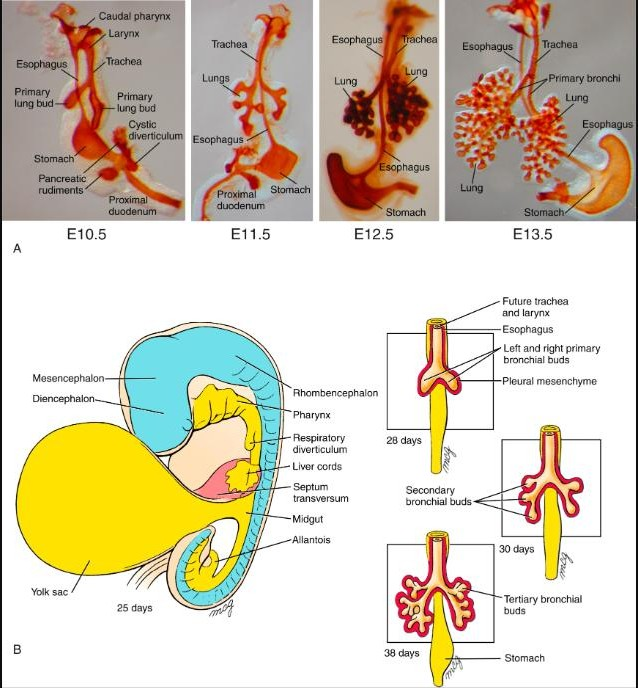
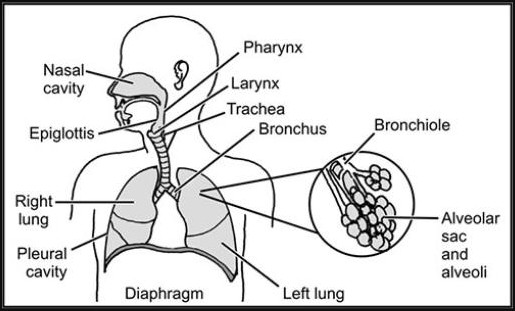
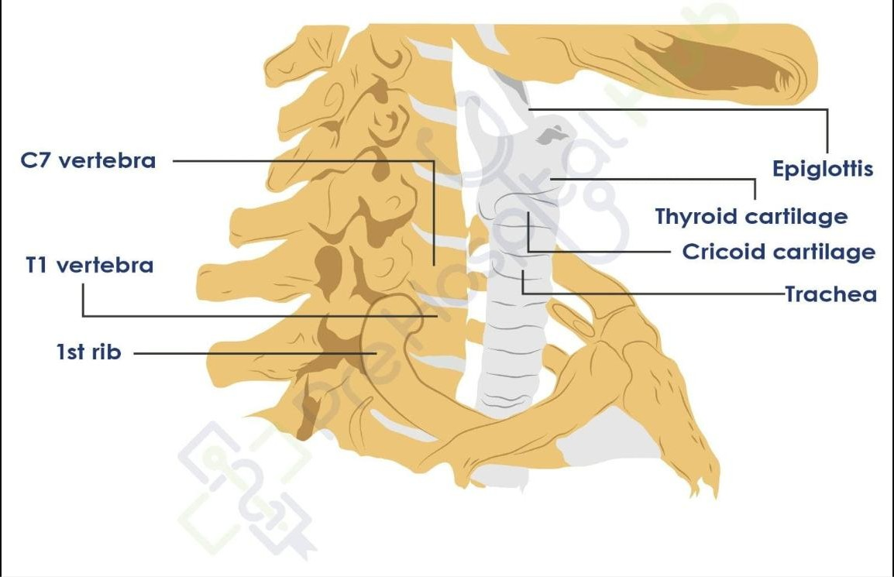
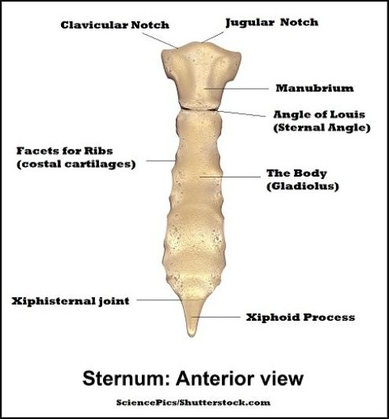
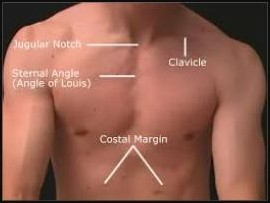
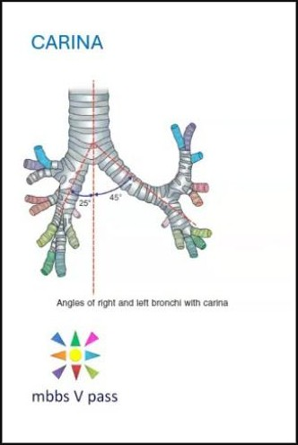
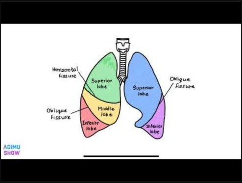
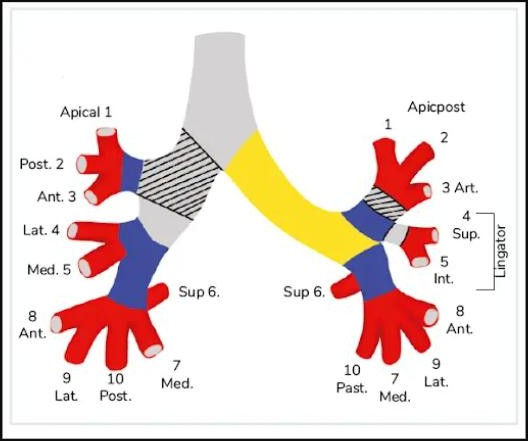
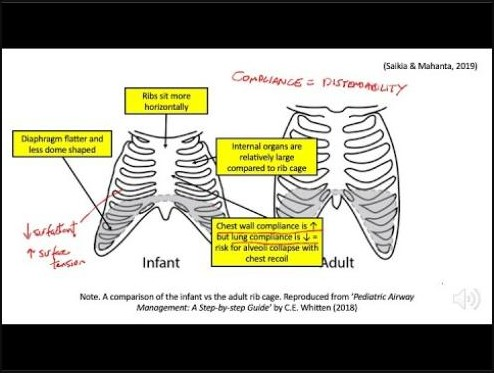
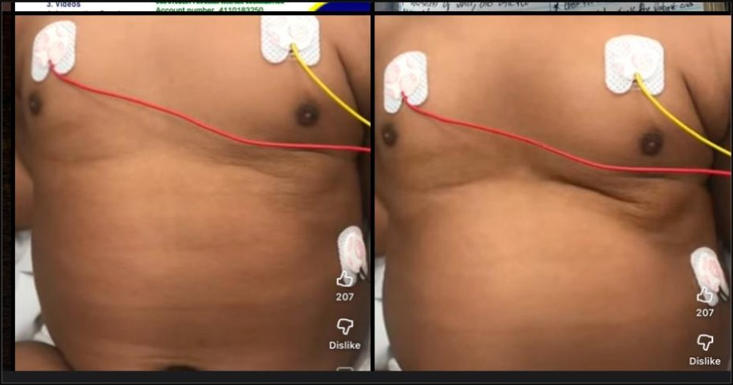

# Introduction to Pulmonology — Respiratory Paediatrics

*Dr (Mrs) Odochi Ewurum — Paediatrics, topic 9*

## Outline

What pulmonology is · Embryology of the respiratory system · Developmental phases & surfactant · The respiratory tract as a continuum · Upper vs lower tract · Trachea, bronchi and lungs · Pathophysiology · Classification · Evaluation: history, examination, investigation

## What is pulmonology?

**Pulmonology** is the field of medicine that focuses specifically on **diagnosing and treating disorders of the respiratory system**. It is also known as **respirology, respiratory medicine or chest medicine**.

## Embryology of the respiratory system

In very early development, the embryo has a simple tube called the **foregut**. A partition grows to split this tube into two channels:

- One going to the stomach — the **oesophagus**
- One going to the lungs — the **trachea**

Everything that becomes the airway — **larynx, trachea, bronchi, alveoli** — grows out from that single anterior split. The respiratory system grows as an **outgrowth from the ventral (front) wall of the foregut in week 4**.

### Tissue origins

- The **epithelial lining** of everything from the larynx down to the alveoli is **endodermal** (from the endoderm)
- The **cartilage and muscle** wrapping around the airways are **mesodermal** (from the mesoderm)

### The oesophagotracheal septum

The **oesophagotracheal septum** is the wall of tissue that grows to **separate the respiratory bud from the oesophagus (foregut)**. It does this in the **4th week**.

> **Failure of this septum to form properly causes tracheo-oesophageal fistula (TOF)** — a connection between the airway and the food pipe, which is a **surgical emergency in newborns**.

The septum divides the foregut into:

- The **respiratory diverticulum anteriorly** (becomes the lungs)
- The **oesophagus posteriorly**

The two remain **connected at one point — through the larynx**.

> The **larynx** is formed from tissue of the **4th and 6th branchial arches**.

### Lung bud asymmetry

Then the lung buds diverge:

- The **left bud** forms **2 main bronchi and 2 lobes**
- The **right bud** forms **3 main bronchi and 3 lobes**

> This asymmetry is not random — it is determined from this embryological stage, and it is **why the adult right lung is slightly larger**.

## Developmental phases & surfactant production

Two key phases of lung maturation:

- **Pseudoglandular phase (5–17 weeks)** — the lung looks **gland-like** under the microscope. Airways are forming but there is **no gas exchange yet** — hence "false gland"
- **Canalicular phase (15–25 weeks)** — the airways begin to **widen and vascularize**. The cells lining the bronchioles **thin out and flatten into type I alveolar epithelial cells** (the actual gas-exchange cells). Also during this period, **type II alveolar epithelial cells begin producing surfactant** — a phospholipid coat laid over the alveolar membranes before birth

### What surfactant does

Surfactant's job is to **reduce surface tension at the air–blood capillary interface**. Without it, the natural surface tension of the fluid lining the alveoli would cause them to **collapse inward during expiration**. Surfactant keeps the alveoli open so the next breath comes in easily.

> This is exactly why **premature infants** (born before sufficient surfactant is produced) develop **RDS (respiratory distress syndrome)** — their alveoli keep collapsing and breathing becomes exhausting work.

### Postnatal lung growth

> After birth, the lungs grow by **increasing the number** of respiratory bronchioles and alveoli — **not by making existing alveoli bigger**. Lung growth is about **multiplication, not enlargement**.

## The respiratory tract as a continuous highway

The respiratory tract is **one single continuous tract** that starts at the nose and ends deep in the alveoli — it flows as **one connected mucosal surface**.

> This matters clinically because an **infection that starts at the top of the road can travel downward** along it. There are no real anatomical "stop signs" between the upper and lower tract.

The road is divided into two sections at a practical landmark — the **larynx**. Everything **above it is the upper respiratory tract**; everything **below is the lower respiratory tract**.

**The full continuum:**

Nasal cavity → Pharynx → Epiglottis → Larynx → Trachea → Bronchi → Bronchioles → Alveolar sacs

> The word **"continuum"** tells you why a child with a runny nose can progress to bronchitis or pneumonia — the infection simply travels down the same road.

## Upper vs lower respiratory tract

| Upper respiratory tract | Lower respiratory tract |
|---|---|
| **Nose** | **Trachea** |
| **Paranasal sinuses** | **Bronchi** |
| **Pharynx** | **Bronchioles** |
| | **Alveoli** |

The **upper** structures can be examined from the outside or with a simple light. The **lower** structures are deeper, require instruments to examine, and are where the serious diseases — **pneumonia, asthma, bronchiolitis** — tend to live.

## The trachea

- **Where it starts** — at the **lower border of the cricoid cartilage at C6**
- **Where it ends** — the trachea **bifurcates at the sternal angle of Louis (T4/T5)** to form the right and left main bronchi
- **Dimensions** — about **4½ inches long, nearly 1 inch in diameter**
- **Lining** — **ciliated columnar epithelium with goblet cells**. The cilia beat upward to sweep debris out; the goblet cells produce mucus to trap pathogens — part of the respiratory tract's **first-line defence system**

## The bronchi

The trachea bifurcates into two main bronchi, with a **crucial asymmetry**:

- The **right main bronchus** is **wider, shorter and more vertical**, leaving at an angle of **25° to the horizontal**
- The **left main bronchus** leaves at a **steeper 45°**

### Why foreign bodies go right

> Because the right bronchus is **wider and more vertical** — essentially a direct continuation of the trachea — **foreign bodies and aspirated material preferentially enter the right bronchus**, particularly into the **middle and lower lobes** of the right lung.

This is **one of the most tested clinical anatomy facts in paediatrics**. If a child inhales something, **look right first**.

Each lung is **conical**, with a **blunt apex projecting above the sternal end of the first rib** — which is why a **penetrating injury at the base of the neck can still injure the lung**.

## Lobes of the lungs

- The **right lung** is slightly larger — **three lobes** (upper, middle, lower) divided by **two fissures**: the **oblique** and the **horizontal**
- The **left lung** has only an **oblique fissure**, giving **two lobes** (upper and lower). It is smaller partly because the **heart occupies space on the left**

## The clinical consequence of continuity

Because the respiratory tract is **one connected surface**, infections rarely stay confined to one region. **Downward spread along the tracheobronchial tree is common** — a child with a URTI can progress to **bronchitis, bronchiolitis or pneumonia** within days as the same pathogen moves along the mucosal highway.

## Pathophysiology

The main function of the respiratory system is to **supply sufficient oxygen to meet metabolic demands and remove carbon dioxide**. This involves **ventilation, perfusion and diffusion**. **Abnormality in any one** of these mechanisms can lead to **respiratory failure**.

## Classification

Respiratory tract disease is classified into:

- **Upper Respiratory Tract Infection (URI / URTI)**
- **Lower Respiratory Tract Infection (LRI / LRTI)**

## The three pillars of evaluation

Evaluating a child with respiratory disease rests on three things, **in this deliberate order**:

1. **History taking**
2. **Physical examination**
3. **Laboratory investigation**

> **History comes first** because it guides everything else — it tells you what to look for on examination and which investigations to request. Without a good history, examination and investigation become **unfocused and expensive**.

## The structure of the history

Five components: **bio-data · presenting symptoms · past medical history · family history · social history**.

### Bio-data: age and gender

**Age** gives insight into anatomical maturity, physiological reserve, likely diagnosis and risk of deterioration.

**Why young infants are more vulnerable** (the immature respiratory system):

- **Smaller airways** — a small amount of mucus, oedema or inflammation narrows the airway significantly. Since **resistance rises dramatically as airway diameter falls**, infants obstruct faster
- **Highly compliant (floppy) chest wall** — soft, horizontal ribs mean the chest wall **collapses inward** in distress instead of supporting ventilation → **recession/retractions and quicker respiratory fatigue**
- **Immature respiratory control / poor hypoxic reserve** — infants tolerate hypoxia poorly and can develop **apnoea**, especially neonates
- **Lower physiological reserve** — limited oxygen reserve and higher metabolic demand mean they **decompensate faster**

> A 2-month-old with bronchiolitis and an 8-year-old with the same severity are **not equally stable** — the infant has far less reserve.

**Age predicts the likely diagnosis:**

| Age | Common respiratory diseases |
|---|---|
| **Neonate (<28 days)** | Congenital anomalies, neonatal pneumonia, aspiration |
| **Infant (<1 year)** | Bronchiolitis, pertussis |
| **Toddler (1–3 years)** | Viral wheeze, foreign body aspiration, croup |
| **School-age** | Asthma, pneumonia |
| **Adolescent** | Asthma, atypical pneumonia |

**Gender** — some conditions have a sex predilection; **pneumonia and bronchiolitis are more common in males**, adjusting your pre-test probability.

### Presenting symptoms: the big three

**Cough** — characterise it: **duration**, **character** (barking, whooping, productive?), **timing** (night, morning, after feeding), **severity**, and **sputum production**.

**Breathlessness** — how severe, how long, and the pattern (constant or episodic, with exercise or at rest?).

**Chest pain** — the key task is distinguishing **respiratory** chest pain (relates to breathing — **worse on inspiration or coughing = pleuritic**) from **cardiac** chest pain.

### Noisy breathing — six types you must know

**Wheeze · Stridor · Snuffles · Rattles · Snoring · Grunting**

### Other associated symptoms

- **Rhinorrhoea and nasal stuffiness** → upper tract involvement or allergic disease
- **Ear ache or discharge** → otitis media often accompanies URTIs (short, horizontal Eustachian tube in young children)
- **Hoarseness** → laryngeal involvement — croup, laryngitis, or a laryngeal foreign body
- **Sore throat** → pharyngitis or tonsillitis
- **Red flags — weight loss, neck swelling, night sweats** → raise suspicion of **tuberculosis or lymphoma**, which must never be missed

### Past medical history

Tells you whether this is **new or recurring**. Five things to probe: **has it happened before?** · **has the child been hospitalised for it?** · **did symptoms follow a previous infection?** · **how did the child respond to previous treatment** (did bronchodilators or antibiotics help)? · **is there a seasonal pattern?**

> A child with **recurrent wheezing that responds to bronchodilators and worsens in harmattan** is telling you the diagnosis before you examine them — this reversible, trigger-worsened pattern is classic for **bronchial asthma**.

### Family history

- **Atopy** — the tendency to allergic disease (asthma, eczema, allergic rhinitis) runs strongly in families; **two atopic parents** greatly raise the child's risk
- **Chronic cough** in the family may point to **cystic fibrosis or primary ciliary dyskinesia** (genetic bases)

### Social history — the environment the child lives in

- **Dust, pets, rugs and fumes** can trigger allergic and obstructive disease
- **Passive smoking** is one of the most significant environmental risk factors — it **damages airway mucosa, impairs ciliary function and increases infection susceptibility**
- **Exercise** can trigger bronchospasm in reactive airway disease
- **Overcrowding** is a major risk factor for spread of respiratory infection, especially **TB and pneumonia**

> The social history is where you find the **hidden causes** that the symptoms alone won't reveal.

## References

Lecture slides of Dr (Mrs) Odochi Ewurum; standard paediatric respiratory texts.
