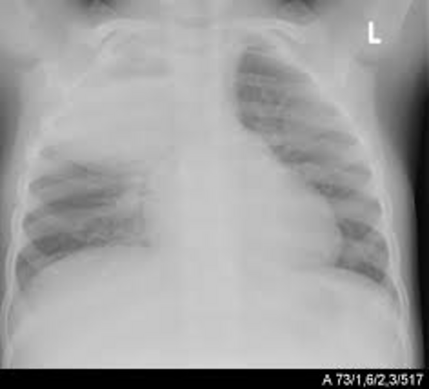
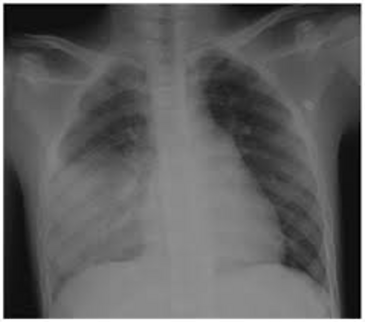
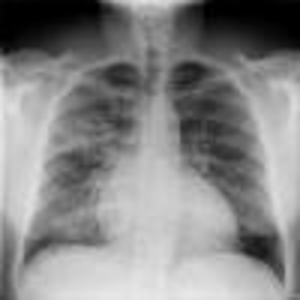

# Pneumonia — Lobar and Bronchopneumonia

*Dr (Mrs) Odochi Ewurum, MBBS, FWACP, FMCPaed, Department of Paediatrics, GUU — Paediatrics, topics 29 & 33*

## Outline

Introduction · Classification · Epidemiology · Aetiology · Pathophysiology · Pathology · Lobar pneumonia · Bronchopneumonia · Investigations · Differential diagnosis · Complications · Treatment · Prevention · References

## Introduction

**Pneumonia** is an **inflammation of the parenchyma of the lung caused by microorganisms**.

The **lung parenchyma** consists of:

- Respiratory bronchioles
- Alveolar ducts
- Alveolar sacs
- Alveoli
- Interstitial tissue

Pneumonia results in a response that leads to **damage to the lung parenchyma**, in which **resolution may be partial or complete**.

> **Pneumonitis** or **alveolitis** is appropriately reserved for inflammation of the lungs caused by **chemical or physical injury** (e.g. burns) — **not** by microorganisms.

## Classification

**Based on probable origin**

- Community acquired
- Hospital acquired (nosocomial or health care associated infection)
- Aspiration
- Pneumonia in the immunocompromised patient

**Based on anatomical involvement or pattern of distribution**

- **Bronchopneumonia**
- **Lobar or segmental pneumonia**

**Based on the type of infecting organism**

- Viral
- Bacterial
- Fungal
- Atypical
- Parasitic

**Based on the actual infecting organism**

- Pneumococcal, streptococcal, staphylococcal
- *Haemophilus influenzae*
- Tuberculous

## Epidemiology

- Pneumonia ranks **high amongst the causes of childhood morbidity and mortality**
- **Infants and toddlers** are more frequently affected than older children
- Occurs **throughout the year**, but is more common during the **rainy and harmattan seasons** in Nigeria
- Unlike in developed countries, the disease is usually **more severe in less privileged communities**

### The figures

- A child dies of pneumonia **every 43 seconds**
- Pneumonia killed **more than 700,000 children under 5 years in 2021** — around **2,000 every day** (UNICEF data)
- It accounts for **15% of all deaths of children under 5 years**
- Globally there are over **1,400 cases per 100,000 children**, or **1 case per 71 children every year**

### Risk factors

- **Lack of breastfeeding**, especially exclusive breastfeeding
- **Malnutrition**, including **vitamin A deficiency**
- **Poor socio-economic status**
- **Large family size**
- **Young age** in the under-5s, especially within the **first 2 years**
- **Low birth weight**
- **Overcrowding**
- **Previous illness** — HIV, sickle cell anaemia, congenital lung or airway disorders
- **Indoor and outdoor pollution**, including smoking

## Aetiology

**Viruses** — the **most common cause** of pneumonia in children. Account for **≈50% in all ages**, but up to **80% in children under 2 years**.

**Bacteria** — the organisms are **age-dependent**.

**Atypical organisms** — mycoplasma, chlamydia, *Pneumocystis jiroveci*, moraxella.

**Fungal** — *Coccidioides*, *Aspergillus*, *Cryptococcus*, *Histoplasma*.

**Parasitic** — ascaris, toxoplasma, schistosoma.

> In **20–60%** of pneumonias, **no pathogen may be identified**.

### Viral pathogens

**Common**

- **Respiratory syncytial virus — the commonest virus**
- Influenza A or B
- Parainfluenza viruses 1, 2 and 3
- Adenovirus
- Measles virus

**Uncommon**

- Varicella–zoster virus, coronaviruses, enteroviruses (coxsackievirus and echovirus), cytomegalovirus, Epstein–Barr virus, mumps virus, herpes simplex virus (in newborns), *Coxiella burnetii*

### Bacterial pathogens by age

| Age group | Organisms |
|---|---|
| **Neonates** | *Escherichia coli*; *Klebsiella*; **Group B streptococcus**; *Staphylococcus aureus* |
| **3 months – 3 years** | ***Streptococcus pneumoniae* — accounts for > 70% of bacterial causes**; *Haemophilus influenzae* |
| **> 3 years** | *Strep pneumoniae*; *Strep pyogenes*; *Bordetella pertussis*; *Staph aureus* |

### Atypical pathogens

- ***Chlamydia pneumoniae*** — implicated in **3 months – 3 years**
- ***Mycoplasma pneumoniae*** — implicated in **> 3 years**
- *Moraxella catarrhalis*
- *Legionella pneumophila*
- ***Chlamydia trachomatis*** — implicated in **neonates**
- ***Pneumocystis jiroveci*** — implicated in **HIV infection and the immunocompromised**

## Pathophysiology

### Normal defence mechanisms

The lower respiratory tract is normally kept **sterile** by physiologic defence mechanisms:

- **Mucociliary clearance**
- **Secretory immunoglobulin A (IgA)**
- **Clearing of the airway by coughing**

**Immunologic defence mechanisms** that limit invasion by pathogenic organisms:

- **Macrophages** present in alveoli and bronchioles
- **Secretory IgA**
- **Other immunoglobulins**

### How infection is established

The lower respiratory tract, which is usually sterile, is **constantly exposed** to infectious and other agents. Except for its defensive mechanisms, the tract would have been overwhelmed. However, a number of organisms **overcome these defences** and cause pulmonary infection.

**Routes of entry:**

- **Inhalation** of airborne droplets with pathogens
- **Descending** from URTI or from other LRTI
- **Aspiration**
- **Haematogenous spread**

After gaining entry, the organisms **establish themselves in small bronchioles and alveoli**, from where they **spread to other parts of the lungs**.

### The inflammatory response

When the pathogen invades the alveolar sacs they **multiply**, triggering the body's immune response.

The immune cells — **alveolar macrophages, neutrophils, lymphocytes and eosinophils** — engulf the pathogens and **release cytokines**.

The inflammatory response — **apoptosis, vascular permeability with oedema, release of cytokines** — causes **cell destruction and alveolar congestion**.

> This **interrupts exchange of oxygen across the alveolar membranes**.

The **virulence and severity** of the pneumonia depends on:

- The **health of the individual**
- The **causative microorganism**
- The **size of the inoculum**

## Pathology — the four stages of inflammation

**(1) Vascular congestion** — occurs **within 24 hours**

- Marked **capillary engorgement/congestion** and **alveolar oedema**
- The protein-rich alveolar fluid contains **numerous bacteria and few neutrophils**
- Produces **clear sputum**

**(2) Red hepatization** — occurs within the **2nd–4th day**

- Many **RBCs, neutrophils, desquamated epithelial cells and fibrin** enter the alveoli
- Lung tissue appears **red** and has a **similar consistency to liver**
- Produces **rusty sputum**

**(3) Grey hepatization** — occurs within the **4th–6th day**

- Alveoli filled with **fibrinopurulent exudate** made of **haemolysed RBCs, degranulated neutrophils and macrophages**
- **Haemosiderin** from RBCs gives the lungs a **grey-brown to yellow colour** and **firm consistency**
- At this stage the lungs are **no longer congested**

**(4) Resolution** — occurs on the **8th–9th day**

- Resolution of the inflammatory exudates and **restoration of pulmonary architecture** by the **breakdown of inflammatory exudates by enzymes**

## Lobar pneumonia

A type of pneumonia that involves **one or more lobes, or part of a lobe**, of the lungs, in which the **consolidation is virtually homogenous**.

### Aetiology

Mostly caused by **bacteria**:

- *Streptococcus pneumoniae*
- *Haemophilus influenzae*
- *Staphylococcus pyogenes*
- *Streptococcus pyogenes*
- *Klebsiella pneumoniae*
- *Pseudomonas*
- *Proteus* species
- *Mycobacterium tuberculosis*

Some cases of lobar pneumonia are caused by **viruses**.

### Symptoms

- **Fever, rigours**
- **Productive cough**
- Breathlessness
- Anorexia
- **Pleuritic chest pain**
- Restlessness
- Cyanosis
- **Upper abdominal pain**
- Vomiting and diarrhoea
- Occasionally **haemoptysis**

### Signs

- **Ill and anxious looking child**
- Restless, toxic, cyanosed
- Tachycardia, dyspnoea, tachypnoea
- **Central trachea** and **diminished chest expansion** over the affected segment or lobe
- **Dull percussion notes**
- **Increase in tactile and vocal fremitus** on the affected side
- **Diminished breath sounds and bronchial breath sounds**, subsequently replaced by **crepitations**

## Bronchopneumonia

There is **patchy consolidation** throughout a lobe or the lungs.

### Aetiology

**Viral**

- **Respiratory syncytial virus is probably the commonest**
- Influenza, parainfluenza, adenoviruses, rhinovirus and measles

**Bacterial**

- *Staphylococcus pyogenes*
- *Streptococcus pneumoniae*
- *Haemophilus influenzae*
- *Mycobacterium tuberculosis*

### Symptoms

- Fever
- Cough
- Breathlessness
- Anorexia
- Restlessness
- Cyanosis
- Upper abdominal pain
- Vomiting and diarrhoea
- **Chest pain is unusual**

### Signs

- **Trachea is central**
- **Resonant percussion notes equal on both sides**
- **Crepitations** (fine or coarse)
- **Diminished breath sounds**

## Investigations

### Goals of investigation

- To **confirm the diagnosis**
- Determine the **severity**
- Establish the presence of **complications**
- To exclude the **close differential diagnoses**
- To determine the **causative organism**
- To **monitor the response** to treatment measures

### The investigations

**(1) Radiology**

- Chest X-ray
- Chest computed tomography
- Magnetic resonance imaging

**(2) Microbiological**

- Nasal washings or nasopharyngeal swabs
- Blood culture
- Sputum culture
- Pleural fluid culture
- Bronchoscopic fluid / broncho-alveolar lavage washings
- Lung aspirate studies
- Serology
- Nucleic acid amplification test
- Countercurrent immuno-electrophoresis of urine sample

**(3)** Arterial blood gas analysis

**(4)** Serial pulse oximetry

**(5)** Full blood count and differentials

**(6)** Others — erythrocyte sedimentation rate (ESR), C-reactive protein

### Chest X-ray

Confirms the diagnosis of pneumonia and may indicate a **complication** such as a **pleural effusion or empyema**.

- **Viral pneumonia** is usually characterized by **hyperinflation with bilateral interstitial infiltrates and peribronchial cuffing**
- **Confluent lobar consolidation** is typically seen with **pneumococcal pneumonia**

**Radiological findings in pneumonia:**

- Peribronchial infiltrates
- Lobar/segmental consolidation
- **Air bronchograms**
- Airspace obliteration
- Hilar lymphadenopathy

Chest CT and MRI are used **under special circumstances**.

### Microbiology

**Culture of specimens.** The **definitive diagnosis of a bacterial infection requires isolation of an organism from the blood, pleural fluid or lung.**

> **Blood culture correctly identifies the causative organism in only 20–30% of patients.**

Growth of respiratory viruses in tissue culture usually requires **5–10 days**.

- **Sputum m/c/s is not reliable in children** — sputum will be contaminated by upper airway flora
- **Nasopharyngeal and throat swabs** may identify only normal commensal organisms, and are thus **not reliable in children**
- **Pleural fluid culture** and **bronchoscopic fluid / BAL washings** are used when technically feasible

**Virology.** Definitive diagnosis of a viral infection rests on **isolation of a virus, or detection of the viral genome or antigen in respiratory tract secretions**. Reliable DNA or RNA tests exist for the rapid detection of **RSV, parainfluenza, influenza and adenoviruses**.

**Serology.** Used to diagnose a recent respiratory viral infection, but generally requires testing of **acute and convalescent serum samples** for a rise in antibodies.

- Acute infection caused by ***M. pneumoniae*** can be diagnosed on the basis of a **positive PCR test or seroconversion in an IgG assay**
- **Anti-streptolysin O (ASO) titre** may be useful in the diagnosis of **group A streptococcal pneumonia**

**Nucleic acid amplification test.** Used for **rapid detection of pathogens that are difficult to culture** — e.g. **PCR** applied to respiratory secretions, lung aspirate samples or blood.

**Countercurrent immuno-electrophoresis of urine sample.** Involves identifying **bacterial antigens of capsulated bacteria** like *S. pneumoniae* and *H. influenzae* — **even after initiating antimicrobial treatment**.

### White cell count

| | WBC count | Predominance |
|---|---|---|
| **Viral pneumonia** | Normal or elevated, but **usually not higher than 20,000/mm³** | **Lymphocyte** |
| **Bacterial pneumonia** | Often elevated, **15,000–40,000/mm³** | **Granulocyte** |

### Other tests

- **Blood chemistry** — renal or hepatic function, to identify patients with **co-morbidities and dehydration**
- **Arterial blood gas analysis** — to assess the **degree of hypoxia** and the **need for oxygen administration**
- **Invasive diagnostic techniques** — thoracocentesis, bronchoscopy, transtracheal aspiration, transthoracic lung aspirate, open lung biopsy — to obtain suitable materials for microscopic and cultural evaluation

## Differential diagnosis

- Bronchiolitis
- Bronchial asthma
- Bronchitis
- Bronchiectasis
- Lung abscess
- Pulmonary oedema
- **Atelectasis due to foreign body or thick mucus**
- Chemical pneumonitis

## Complications

**Acute — mnemonic SHARE 4Ps**

- **S**epticaemia
- **H**eart failure
- **A**telectasis
- **R**espiratory failure
- **E**mpyema
- **P**leural effusion
- **P**yo-pneumothorax
- **P**neumothorax
- **P**neumatocele
- *(and subcutaneous emphysema — rare except in measles infection)*

**Chronic**

- **Lung abscess**
- **Bronchiectasis**

## Treatment

### Principles of treatment

- **Eradicate the infection**
- **Give supportive treatment**
- **Manage the complications**

### Specific

**Antibiotics, antivirals, antifungal drugs.**

Antimicrobial treatment is guided by:

- **Age** of the patient
- **Immune status**
- **Local epidemiologic information**
- **Radiologic findings**
- **Microbiology results** if available

### Supportive

- **Hospital admission** when necessary
- **Oxygen therapy** with monitoring of ABG
- **Antipyretics**
- **Fluid therapy**
- **Trial of bronchodilators**
- **Nursing care**
- **Appropriate feeding**
- **Chest physiotherapy** — percussion, postural drainage, tracheal suction

### Indications for hospitalization

- **Age < 6 months**
- **Sickle cell anaemia with acute chest syndrome**
- **Multiple lobe involvement**
- **Immunocompromised state**
- **Toxic appearance**
- **Severe respiratory distress**
- **Requirement for supplemental oxygen**
- **Dehydration, vomiting**
- **No response to appropriate oral antibiotic therapy**
- **Noncompliant parents**

### For complications

- **Digitalize** in CCF
- **Drain pleural fluid**
- **Transfuse** if the patient is anaemic

## Prevention

**Immunization** — against respiratory pathogens e.g. measles, diphtheria, pertussis, *H. influenzae* etc.

**Health education** — parents and caregivers should be educated on:

- Reduction of **overcrowding**
- **Adequate nutrition**
- **Advantages of breastfeeding**
- **Avoidance of practices such as kissing children** by those with respiratory tract infection
- **Reduction in air pollution** caused by cigarette and wood smoke

**Legislation** — government should enact laws to reduce environmental pollution and discourage cigarette smoking.

## References

1. Sectish TC, Prober CG. Pneumonia. In: Kliegman MR, Behrman ER, Jenson BH, Stanton FB, editors. *Nelson's Textbook of Paediatrics*, 19th ed. Elsevier; 2011
2. Aderele WI, Johnson AWBR. Pneumonia. In: Azubuike JC, Nkanginieme KEO. *Paediatrics and Child Health in a Tropical Region*, 3rd ed. Owerri: African Educational Services; 2007
3. Webb JKG. Pneumonia. In: Stanfield P, Brueton M, Chan M, Parkin M, Waterston T, editors. *Diseases of Children in the Subtropics and Tropics*, 4th ed. Educational Low Priced Books
