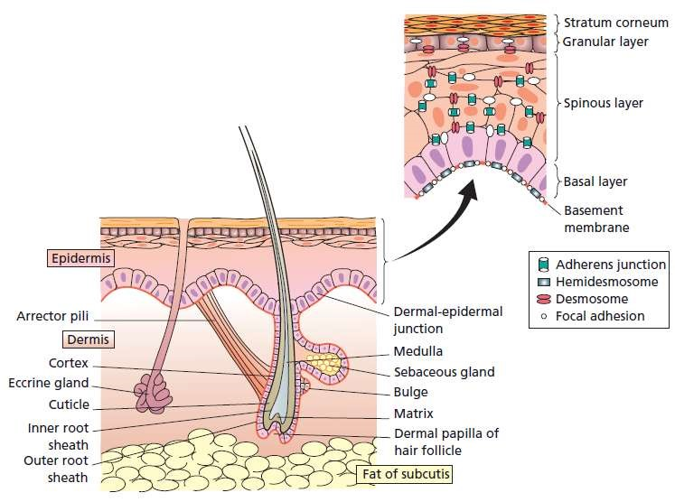
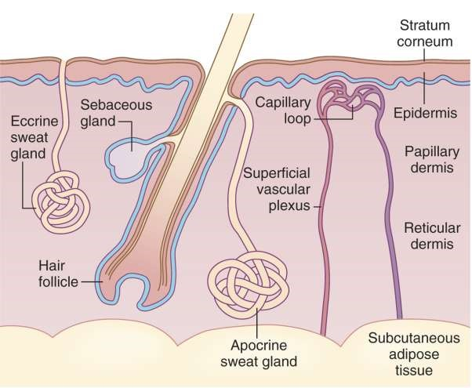
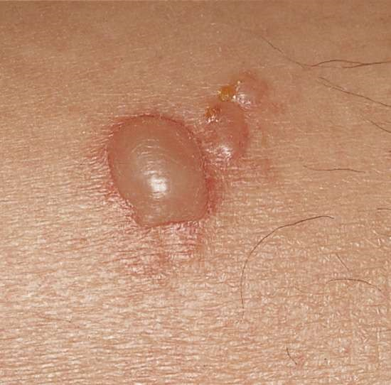
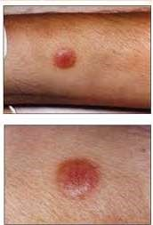
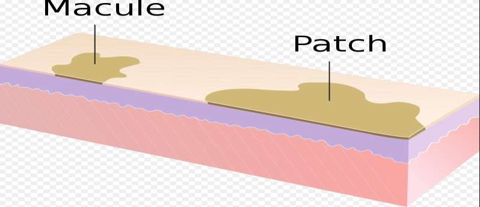
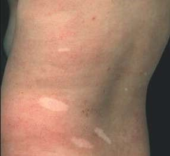
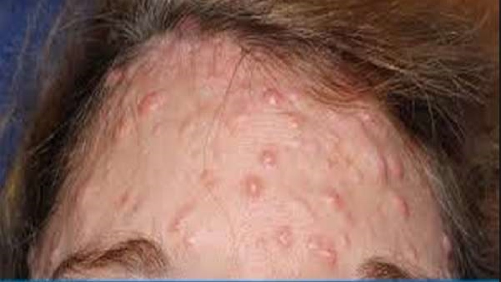
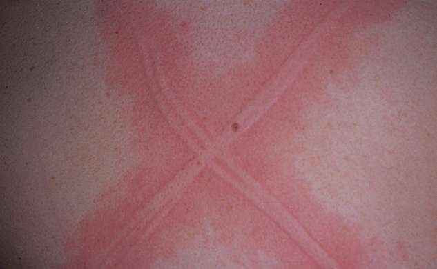
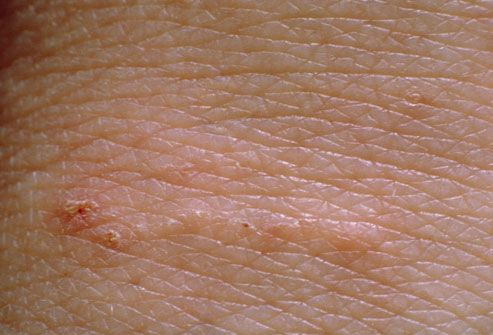

# The Skin as an Organ — Primary & Secondary Lesions

*Dr (Mrs) Odochi Ewurum, MBBS, FWACP, FMCPaed — Paediatrics, topic 23*

## Outline

Introduction · Functions of the skin · Anatomy and structure · Morphology of skin lesions · Primary lesions · Secondary lesions · References

## Introduction

The skin and its accessory organs — **hair, nails and glands** — are known as the **integumentary system** of the body.

**Integument** means *covering*, and the skin is the outer covering of the body. It is however **more than a simple body covering**.

The skin is a **complex system of specialized tissues** containing:

- **Glands** that secrete several types of fluids
- **Nerves** that carry impulses
- **Blood vessels** that aid in the regulation of body temperature

The skin is often referred to as the **largest body organ**, and serves as the main **protective barrier** against damage to internal tissues from **trauma, ultraviolet light, temperature, toxins and bacteria**.

## Functions of the skin

**(i) Protection.** As a protective membrane over the entire body, the skin guards the deeper tissues against **excessive loss of water, salts and heat**, and against **invasion of pathogens and their toxins**.

**(ii) Secretion.** The skin contains **two types of glands**:

- **Sebaceous glands** produce an oily secretion called **sebum**, which helps lubricate the surface of the skin
- **Sweat glands** produce a watery secretion called **sweat**, which helps cool the body as it evaporates from the skin surface

**(iii) Sensation.** **Nerve fibres** located under the skin act as receptors for sensations such as **pain, temperature, pressure and touch**.

**(iv) Thermoregulation.** Several different tissues in the skin aid in **maintaining the body temperature**.

## Anatomy / structure of the skin

There are **three layers** in the skin. From the outer surface inwards:

1. **Epidermis** — a thin cellular membrane layer
2. **Corium or dermis** — dense, fibrous connective tissue layer
3. **Subcutaneous tissue or hypodermis** — thick, fat-containing tissue

### The epidermis

Cells move **from the base of the epidermis up to the surface**, changing shape and structure as they go.

The epidermis is divided into **five layers**, from upper to lower:

**i. Stratum corneum** — made up of **stratified squamous epithelium** or hardened cells, which play a role in the skin's **protective function**.

**ii. Granular layer** — the **transitional layer** where keratinocyte skin cells develop into their final form and **die**. It contains **keratohyalin and lamellar granules**.

**iii. Spinous layer** — **keratin-producing epidermal cells** that provide a continuous **net-like layer of protection** for underlying tissue.

**iv. Basal layer** — contains special cells called **melanocytes**. Melanocytes form and contain a black pigment called **melanin**.

> **The number of melanocytes in all races is the same** — but the **amount of melanin** accounts for the colour differences among the races.

**v. Basement membrane** — **connects and functionally separates** the epidermis and the dermis.

> The epidermis contains **no blood vessels, no lymphatic vessels and no connective tissue** (elastic fibres, cartilage, fat). It is therefore **dependent on the deeper dermis** and its rich network of capillaries for nourishment.

### The dermis

Composed of **blood and lymph vessels and nerve fibres**, as well as the **accessory organs of the skin** — the **hair follicles, sweat glands and sebaceous glands**.

**Main function:** to provide **physical support and nutrients to the epidermis**.

Two layers are identified within the dermis:

- **Papillary dermis** — contains **smaller blood vessels** which supply oxygen, elastic fibres and nutrients to the **lower epidermis**
- **Reticular dermis** — the **thicker** layer; contains **dense connective tissue, larger blood vessels, elastic fibres**, and **bundles of collagen arranged in layers**

**Key cell types within the reticular layer:**

- **Fibroblasts** — a key cell involved in **repairing tissue damage**
- **Mast cells** — involved in **fighting infection**
- **Lymphatic vessels** — a key part of the body's defence against infection
- **Epidermal appendages or rete pegs** — link the epidermis and dermis together to **prevent skin damage**
- **Ground substance** — a **gel-like substance** that supports the cells within the dermis and provides structure to the area

### The subcutaneous layer / hypodermis

Composed of **adipose (fat) tissue**. Important in **protection of the deeper tissues** of the body, and as a **heat insulator**.

## Morphology of skin lesions

A **skin lesion** refers to **any skin area that has different characteristics from the surrounding skin** — including **colour, shape, size and texture**.

Skin lesions are very common and often appear as a result of **localized damage to the skin**, like sunburns or contact dermatitis.

Others, however, can be **manifestations of underlying disorders**, such as diabetes, infections etc.

Lesions are classified into **two**:

- **Primary lesions** — originate on **previously healthy skin** and are **directly associated with a specific cause**. Examples: bullae, burrow, macule, nodule, papule, plaque, pustule, tumour, vesicle and wheal
- **Secondary lesions** — develop from the **evolution of a primary skin lesion**, either due to **traumatic manipulation** (such as scratching or rubbing), or due to its **treatment or progression**. Examples: crusts, sores, ulcers, scars etc.

## Primary skin lesions

| Lesion | Definition |
|---|---|
| **Vesicle** | A raised lesion filled with **clear fluid**, **< 1 cm** in diameter |
| **Bulla** | A raised lesion filled with **clear fluid**, **> 1 cm** in diameter |
| **Papule** | A **circumscribed palpable elevation** with distinct borders, **< 0.5 cm** in diameter |
| **Plaque** | An **elevated area of skin** with distinct borders and an **epidermal change**, **> 1 cm** in diameter |
| **Macule** | A **circumscribed alteration in the colour** of the skin that is **flat** to the surface and **not palpable**, **< 1 cm** in size |
| **Patch** | A **large macule**, **> 1 cm** in size |
| **Nodule** | A circumscribed **raised solid lesion**, **≤ 1 cm** |
| **Wheal** | A **transient** area of dermal (or dermal and hypodermal) **oedema** — compressible and usually **evanescent** |
| **Burrow** | A **small linear tunnel** in the skin that **houses a parasite** such as scabies |
| **Pustule** | A circumscribed elevation of **pus-filled** skin lesion, **< 1 cm** |

## Secondary skin lesions

| Lesion | Definition |
|---|---|
| **Crust** | A **hard, friable, irregular layer** of dried **blood, serum, pus, tissue debris** or any combination of these, **adherent to the surface** of injured or inflamed skin |
| **Ulcer** | An **open sore or erosion** of the skin or mucous membrane |
| **Scaling** | **Whitish plates or flakes of stratum corneum** present on the skin surface |
| **Scar** | **Fibrous tissue replacing normal tissue** destroyed by injury or disease |
| **Erosion and oozing** | **Moist, circumscribed, slightly depressed areas** representing a **blister base with the roof of the blister removed** |
| **Desquamation** | The **peeling of sheets of scale** after an acute injury to skin (burns, toxic drug reaction) |
| **Excoriation** | **Oval to linear depressions** in the skin with **complete removal of the epidermis**, exposing a broad section of the red dermis (atopic dermatitis) |
| **Fissure** | **Linear, wedge-shaped cracks** in the epidermis extending down to the dermis and **narrowing at the base** (warts) |
| **Lichenification** | A **thickening of the epidermis** (and to some extent the dermis) in response to **prolonged rubbing** |
| **Gangrene** | **Death of tissue**, usually due to **loss of blood supply** |

## References

1. Dermatology notes — handbook of medical information for medical transcriptionists
2. Bianchi J, Page B, Robertson S. *Your Dermatology Pocket Guide: Common skin conditions explained*
3. Cox NH, Coulson IH. Diagnosis of skin diseases. In: *Rook's Textbook of Dermatology*
4. Morelli JG. Morphology of the skin. In: Kliegman MR, Behrman ER, Jenson BH, Stanton FB, editors. *Nelson's Textbook of Paediatrics*, 19th ed. Elsevier; 2011
