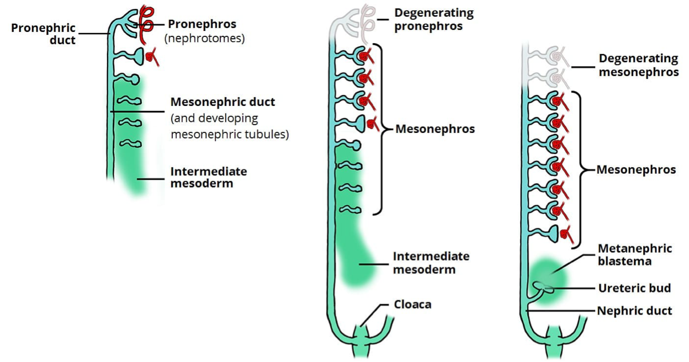
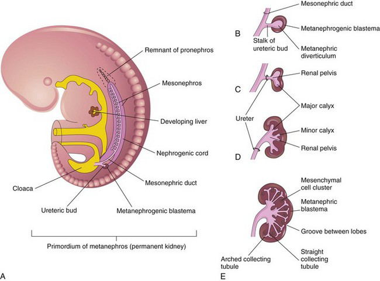
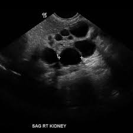
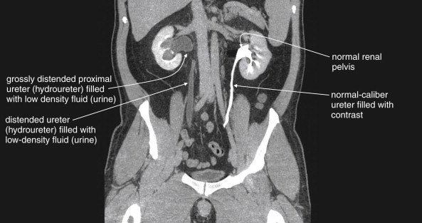
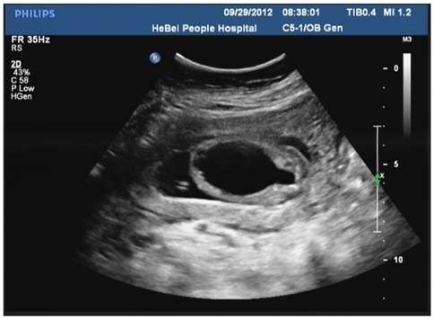
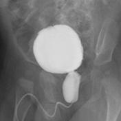

# Congenital Anomalies of the Kidney and Urinary Tract (CAKUT)

*Dr Nwangwa Innocent, Consultant Paediatrician, FMC Umuahia — Paediatrics, topic 36*

## Outline

Introduction · Epidemiology & risk factors · Embryology · Clinical manifestations · Classification · Renal parenchymal malformations · Migration & fusion anomalies · Collecting-system anomalies (PUJ, VUJ, PUV, MCDK) · Management · Complications · Prognosis · Prevention

## Introduction

**CAKUT** is a spectrum of **structural and developmental abnormalities of the kidneys and urinary tract from disrupted morphogenesis** — anomalies of the kidney parenchyma, collecting system, ureters, bladder and urethra.

> **20–30% of all prenatally diagnosed anomalies are CAKUT.** It is a major cause of paediatric morbidity and the **most common cause of chronic kidney disease (CKD) and end-stage kidney disease (ESKD) in children.**

## Epidemiology & risk factors

- Worldwide prevalence **~3–6 per 1000 births**. In Nigeria, hospital incidence of lower urinary tract anomalies **3.5/1000 LB**, upper tract **1.7/1000 LB**. Many are **asymptomatic** until complications occur.
- **Males more affected than females.** **30–50% of CAKUT patients develop ESKD**; if undetected in childhood, can cause adult hypertension and proteinuria.
- **Risk factors:** maternal gestational diabetes, maternal thalassaemia/haemochromatosis, increasing maternal age, maternal obesity, birth parity > 1, poly- or oligohydramnios, prematurity/low birth weight, male gender, chromosomal abnormalities, and associated syndromes (Alagille, Beckwith-Wiedemann, branchio-oto-renal, Frasier, Kallmann, etc.).

## Embryology

The fetal urinary system develops in the **first trimester** from **intermediate mesoderm**, through **three successive systems**:

- **Pronephros** — nonfunctional, week 4.
- **Mesonephros** — temporary (weeks 5–10); forms mesonephric tubules draining into the **mesonephric (Wolffian) duct**; mostly regresses (in males contributes to reproductive ducts; in females largely disappears).
- **Metanephros** — the **permanent kidney**, from week 10.

The **metanephros** develops from two tissues requiring **reciprocal induction**:

- **Ureteric bud** → ureter, renal pelvis, major & minor calyces, collecting ducts.
- **Metanephric mesenchyme** → nephrons.

**Bladder** — derived from the **cloaca**, divided by the urorectal septum into the anterior **urogenital sinus** (→ bladder and most of the urethra) and the posterior anorectal canal. The **trigone** derives from the mesonephric ducts (mesoderm) but is later lined by endoderm.

> **Nephrogenesis ceases at 36 weeks** — ~**1 million glomeruli** in each kidney.

## Clinical manifestations

Often **asymptomatic**. Otherwise: fever, vomiting, diarrhoea, poor feeding, poor weight gain, **poor urinary stream**, palpable abdominal mass, urinary incontinence, abdominal/flank pain, foul-smelling urine, reduced urine volume, other anomalies (**VACTERL**), electrolyte imbalance, delayed puberty, decreased height, pallor, and **high blood pressure**.

## Classification

CAKUT is complex, with variable phenotypes. It may be classified by:

- **Developmental origin:** renal parenchymal malformations · anomalies of renal migration · anomalies of the collecting system.
- **Clinical presentation:** **syndromic** (with defects outside the urinary tract, e.g. Townes-Brocks, branchio-oto-renal) vs **non-syndromic** (limited to the urinary tract).
- **Functional impact (radiologic):** **hydronephrotic/obstructive** (PUV, PUJ obstruction, prune belly) vs **non-hydronephrotic** (agenesis, hypoplasia, multicystic dysplastic kidney, bladder exstrophy).
- **Structure/type:** nephropathies vs uropathies.
- Kidney **dysgenesis:** agenesis, hypoplastic, dysplastic, aplastic.

## Renal parenchymal malformations

**Renal agenesis** — congenital absence of one or both kidneys.

- **Bilateral (Potter syndrome)** — **fatal**; main abnormality is **pulmonary hypoplasia**. ~1 in 4000 live births.
- **Unilateral** — ~1 in 500 live births, slight male predilection, usually **asymptomatic** with normal life expectancy.

**Multicystic kidney disease** — a **non-functioning renal unit** of **non-communicating cysts** with intervening solid tissue (fibrosis, primitive tubules, cartilage); **ureteral atresia** usually present.

## Migration & fusion anomalies

- **Renal ectopia** — a kidney fails to ascend from the true pelvis (rarely a superiorly ascended **thoracic** kidney). **Pelvic ectopia** increases the risk of PUJ obstruction, vesicoureteral reflux (VUR), and multicystic dysplasia.
- **Horseshoe kidney** — the **most common fusion anomaly**: renal parenchyma joined across the midline at the **isthmus**. Ureters course medially and anteriorly over the isthmus and generally drain well; obstruction, if present, is usually from **high ureteric insertion** in the renal pelvis.

## Anomalies of the collecting system

Include **PUJ obstruction, VUJ obstruction, posterior urethral valve (PUV), and duplicate collecting system.**

**PUJ obstruction** — partial obstruction of urine from the renal pelvis to the ureter; the **most frequent cause of fetal hydronephrosis**. Often asymptomatic/incidental; when symptomatic → recurrent UTIs, stones, palpable flank mass, and classically **intermittent pain after drinking large fluid volumes** (diuresis outstrips outflow). At high risk of renal injury even from minor trauma.

**Posterior urethral valve (PUV)** — also called congenital obstructing posterior urethral membranes (COPUM); the **most common congenital obstructive lesion of the urethra** and a common cause of obstructive uropathy in infancy.

- **Commonest obstructive uropathy in children; common in boys, ~1:5000–8000.** A congenital valve in the posterior urethra from a persistent urogenital membrane; associated with **renal dysplasia** (back-pressure).
- **Antenatal** (severe): bilateral hydronephrosis, persistently filled bladder, dilated posterior urethra (the **"keyhole sign"**), often **oligohydramnios**, SGA fetus.
- **Postnatal presentation** (commonest in developing countries): **neonate** — abdominal distension, poor urinary stream, respiratory distress, straining to void; **infant** — recurrent UTI/urosepsis, failure to thrive, poor stream; **older child** — poor stream, straining, daytime incontinence, features of CKD.
- **Surgical intervention is paramount** — valve ablation as soon as possible (antenatally, vesico-amniotic shunting for severe obstruction).

**Multicystic dysplastic kidney (MCDK)** — a non-functioning kidney replaced by large non-communicating cysts, **no renal cortex**, atretic ureter. **Unilateral, 2× more common in males**; associated with obstruction (PUJO/PUV), VUR, and syndromes (Meckel-Gruber). Usually detected on **antenatal ultrasound**.

## Management

**History and examination** (general; systemic — abdominal mass, palpable bladder).

**Investigations:** ultrasound (oligohydramnios, dysplasia), CT, MRI; **DMSA** (differential function, scarring; no function on the affected side in MCDK, contralateral hypertrophy); **MCUG/VCUG** (detects VUR, PUV); IVU; scintigraphy; urodynamics; **diuretic renogram** (urinary obstruction with persistent hydronephrosis); cystoscopy.

**Treatment:**

- **Conservative** — unilateral agenesis; cysts < 5 cm (high chance of involution). Follow up **BP, urinary protein, renal function**; ultrasound for cyst involution and contralateral growth — up to age 2, then at 5 years if normal.
- **Nephrectomy** if no involution by 2 years, hypertension, or infection.
- **RRT** (dialysis/transplant) for ESKD.
- **Surgical correction** — valve ablation, re-implantation, vesicostomy. **ALL children with PUV should have valve ablation as soon as possible.** Persistent bladder dysfunction, VUR and CKD demand **long-term follow-up even after ablation** (anticholinergics for an overactive, poorly compliant bladder).
- **Supportive** — correct electrolytes, treat sepsis, control BP, ensure adequate nutrition and growth monitoring.

## Complications

CKD (60% in dysplastic kidney), VUR, bladder dysfunction/incontinence, recurrent UTI, **malignancy** (Wilms tumour, adenocarcinoma, embryonal/carcinoma), hypertension, infection/bleeding/rupture of large cysts, stones and hydronephrosis (secondary PUJO), and death.

## Prognosis

- Severe CAKUT → **ESRD in infancy**; mild cases may reach ESRD by adolescence; **RRT** supports ESRD.
- **Bilateral agenesis is lethal** (pulmonary hypoplasia the commonest cause of death).
- **Good prognosis:** mild hydronephrosis, ectopic kidneys/ureters, solitary kidneys.

## Prevention

- **Primary** — preconception care, genetic counselling (family history/known syndrome), control of maternal disease (HTN, diabetes), avoid consanguineous marriage, adequate nutrition; in pregnancy: good glycaemic control, avoid teratogens/radiation, treat infection, **adequate folate**.
- **Secondary** — antenatal screening of all mothers (**18–22-week anomaly scan**), amniotic fluid assessment, renal ultrasound, DMSA, serum electrolytes/urea/creatinine.
- **Tertiary** — prompt UTI treatment, antibiotic prophylaxis, surgical correction, BP control, regular renal function tests, growth monitoring, **dialysis**.

## Conclusion

CAKUT is the leading cause of childhood CKD worldwide. Primary prevention is limited (genetic/sporadic causes), so **early antenatal detection and prompt postnatal evaluation** are crucial to prevent renal scarring, hypertension and CKD progression. **Early diagnosis and structured multidisciplinary management** are the cornerstone of preserving renal function.

## References

Medscape; Nelson Textbook of Paediatrics; Nkanginieme, Paediatrics and Child Health in a Tropical Region; lecture material of Dr Nwangwa Innocent.
