# Introduction to Nephrology / Investigations of the Renal System

*Dr Nwangwa Innocent, Consultant Paediatrician, FMC Umuahia — Paediatrics, topic 13*

## Outline

Introduction · Basic anatomy of the kidneys · Functions of the kidney · Common renal disorders · Features of renal disorders · Investigations in nephrology · Conclusion · References

## Introduction

**Nephrology** is the branch of paediatrics responsible for the **diagnosis, evaluation and management of the disorders of the kidneys and urinary tract in children**.

It focuses on **kidney health and diseases**, and covers a wide range of disorders including **glomerular and urinary tract diseases** — glomerulonephritis, AKI, CKD, nephrotic syndrome, hypertension, acid-base disorders, CAKUT, UTI etc.

### A nephrologist should be able to

- Evaluate and diagnose renal pathology
- Institute appropriate treatment
- **Monitor growth and development** in children with kidney disorders
- Provide **renal replacement therapy**
- **Educate and counsel families** on reno-prevention and long term care

## Basic anatomy

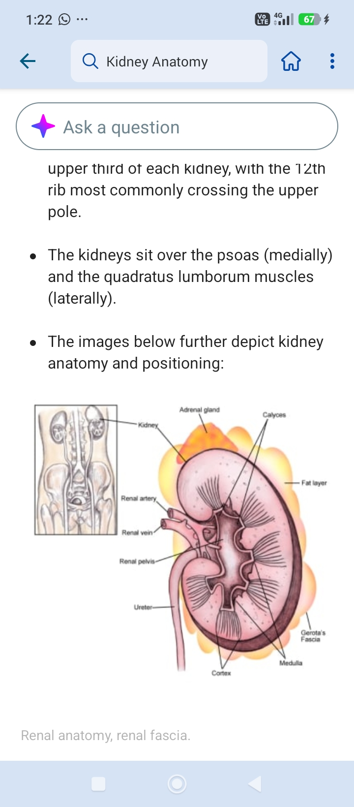

- **Paired, bean-shaped, retroperitoneal organs** located between **T12–L3** vertebrae, with the **left kidney being more superior than the right**
- Covered by the **renal fascia — Gerota's fascia**
- Weigh about **150 g in males and 135 g in females**
- About **10–12 cm in length, 5–7 cm in width, 2–3 cm in thickness**

### Blood supply and innervation

- Receives about **20% of cardiac output**, from the paired **renal arteries at the level of L2**
- **Venous drainage** by the renal veins
- **Lymphatic drainage** via renal lymphatics
- Receives **both sympathetic and parasympathetic** innervation:
  - **Sympathetic** arises from the spinal cord at **T8–L1**
  - **Parasympathetic** comes from the **vagus nerves**
  - These cause **vasoconstriction and vasodilation** respectively

### Structure

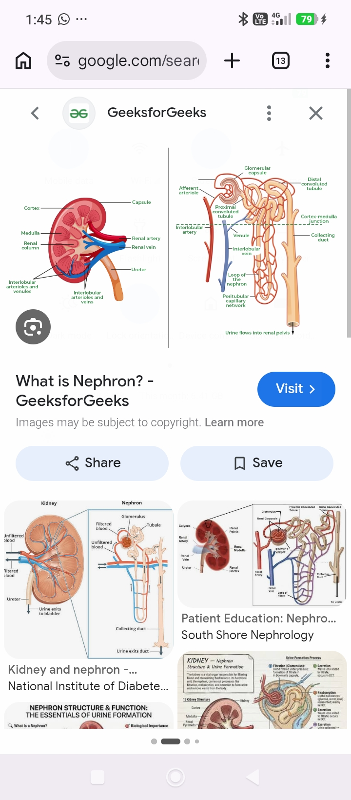

Divided into the **cortex** and **medulla**. The **functional unit is the nephron**, made of:

- **The renal corpuscle** — glomerulus and Bowman's capsule
- **PCT** — located in the renal cortex
- **Descending loop of Henle** — from cortex to medulla
- **Ascending limb**
- **Distal convoluted tubule** — cortex
- **Collecting duct** — from cortex, passes through medulla to renal pelvis

## Functions of the kidneys

1. **Filtration and excretion of metabolic waste products**
2. **Fluid and electrolyte balance**
3. **Blood pressure regulation**
4. **Endocrine function**
5. **Acid-base homeostasis**
6. **Regulation of red blood cell production**
7. **Calcium and bone metabolism**

## Common renal disorders

- **CAKUT**
- **UTI**
- **Nephrotic syndrome**
- **AGN**
- **AKI**
- **CKD**
- **Vesicoureteric reflux (VUR)**
- **Haemolytic uraemic syndrome**
- **Renal tubular disorders**

## Risk factors for renal disorders

- Drug toxicity
- Family history / genetics
- Obesity
- Hypertension
- Prematurity
- Diabetes
- Autoimmune disorders

## Clinical features of renal disorders

- **Oliguria / anuria**
- **Oedema**
- **Haematuria**
- **Proteinuria**
- **Hypertension**
- **Electrolyte imbalance**
- **Lower abdominal pain**

## Investigations in nephrology

### Rationale

- To **confirm a clinical diagnosis**
- To **assess structural and functional integrity** of the kidneys/urinary tract
- To **assess the severity and extent** of the disease
- **Prognostication**
- To **exclude other co-morbidities**

> **Consideration to diagnostic value, availability, cost and sustainability is very important.**

### Classification of investigations

1. Urine examinations
2. Blood investigations
3. GFR estimation
4. Assessment of tubular function
5. Imaging
6. Biopsy
7. Bladder function assessment

## Urine examination

An important **non-invasive** test.

**Diagnostic yield depends on method of collection, preparation and testing.**

Samples should be **examined freshly** to avoid **disintegration of cellular elements and bacterial overgrowth**. Urine can be **stored in the refrigerator at 4 °C**.

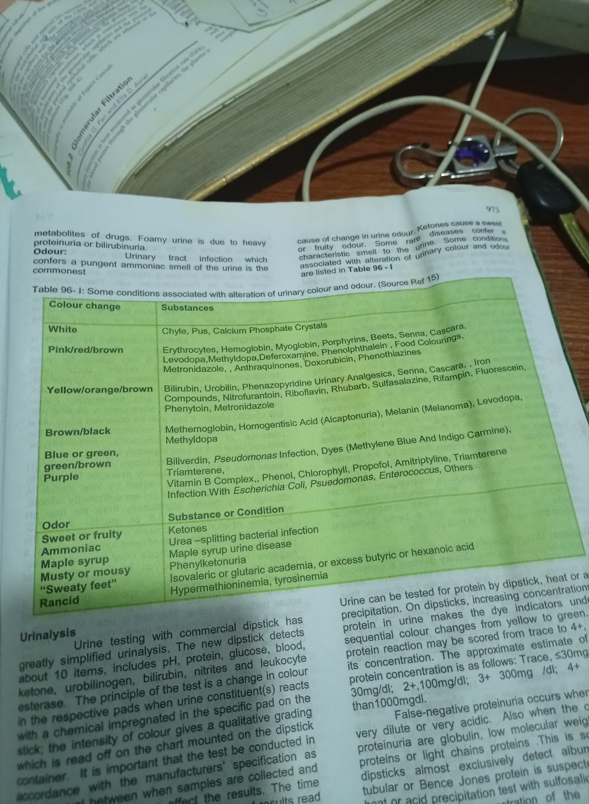

### Methods of urine collection

- **MSU** (with a long bladder time)
- **Clean catch method**
- **Bagging** — associated with **high risk of contamination**; the bag must be removed as soon as urine is passed. *Important for its negative predictive value*
- **SPA (suprapubic aspiration)** — **most reliable**, useful in children **less than 2 years**
- **Catheterization**
- **Use of mid-stream urinary collector**

### Interpretation of culture

> **Interpretation of the culture report depends on the method of urine collection.**

- **SPA** — **any growth is significant**, because bladder urine is supposed to be sterile
- **CSU** — **≥ 10⁴ CFU/mL** considered significant
- **MSU** — **≥ 10⁵ CFU/mL** considered significant (a second or repeat urine sample may be required for diagnosis, particularly if there are no referable symptoms and signs to the urinary tract)

| Method | Finding |
|---|---|
| **Suprapubic aspiration** | If a UTI is present, bacteria are likely to be proliferating in bladder urine, with **growth of any organism** except 2,000–3,000 CFU/mL coagulase-negative staphylococci |
| **Catheterization in a girl, or midstream clean-void in a circumcised boy** | Febrile infants and children with UTI usually have **> 50,000 CFU/mL** of a single urinary pathogen; however UTI may be present with 10,000–50,000 CFU/mL of a single organism |
| **Midstream clean-void in a girl or uncircumcised boy** | UTI is indicated when **> 100,000 CFU/mL** of a single urinary pathogen is present in a symptomatic patient. **Pyuria usually present.** A UTI may be present with 10,000–50,000 CFU/mL of a single bacterium |
| **Any method in a girl or boy** | If the patient is **asymptomatic**, bacterial growth is usually > 100,000 CFU/mL of the same organism on different days. **If pyuria is absent, this probably indicates colonization rather than infection** |

> Patients with **urinary frequency** (i.e. decreased bladder incubation time) are those most likely to have bacteria proliferating in the urinary bladder in the presence of **low colony counts**.

### Routine dipstick

**Leukocyte · Nitrite · Protein · pH · Blood · Specific gravity · Ketone · Bilirubin · Glucose · Ascorbic acid · Urobilinogen**

**Principle:** based on the **change in colour in the respective pads** when urine constituents react with a chemical impregnated in the specific pad on the strip. The **intensity of colour gives a qualitative grading** which is read off the chart on the container.

> **Quality of result depends on strict adherence to the manufacturer's instructions.**

### Other urine examinations

**Urine macroscopy** — appearance (pale to dark yellow and amber), any colour change, odour

**Urine microscopy** — RBC, WBC, cast, crystal

**Urine culture and sensitivity**

**Spot urine protein creatinine ratio**

### Estimate of urine protein concentration

| Dipstick | Concentration |
|---|---|
| **Trace** | **< 30 mg/dL** |
| **+** | **30 mg/dL** |
| **2+** | **100 mg/dL** |
| **3+** | **300 mg/dL** |
| **4+** | **> 1000 mg/dL** |

### False results in proteinuria

**False NEGATIVE proteinuria**

- **Dilute** or **very acidic** urine
- Proteinuria from other proteins

**False POSITIVE proteinuria**

- **Concentrated** urine
- **Alkaline** urine
- **Gross haematuria**
- **Delay in reading**
- **Urine contamination** with vaginal secretions or antiseptic

## Blood tests

- **Se/U/Cr**, calcium, phosphate, magnesium, **vitamin D assay**
- **FBC, MP, ESR**
- **Arterial blood gases**
- **Immunologic tests:**
  - **C3, C4, CH50**
  - **ASO titre**
  - **Anti-DNAse B**
  - **IgG, IgA** — SLE, JRA
  - **ANCA** — Wegener granulomatosis, crescentic glomerulonephritis
  - **Hormonal profile** — T3, T4, TSH

## Estimation of GFR

**Purpose:** to **assess renal function**, **detection of renal disease**, **severity assessment**, and **prognostication**.

> **There is no perfect substance for its measurement.**

### Commonly used markers

**Inulin · polyfructose · Cr-EDTA · creatinine · cystatin C · urea**

### The ideal marker should

- Be **freely filtered at the glomerulus**
- Be able to **achieve a stable plasma concentration**
- **Not be reabsorbed, secreted or metabolized** by the kidney

### Why creatinine is not ideal

- It is **secreted in the proximal tubule**
- Its concentration is **influenced by age, sex, height and dietary protein**

**Creatinine clearance is the most widely used**, done using a **timed urine collection (24 or 6–12 hours)**.

### Why urea is not ideal

- It is **reabsorbed by the renal tubules**
- Plasma level is **affected by dietary protein intake and state of hydration**

### The Schwartz formula

> **GFR (mL/min/1.73 m²) = 0.413 × height (cm) / serum creatinine (mg/dL)**

GFR is expressed **per 1.73 m²** — the **average body surface area of an ideal adult**.

## Assessment of renal tubular function

### Fractional excretion of electrolytes/solutes

The **ratio of the urine concentration of the solute × plasma concentration**, divided by the **ratio of urine creatinine concentration to plasma creatinine concentration**.

> **FENa (%) = quantity of Na excreted / quantity of Na filtered × 100 = (UNa × Pcr) / (PNa × Ucr) × 100**

**Extracellular fluid volume normally determines the urinary Na excretion.**

- **FENa ≤ 1** in **normovolaemia and pre-renal AKI**
- **FENa > 1** in **impaired tubular transport, e.g. ATN**

### Other tubular function tests

**Concentrating ability test** — osmolality, pH

**Water deprivation test** — to differentiate between **central DI and nephrogenic DI**

**Diluting ability test** — for assessment of **unexplained hyponatraemia**

**Urine acidification test** — serial urine pH, bicarbonate excretion, titratable acid, NH₃ excretion, and **ammonium chloride challenge test**

## Renal imaging

### Ultrasonography (abdominal USS KUB)

**Ultrasonography makes use of sound waves beyond the human auditory capability (> 20 kHz).**

- Sound wave is **produced by the transducer**, and the **reflected sound wave is also received by the transducer**
- The received echoes are **converted to electrical impulses** by the transducer
- The electrical impulses are subsequently **displayed as images on the monitor**

**Has become a routine imaging modality.** Varied uses:

- Investigating **causes of urinary tract infections**
- Checking for **causes of urinary tract obstruction**
- Diagnosing **kidney stones / masses / cysts / tumours**
- Evaluating **congenital urinary tract abnormality**
- Assessing **kidney injury from trauma**
- Monitoring **kidney transplant status** or vascular issues

**Merits of ultrasonography:**

- **No ionizing radiation**
- **Real time images**
- **Readily available**
- **Relatively cheap**
- **Portable, point-of-care option**

**Demerits of ultrasonography:**

- **Cannot see through compact bone** (posterior acoustic shadow)
- **Gas distorts image**
- **User dependence**
- **Depth limitation**

### Radiographic imaging

Plain film · intravenous urography · voiding cysto-urethrography · antegrade and retrograde pyelography · renal arteriography

#### Plain film

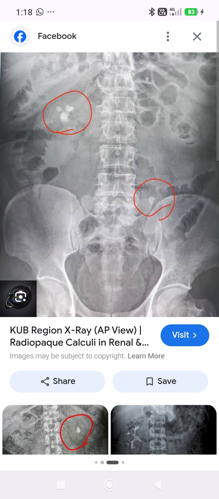

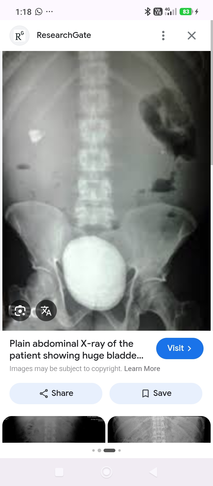

- For diagnosis of **nephrocalcinosis**, **radio-opaque stones** in pelvis, ureters and bladder
- Diagnosis of **congenital spinal abnormalities** with urinary symptom manifestation
- **Before injecting contrast material** for intravenous urography
- **Declining with the advent of USS**

#### Intravenous urography (IVU)

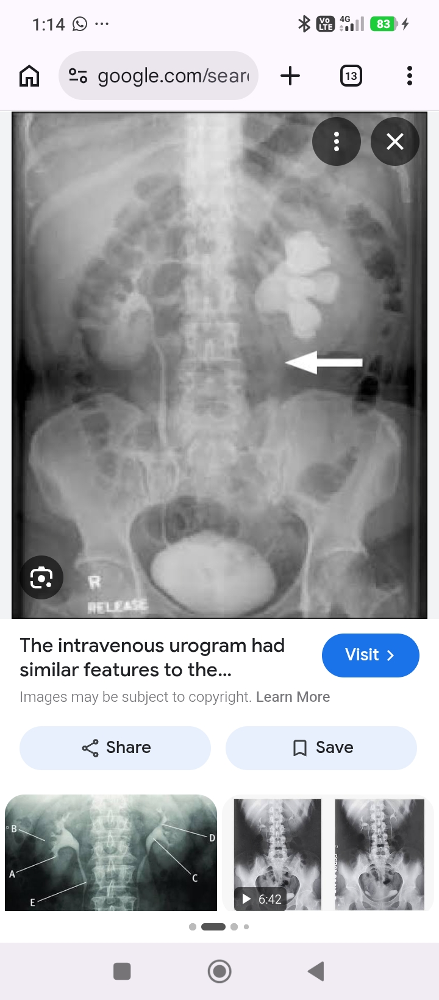

- To **demonstrate anatomy of the urinary tract**, as it can give details of the **calyces and ureters**
- In the diagnosis of **occult duplex kidney, malrotation, site of urinary tract obstruction and calculi**
- Can **detect renal scars**
- **Demerits:** high radiation exposure, low sensitivity for renal scar detection, potential reaction to contrast; **not used in neonates, young infants and patients with renal failure**

#### Voiding cysto-urethrography (VCUG)

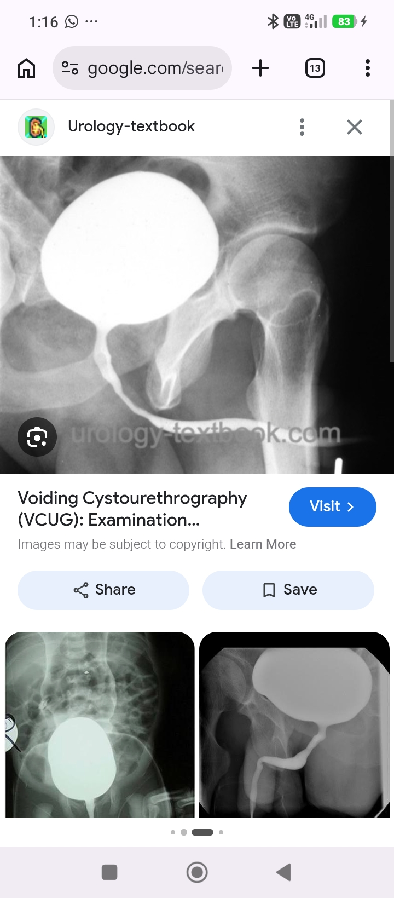

- **Definitive method for demonstrating the lower urinary tract**
- **Gold standard for diagnosing and grading VUR and PUV obstruction**
- Makes use of **contrast injected into the bladder** to the upper tract
- **Films are taken during instillation, voiding and post-voiding**

**Indications for VCUG:**

- Suspected ureteric dilatation
- Small contracted kidneys
- Renal failure of indeterminate cause
- Terminal haematuria
- Voiding difficulties
- Thick walled bladder seen by US

**Demerits:** high dose of radiation, risk of UTI

### Radioisotope studies

**Dynamic renography** — uses radioisotopes like **technetium-labelled diethylene-triamine penta-acetic acid (Tc-DTPA)** and **Tc-mercapto-acetyl-triglycine (Tc-MAG3)**

**Uses:**

- Determining **differential renal function**
- **Indirect voiding cystography**
- Evaluation of **post-transplantation state**
- Evaluating **surgical treatment** involving the kidneys

**Has low dose of radiation.** **Demerits:** poor visualization of renal cortex, and cannot be used to evaluate renal size or morphology.

**Static renal scan:**

- In **renovascular diseases** and **dribbling urinary incontinence**
- **Location of ectopic/absent kidney**
- **Detection of renal scars**
- **Acute phase of pyelonephritis** — to demonstrate parenchymal involvement
- To detect **focal parenchymal abnormalities**

**Drawback:** time-consuming; does not give information on function of the urinary tract.

### Computerized tomography (CT)

- **Indications similar to that of USS**
- Gives **clearer resolution**
- Can detect **fine calcifications** within the renal parenchyma and collecting system
- **With contrast enhancement**, can evaluate **masses in the pelvis or bladder**, e.g. **Wilms tumour**
- **Expensive**; **risk of exposure to considerable radiation**

### Magnetic resonance imaging (MRI)

- For **detailed evaluation of complex urinary system disorders**
- Gives **excellent pelvic floor details**
- Good for **renal masses and cystic lesions**
- **No radiation exposure**
- **Heavy sedation needed**

## Renal biopsy

**Renal biopsy** is the process of **obtaining tissue from the kidney in an individual for the purpose of histopathological evaluation**.

### Types

- **Percutaneous**
- Transvenous or transjugular
- Laparoscopic
- Open surgical approach

> **The percutaneous approach is preferred by the paediatric nephrologist.**

### Renal biopsy needles

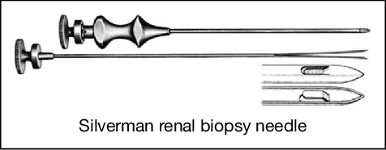

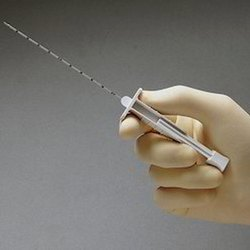

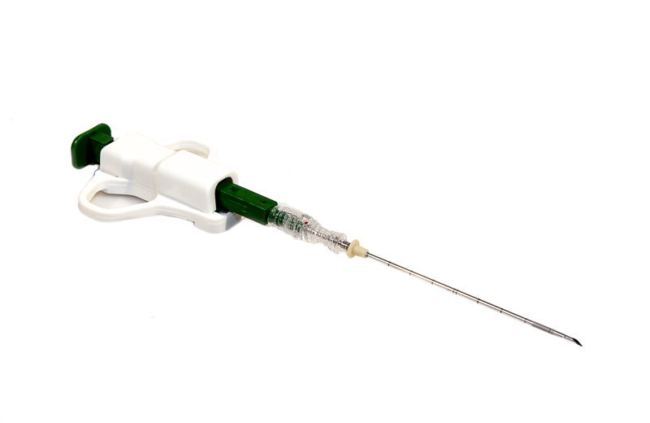

- **Vim-Silverman needle**
- **Manual Tru-cut biopsy needle**
- **Semi-automatic Tru-cut biopsy needle**

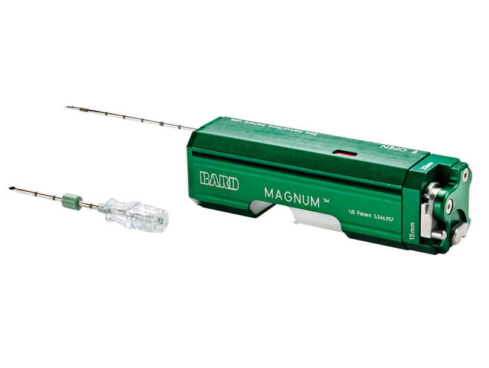

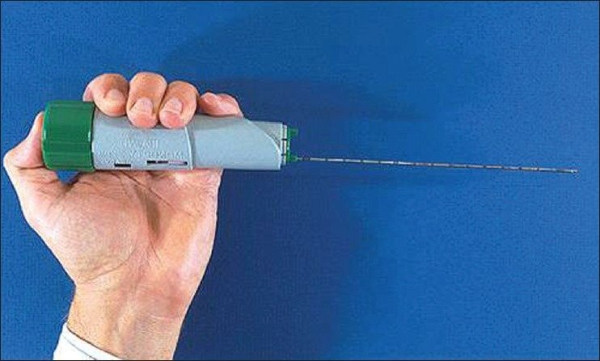

- **Tru-cut spring-loaded automatic biopsy system**

### General indications for renal biopsy

- **Establishment of the exact diagnosis**
- As an aid to **determine the nature of recommended therapy**
- To help **decide when treatment is futile**
- To ascertain the **degree of active (potentially reversible) and chronic changes (irreversible)**
- **Follow up** of treatment or disease
- **Research**

> **Prognostication based on kidney pathology alone may be affected by sample size, especially in focal lesions — biopsies with glomeruli < 5 may not be accurate.**

### Indications by condition

**Nephrotic syndrome**

- Age **< 1 or > 7 years**
- **SRNS** (steroid-resistant nephrotic syndrome)
- Those with **evidence of nephritis** — hypertension, haematuria, low C3, or decreased renal function persisting despite volume correction

**Acute glomerulonephritis**

- **Course not typical of PSAGN**
- **HSP or SLE**
- Assessment of **severity of injury**, to guide therapy and prognosis
- **Differentiation of specific types of proliferative lesions** e.g. MPGN, C3 glomerulopathies including dense deposit disease and C3-dominant GN
- **Recurrent persistent haematuria, proteinuria**

**AKI**

- **Unexplained AKI** — when pre- and post-renal causes are excluded
- AKI associated with **nephritis, nephrotic syndrome, evidence of vasculitis or systemic disease** — biopsy usually performed
- **Persisting ATN** when the cause remains uncertain after complete evaluation
- **Suspected RPGN** — determination of cause, activity and chronicity
  - **Serology:** anti-GBM antibody, ANCA — screening test for necrotizing vasculitides
  - **Immunofluorescence:** p-ANCA, c-ANCA, MPO or PR3

**CKD**

- **When kidneys are not shrunken**
- Diagnosis of primary disease
- Assessment of severity of morphologic lesions
- Determination of **risk of recurrence in eventual renal transplant**
- Suitability of **deceased versus living-related donor transplantation**

**Systemic diseases**

- To assess **severity of renal disease** e.g. SLE, atypical HUS
- Patients with **diabetes with a clinical course atypical of diabetic nephropathy**

**Renal transplant**

- **Acute rejection**
- **Recurrence of kidney disease**
- **Calcineurin toxicity**
- Some infections
- **Chronic allograft rejection**

### Conditions NOT requiring renal biopsy

- **Isolated glomerular haematuria (microscopic)**
- **Isolated non-nephrotic haematuria**
- **Childhood nephrotic syndrome age > 1 yr and < 7 yrs**
- **Frequently relapsing nephrotic syndrome**

### Analysis — specimen transport medium

| Examination | Transport medium |
|---|---|
| **Light microscopy** | **10% buffered formalin** |
| **Immunofluorescence** | **Michel's transport media** |
| **Electron microscopy** | **Glutaraldehyde** |

### Contraindications to renal biopsy

- **Uncorrectable bleeding diathesis** — **ABSOLUTE contraindication**
- **Uncontrolled hypertension**
- **Active renal or peri-renal infection**
- **Hydronephrosis**
- **Obesity**
- **Ascites**
- **Small shrunken kidneys**
- **Tumours, large cysts, abscesses, or pyelonephritis**
- **Solitary, ectopic, or horseshoe kidney**
- **Uncooperative patient**
- **Skin infection over the biopsy site**
- **When a skilled operator or appropriate pathology support is not available**

### Patient preparation

- Patient should be **admitted at least the day before** the procedure
- **History** — bleeding disorders
- Ensure patient is **not on warfarin, any anticoagulant or antithrombotic agent**, and has had **no aspirin or other NSAID for at least 7 days**
- **Check blood pressure** — hypertension should be **controlled before biopsy**
- Patient/parents to be **informed of the procedure, risks explained, and consent obtained**

**Investigations before biopsy:**

| Test | Requirement |
|---|---|
| **PCV** | **> 24–30%** |
| **FBC — platelet count** | **at least 100,000/mm³** |
| **PT** | Coagulation profile |
| **INR** | **< 1.2** |
| **APTT** | **< 2× control or < 40 secs** |
| **E&U and creatinine** | |
| **Abdominal USS KUB** | to assess if patient has **two kidneys**, kidney sizes etc |
| **Urinalysis, urine m/c/s** | |
| **Group and cross-match** | **1 unit of blood** |

**Further preparation:**

- If the child is on **haemodialysis**, the procedure should be done **after at least 24 hours** of the last dialysis session
- For patients with **prolonged bleeding time (> 8–10 minutes**, e.g. in SLE, azotaemia), **IV desmopressin 0.3 µg/kg 30 min prior**, or **intranasal DDAVP 2–4 µg/kg 2 hours before** the procedure, may be considered

### Premedication

- **NPO 4 hours before** the procedure, and commence **5% D/W at maintenance**
- **Local anaesthesia and sedation**
- **Sedation** — most widely used: **1–2 doses of midazolam (0.1 mg/kg)** and **ketamine 0.5–1.0 mg/kg** (with anaesthetist)
- **± IV atropine 0.01 mg/kg**, 1–2 minutes after midazolam

### Procedure

**Persons in attendance:** paediatric nephrologist, radiologist, pathologist (presence of radiologist or pathologist may vary across centres)

**Position:**

- **Prone** position for biopsy of **native kidney**
- **Supine** position for **graft kidney**
- In conditions like **abdominal distension and ascites**, the biopsy can be done in the **lateral decubitus** position

**During:** oxygen saturation, heart rate and blood pressure monitoring

- **The LEFT kidney is usually biopsied**
- Identify the **lower pole** of the kidney under **real-time USS**, and determine the skin entry point
- Clean skin with **methylated spirit and povidone iodine**
- Give local anaesthesia with **1% lignocaine** (under USS guidance)
- Make a **nick on the skin** at the site of entry
- **Advance the biopsy needle under real-time ultrasound guidance into the cortex** of the kidney
- **16G versus 18G needle**
- **Sample is obtained from the renal CORTEX**
- **2–3 passes**
- **The core can be examined for the presence of glomeruli**

### Post-biopsy instructions

- Do a **post renal biopsy clinical evaluation**
- **Monitor vital signs** — BP, heart rate, respiratory rate, temperature: **¼ hourly for 1 hour, half hourly for 2 hours, hourly for 4 hours, then 4 hourly for 24 hours**
- **Keep urine rack**
- **IV fluids 10% dextrose** at maintenance requirements
- **Fluid input and output monitoring**
- Patient can eat as soon as fully conscious
- **Watch out for gross haematuria, abdominal pains, or flank pains**

### Complications

- **Significant haematuria**
- **Anaemia and hypotension**
- **Bowel or solid organ perforation / laceration**
- **Loss of a kidney**
- **Death**
- **AV malformation**
- **Hypertension**
- **Persistent loin pain**

## Evaluation of bladder function — urodynamic studies

**Urodynamic studies** are investigations done to **evaluate the anatomy and physiology of the lower urinary tract**, especially the **filling and emptying of the bladder and urethra**.

**Useful in:**

- **Neurogenic bladder**
- **Urinary incontinence**
- **Voiding dysfunction**
- **VUR**
- **Anorectal malformations**

**Non-invasive studies:**

- **Uroflow study / uroflowmetry** — measures **urine speed and volume**
- **Post-void residual urine estimation**

**Invasive studies:**

- **Cystometry studies**
- **Pressure flow study**
- **Electromyography**

## Conclusion

- Nephrology is an important aspect of paediatrics
- **Understanding of renal physiology is invaluable** in recognizing and managing renal disorders
- **Various investigations and imaging are indispensable** in making diagnosis, patient monitoring and prognostication

## References

- Nelson's Textbook of Paediatrics, 21st edition
- Paediatrics and Child Health in Tropical Region — Azubuike and Nkanginieme
- Medscape
