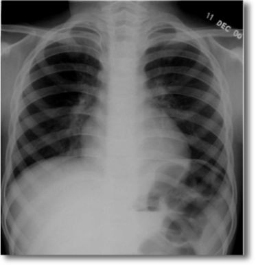
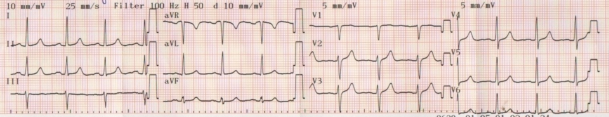
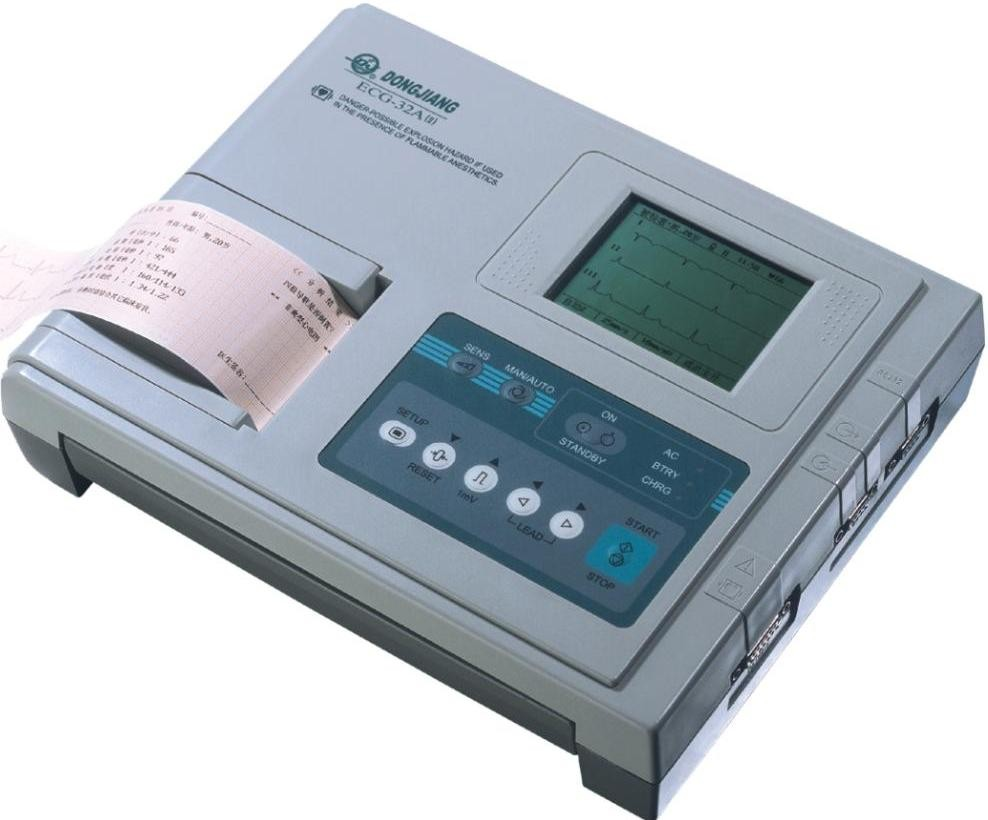
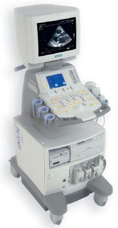
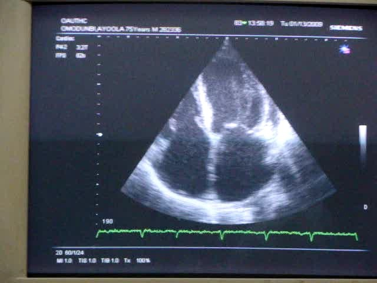

# Investigations in Cardiology — Simplified

**One line:** twelve tests, and the trick is knowing which question each one answers.

---

## What are they for?

**Tests or procedures for evaluation of cardiovascular diseases**, done at the **bedside** and/or in **laboratories**.

**Seven objectives — remember the pattern:**

1. Establish the **diagnosis**
2. Determine the **aetiology**
3. Identify the **risk factors**
4. Detect the **complications**
5. Monitor **disease progression**
6. Evaluate **co-morbidities**
7. Make a **prognosis**

> Notice: only the first one is about *what* the disease is. The other six are about *why, how bad, and what next*.

---

## The 12 investigations

| | Investigation |
|---|---|
| 1 | Chest X-Ray |
| 2 | Electrocardiogram |
| 3 | Electrophysiological Studies |
| 4 | Echocardiography |
| 5 | Cardiac MRI |
| 6 | Cardiac Catheterization |
| 7 | Coronary Arteriography |
| 8 | Cardiac Enzymes and Troponins |
| 9 | BNP |
| 10 | Lipid Profiles |
| 11 | Blood Sugar |
| 12 | Electrolytes, Urea and Creatinine |

---

## The one classification you must know

**NON-INVASIVE** — limited to the **body surface**

> Standard 12-lead ECG · **transthoracic** echo

**INVASIVE** — involves **penetration of the vascular system or body tissues**

> Electrophysiological studies · cardiac catheterization · **transoesophageal** echo · angiography

> **The catch:** echo appears in BOTH. Transthoracic = non-invasive. Transoesophageal = invasive.

---

# 1. CHEST X-RAY

Uses **ionizing radiation**.

Studies **cardiac structure** and **changes in the pulmonary circulation of cardiac origin**.

**Uses:**

- Diagnose **cardiomegaly**
- Identify heart disease features — hypertension, heart failure, cardiomyopathy, congenital heart disease, pericardial effusion, coarctation of aorta, valvular and pericardial calcification
- Diagnose **acute pulmonary oedema**
- Identify **precipitants** of heart failure, e.g. chest infection

---

## CARDIOMEGALY — the two numbers

> **1. Cardiothoracic ratio (CTR) > 50%**
>
> **2. Maximum transverse cardiac diameter > 15.5 cm**

**CTR** = maximum transverse **cardiac** diameter ÷ maximum internal diameter of the **thoracic cage**, as a percentage.

---

# 2. ECG

**The graphical record of the electrical activities of the heart obtained at the body surface.**

### Three forms

| Form | Key facts |
|---|---|
| **Standard 12-lead** | 12 leads · at rest · **10–20 seconds** · most widely used |
| **Holter / ambulatory** | **24 hours** |
| **Stress ECG** | during **exercise** |

---

### The 14 indications — grouped so you can recall them

**Structure:** chamber abnormalities (ventricular hypertrophy, left atrial abnormality) · congenital heart disease · cardiomyopathies

**Rhythm:** arrhythmias · heart blocks (AV, bundle branch) · pre-excitation (**WPW**) · cardiac arrest

**Blood supply:** ischaemic heart disease

**Inflammation:** myocarditis · pericardial disease

**Outside the heart:** electrolytes (**hyperkalaemia, hypokalaemia**) · drugs (**digoxin toxicity**) · **pulmonary embolism** · **cor pulmonale**

---

# 3. ELECTROPHYSIOLOGICAL STUDIES

**Invasive.** For **arrhythmias** and **pre-excitation syndromes** such as **WPW**.

---

# 4. ECHOCARDIOGRAPHY

**Cardiac imaging using ultrasound** — also called cardiac ultrasound.

**Two forms:**

- **Transthoracic** — probe on the **body surface** → non-invasive
- **Transoesophageal** — probe in the oesophagus, **very close to the heart** → invasive

**Uses:** evaluate cardiac **structures, functions and dysfunctions** · establish **diagnosis** · detect **complications**

**10 indications:** hypertensive · congenital · rheumatic · valvular · **infective endocarditis** · cardiomyopathies · **pericardial effusion** · ischaemic · heart failure · **cardiac masses** (intramural thrombus, atrial myxoma)

---

# 5. CARDIAC MRI

- **Powerful magnetic field** aligning **hydrogen atoms in water**
- **NO ionizing radiation**
- Studies **cardiac structure**
- **GOLD STANDARD for left ventricular hypertrophy**

---

# 6. CARDIAC CATHETERIZATION

**Invasive** — catheter through the **veins into the heart** under **fluoroscopy**.

- Evaluates **intracardiac pressures**
- Also **therapeutic** — valvular lesions, ASD/VSD

---

# 7. CORONARY ARTERIOGRAPHY

**Invasive** — uses **contrast agents** to evaluate the **coronary arteries**.

For **coronary artery disease**.

---

# 8. CARDIAC ENZYMES AND TROPONINS

**Markers of myocardial injury. Elevated in myocardial infarction.**

**Enzymes:** **CK** (creatine phosphokinase) · **AST** · **LDH**

**Troponins:** **troponin I** and **troponin T**

---

# 9. BNP AND NT-proBNP

| | Amino acids | From |
|---|---|---|
| **BNP** | **32** | the **ventricles** |
| **NT-proBNP** | **76** | co-secreted with BNP |

**Both:** screening and **diagnosis of heart failure** · very useful for **prognosis**

---

# 10–12. THE SUPPORTIVE TESTS

> These detect **risk factors, complications or co-morbidities** — not the heart disease itself.

**Lipid profile (fasting):** **TC · LDL · HDL · TG**

**Blood sugar:** exclude diabetes — **FBS** and **2HPPS**

**Electrolytes, urea, creatinine:** Na⁺, K⁺, Ca²⁺, HCO₃⁻ — to (1) exclude electrolytes as the cause of the cardiac dysfunction, and (2) detect renal disease

---

## The fastest way to remember all twelve

**Structure:** CXR · Echo · Cardiac MRI

**Electrics:** ECG · Electrophysiological studies

**Plumbing (invasive):** Catheterization · Coronary arteriography

**Blood — damage:** Enzymes & troponins · BNP

**Blood — background:** Lipids · Sugar · E/U/Cr
