# System Examination (CVS) — History Taking & Physical Examination of the Cardiovascular System in Paediatrics

*Dr Oji-Onuoha S.N. — Paediatrics, topic 21*

## Outline

The seven diagnostic questions · Perinatal, maternal and family history · General examination · The CVS examination sequence · Pulse · Blood pressure · JVP · Inspection and palpation of the precordium · Percussion · Auscultation — heart sounds, added sounds and murmurs · Dynamic auscultation · The examination check-off · References

## The seven questions the history must answer

A cardiovascular history in a child is really an attempt to answer **seven questions in order**:

1. **Are there symptoms of heart disease?**
2. **Is it congenital or acquired?**
3. **If congenital, is it cyanotic or acyanotic?**
4. **If cyanotic, what is the actual CHD?**
5. **If acyanotic, what is the actual CHD?**
6. **Is it rheumatic fever or rheumatic heart disease — and which valves?**
7. **Are there any complications?**

### 1. Symptoms of heart disease

- Feeding difficulties, poor weight gain, irritability, excessive crying
- Bluish extremities, excessive perspiration
- Wheezing, noisy laboured breathing, frequent respiratory tract infections
- Oliguria, breathlessness, fatigue and weakness
- Cough, chest pain, swelling of feet
- Joint pain, painful swelling in finger pulps
- Syncope, involuntary movements, haemoptysis

### 2. Congenital or acquired?

- **Congenital** — symptoms **from infancy**; feeding difficulties, failure to thrive, recurrent hospital admissions
- **Acquired** — e.g. **rheumatic fever**: fever, joint pain, chorea

### 3. If congenital — cyanotic or acyanotic?

Consider **why cyanosis occurs**, the **types of cyanosis**, which type is present in cyanotic CHD, and **how to differentiate** central from peripheral cyanosis.

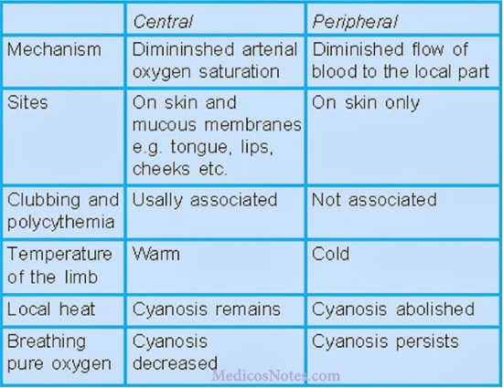

| | Central cyanosis | Peripheral cyanosis |
|---|---|---|
| **Mechanism** | Diminished arterial oxygen saturation | Diminished flow of blood to the local part |
| **Sites** | Tongue, lips, cheeks (mucous membranes) | Skin only |
| **Clubbing/polycythaemia** | Usually associated | Not associated |
| **Temperature of limb** | Warm | Cold |
| **Effect of local heat** | Cyanosis remains | Cyanosis abolished |
| **Breathing pure oxygen** | Cyanosis decreased | Cyanosis persists |

### 4. If cyanotic CHD — which one?

Classified by **pulmonary blood flow (PBF)**, and confirmed by **murmurs, changes in heart sounds and investigations**:

- **Decreased PBF** — TOF, tricuspid atresia, TGA (with PS), single ventricle with PS
- **Increased PBF** — truncus arteriosus, TAPVC, single ventricle without PS

### 5. If acyanotic CHD — which one?

- **Volume overload (shunt)** — ASD, VSD, PDA
- **Pressure overload (obstruction)** — PS, AS, CoA

### 6. Rheumatic fever or RHD?

Which valves are involved? Is there evidence of **pericarditis or myocarditis**?

### 7. Complications

- **CCF** (congestive cardiac failure)
- **Infective endocarditis**
- **Pulmonary hypertension**

## Nada's criteria for the presence of heart disease

**Major**

- Systolic murmur grade III or more in intensity
- Diastolic murmur
- Cyanosis
- Congestive heart failure

**Minor**

- Systolic murmur grade II or less in intensity
- Abnormal second sound
- Abnormal ECG
- Abnormal CXR
- Abnormal BP

> **The presence of 1 major or 2 minor criteria suggests the presence of heart disease.**

## Perinatal, maternal and family history

**Perinatal** — was the mother immunized against rubella before delivery? Was she scanned antenatally? History of fever with rash in the 1st trimester, or painful swelling behind the ear?

### Maternal conditions and the defects they predict

| Maternal condition | Heart defects |
|---|---|
| **Diabetes** | TGA, VSD, PDA, HOCM |
| **SLE** | Congenital heart block |
| **Phenylketonuria** | TOF, VSD, ASD, PDA, CoA |

### Teratogenic drugs and the defects they cause

| Drug | Cardiac defect |
|---|---|
| **Sodium valproate** | CoA, HLHS, AS, VSD |
| **Hydantoin** | PS, ASD, VSD, PDA |
| **Alcohol** | VSD, PDA, ASD, TOF |
| **Thalidomide** | TOF, ASD, VSD, TA |
| **Lithium** | Ebstein's anomaly |
| **Amphetamines** | ASD, VSD, PDA, TGA |
| **Indomethacin** | Intrauterine closure of PDA |
| **Vitamin A** | TOF, TGA, TA |
| **Vitamin D** | Supravalvular aortic stenosis |

**Postnatal** — neonatal cyanosis, breathing difficulties, feeding problems, delay in growth.

**Family history** — consanguinity, maternal age at conception, age of the father, heart disease in the family, hereditary disease (PS is common in **Noonan syndrome**), rheumatic fever, diabetic mother.

## General examination

### Dysmorphic syndromes and their cardiac defects

| Syndrome | Common cardiac defect |
|---|---|
| **Down's** | ECD (endocardial cushion defect), VSD |
| **Edward's** | VSD, PDA, PS |
| **Patau** | VSD, PDA, dextrocardia |
| **Noonan** | PS |
| **Marfan** | AR, MVP |
| **Turner** | CoA, AS, ASD |
| **Holt-Oram** | ASD (ostium primum) |

**Other general signs**

- **Clubbing** — infective endocarditis, cyanotic heart disease
- **Oedema** (pedal/sacral) — restrictive or severe tricuspid valve disease
- **Sweating on the forehead**
- Chest and spine deformities; shifting of the apical impulse in **scoliosis/kyphosis**
- Skin — **rheumatic nodules**, **pallor**
- **Anthropometry** — weight (FTT in CHF and cyanotic heart disease; may increase with oedema); height (tall/short stature)

## The CVS examination sequence

**Pulse · BP · JVP · Inspection of precordium · Palpation · Percussion · Auscultation**

## Pulse

A **pulse** is a waveform felt by the finger, produced during cardiac systole, which travels along the arterial tree **at a rate much faster than that of the blood column**.

**Assess:** rate · rhythm · volume · character · pulse deficit · condition of the vessel wall · radio-femoral delay · symmetry.

### Rate

Counted for a full minute by palpating the **radial artery**.

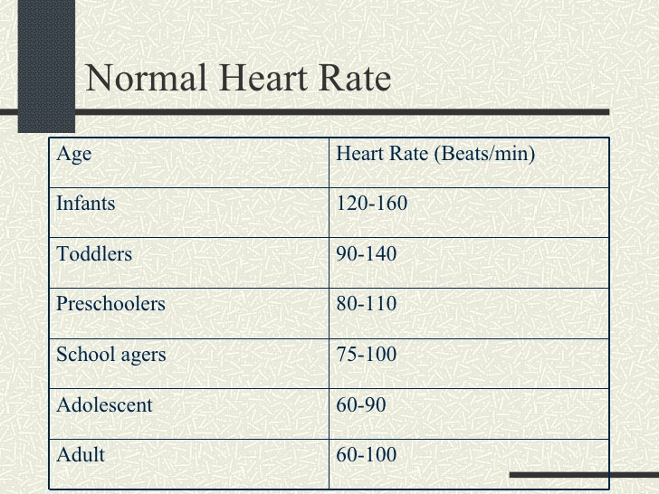

- **Tachycardia** — rheumatic fever, congestive cardiac failure, arrhythmias
- **Bradycardia** — complete heart block, sick sinus syndrome (sino-atrial disease)

### Rhythm

- **Normal sinus rhythm** — regular
- **Regularly irregular** — sinus arrhythmia
- **Irregularly irregular** — atrial fibrillation, atrial flutter with varying block

### Volume

Assessed by palpating the **carotid artery**; **pulse pressure (PP)** gives the accurate measurement:

- **30–60 mmHg** — normal volume
- **< 30 mmHg** — low volume
- **> 60 mmHg** — high volume

| Large volume (bounding) | Small volume (weak, thready) |
|---|---|
| Aortic incompetence (AR) | CCF |
| PDA | Pericardial effusion |
| A-V fistula | Constrictive pericarditis |
| Persistent truncus arteriosus | Lower limb in CoA |

### Character (best assessed at the carotid)

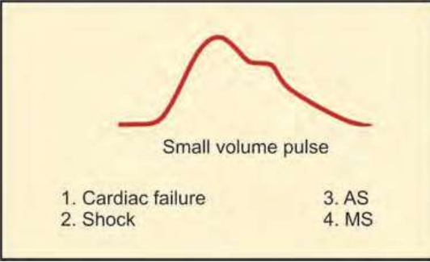

- **Hypokinetic pulse** — small weak pulse (small volume and narrow PP)
- **Anacrotic pulse (parvus et tardus)** — *parvus* = low amplitude, *tardus* = slow rising with a late peak — **aortic stenosis**
- **Hyperkinetic pulse** — rapid rise, high amplitude, large volume and wide PP
- **Collapsing pulse** — rapid upstroke, rapid downstroke, large stroke volume — **aortic regurgitation, PDA**

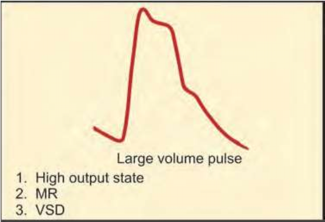

- **Pulsus alterans** — alternating small and large volume pulse — **severe LV failure**
- **Pulsus paradoxus** — a fall in BP of **more than 10 mmHg during inspiration** — **cardiac tamponade, constrictive pericarditis**

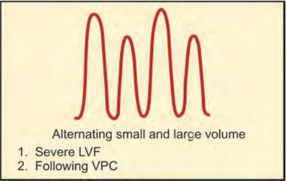

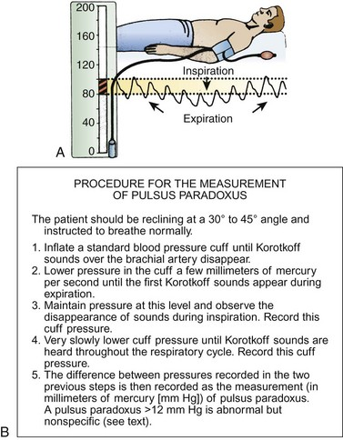

### Pulse deficit, radio-radial and radio-femoral delay

- **Pulse deficit** — the difference between heart rate and pulse rate counted simultaneously for 1 minute; seen in **atrial fibrillation** and **ventricular premature contractions**
- **Radio-radial delay** — pre-subclavian coarctation, supravalvular AS
- **Radio-femoral delay** — **coarctation of the aorta**, aortic embolism

## Blood pressure

Cuff dimensions:

- **Width — 40% of the arm circumference**
- **Length — 80–100% of the arm circumference**

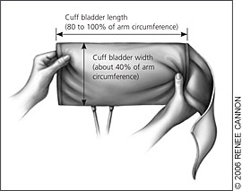

## Jugular venous pressure (JVP)

Expressed as the **vertical height from the sternal angle to the zone of transition** of the distended and collapsed internal jugular vein, with the patient at **45 degrees**.

- **JVP is an indicator of right atrial pressure**
- The centre of the RA is approximately **5 cm from the sternal angle**
- **Right atrial pressure = vertical height of the blood column + 5 cm (cm H₂O)**
- **Normal JVP = < 8 cm H₂O or < 6 mmHg**

| Elevated JVP | Fall in JVP |
|---|---|
| CCF | Hypovolaemia |
| TS, TR | Shock |
| Constrictive pericarditis | |
| Cardiac tamponade | |

- **Kussmaul's sign** — a paradoxical rise of JVP on inspiration — constrictive pericarditis, cardiac tamponade, RV failure
- **Hepato-jugular reflux** — right heart failure, TR
- **Friedreich's sign** — rapid fall and rise of JVP — TR, constrictive pericarditis

## Inspection of the precordium

Bony/spine deformities; chest shape; trachea central or deviated; **visible precordial bulge** (long-standing cardiac disease); visible pulsations; scars, dilated veins, sinuses.

**Visible pulsations**

- **Carotid** — hyperdynamic states, AR, CoA
- **Suprasternal** — AR, CoA, thyrotoxicosis
- **Epigastric** — pulsation of the liver in CHF with TR, RVH, abdominal aortic aneurysm, tricuspid stenosis

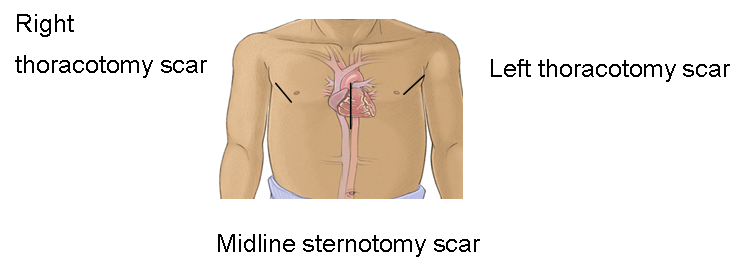

## Palpation

**General rule for the hand:**

- **Fingertips** — to feel pulsations
- **Base of the fingers** — thrills
- **Base of the hand (ulnar aspect)** — heaves

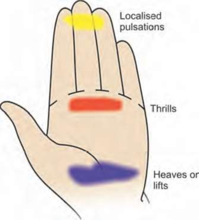

### Apical impulse

The **lowermost and outermost point of definite cardiac impulse**, giving maximum thrust to the palpating finger.

| Age | Position of apical impulse | Relation to mid-clavicular line |
|---|---|---|
| **Infancy** | Left 4th ICS | Lateral to MCL |
| **Approx. 5 years** | Left 5th ICS | In the MCL |
| **Older children** | Left 5th ICS | Medial to MCL |

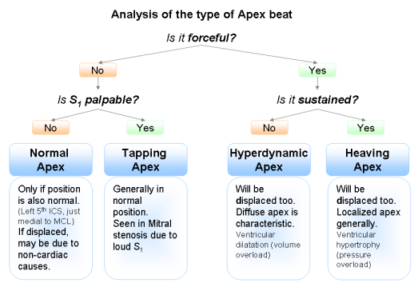

- **Normal apex** — position not displaced
- **Tapping apex** — palpable S1, seen in mitral stenosis
- **Hyperdynamic apex** — diffuse, displaced — **ventricular dilatation (volume overload)**
- **Heaving apex** — sustained, forceful — **ventricular hypertrophy (pressure overload)**

### Parasternal heave

A palpable thrust that **lifts the palpating hand**; seen in **RVH and left atrial enlargement**; palpated by the ulnar aspect of the hand.

**Grading:** (1) instant lift, visible not palpable; (2) visible and palpable, can be obliterated; (3) visible and palpable, cannot be obliterated.

### Thrills

Palpable vibrations of murmurs, accompanying any organic murmur of **grade 3 or more**.

## Percussion

Done to detect **enlargement or dullness** of the cardiac region — cardiomegaly, pericardial effusion.

## Auscultation

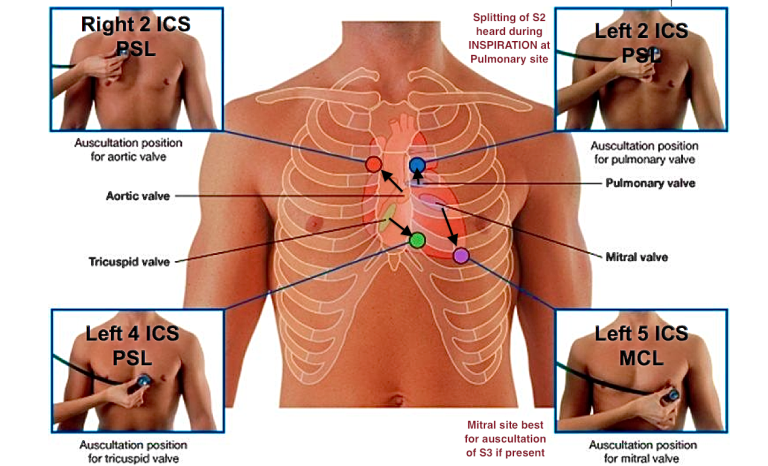

**Heart sounds** are relative, brief auditory vibrations of variable intensity, frequency and quality, **produced by closure of the heart valves**.

### First heart sound (S1)

| Soft S1 | Loud S1 | Split | Reverse split |
|---|---|---|---|
| MR | MS | RBBB | RV pacing |
| TR | TS | LV pacing | Ectopic beats |
| Calcified AV valves | High-output states | Pulmonary hypertension | |

### Second heart sound (S2)

| Soft S2 | Loud A2 | Loud P2 | Absent A2 | Absent P2 |
|---|---|---|---|---|
| AS, PS | Systemic HTN, aortic aneurysm, dilated aorta | Pulmonary HTN, ASD, PDA, large VSD | AS, calcified semilunar valves | PS, TOF, TGA |

**Splitting of S2**

- **Wide, fixed** — ASD
- **Wide, variable** — VSD, RBBB
- **Narrow** — severe AS, severe PS
- **Reversed** — aortic stenosis, HOCM

### Third and fourth heart sounds

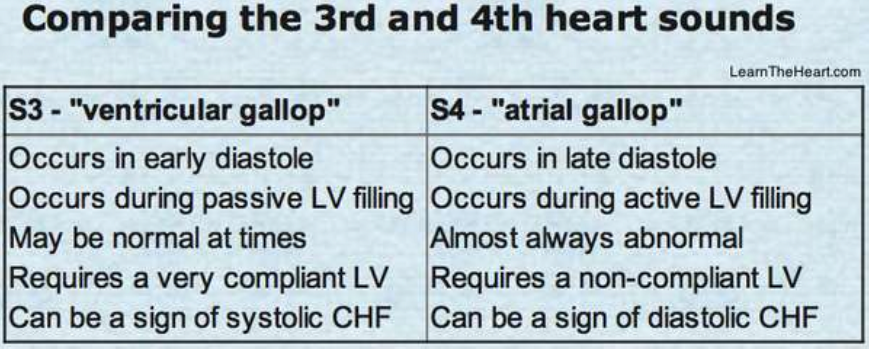

| Physiological S3 | Pathological S3 |
|---|---|
| Children | High-output states |
| Young adults | CHD — ASD, VSD, PDA; MR, TR, AR |

### Added sounds

- **Opening snap** — opening of AV valves; at the apex (MS, MR, VSD, PDA) or parasternal region (TS, TR, ASD)
- **Ejection click** — a sharp clicking sound from sudden swelling of the pulmonary artery, abrupt dilatation of the aorta, or forceful opening of the aortic cusps. **Early** ejection click — aortic and pulmonary valve stenosis; **mid-systolic** click — floppy mitral valve
- **Pericardial rub** — sliding of two inflamed pericardial layers; scratching, grating; triphasic; best heard along the left sternal edge in the 3rd–4th ICS

## Murmurs

Occur due to **turbulence** — either **increased flow through a normal/stenosed valve**, or **normal flow through a stenosed valve/orifice**. Auscultate over the precordium, back and carotids.

**Describe by:** pitch · timing and character · systolic/diastolic · area best heard · intensity · bell or diaphragm · conduction · variation with respiration · posture · variation with dynamic auscultation.

### Grading

**Systolic murmur (out of 6)**

1. Very soft (heard in a quiet room)
2. Soft but easily audible
3. Moderate, no thrill
4. Loud with thrill
5. Very loud with thrill, heard with the stethoscope barely on the chest
6. Loud, audible with the stethoscope just off the chest wall

**Diastolic murmur (out of 4)** — very soft; soft; loud; loud with thrill.

### Types of murmur and their causes

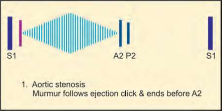

- **Pan-systolic** — mitral regurgitation (mitral area), tricuspid regurgitation (left sternal border), **ventricular septal defect** (left lower sternal border)
- **Ejection-systolic** — crescendo-decrescendo; **aortic stenosis** (aortic area), **pulmonary stenosis** (pulmonary area), **HOCM** (4th ICS left sternal border)
- **Early diastolic** — aortic regurgitation, pulmonary regurgitation

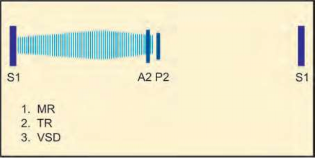

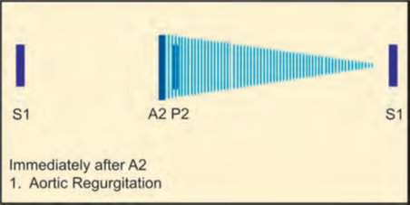

- **Mid-diastolic** — mitral stenosis
- **Late diastolic** — MS, TS, atrial myxomas
- **Continuous** — **PDA**, ruptured sinus of Valsalva, coronary AV fistula

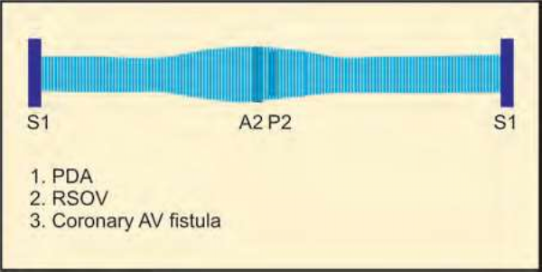

### Innocent (functional/benign) murmurs

Absence of anatomical/functional abnormality; accentuated during febrile illness and high-output states.

**Characteristic features — the "S" list:**

- **Soft · Single · Short · Sweet · Systolic · Symptomless · Sensitive · Situation dependent** (quieter on standing, or only present when the child is unwell or feverish)

Also: **less than grade 3, no cyanosis, normal pulses, normal heart sounds, normal cardiac silhouette on CXR.**

**Features prompting referral:** murmur louder than 2/6; diastolic murmurs; louder on standing; or other symptoms such as failure to thrive, feeding difficulty, cyanosis or shortness of breath.

### Splitting of the second heart sound — the mechanism

During **inspiration**, the chest and diaphragm expand, creating **negative intrathoracic pressure** that increases filling of the right atrium and ventricle. It takes longer for the right ventricle to empty the greater volume, delaying pulmonary valve closure relative to the aortic — so there is a **split S2 during inspiration**.

- **ASD** — blood flows from left to right atrium, increasing RV volume, causing a **fixed split** that does not vary with respiration
- **Pulmonary stenosis** — a **widely split** S2, because the RV takes longer to empty through the narrow valve

## Dynamic auscultation

The patient changes position or performs manoeuvres to accentuate murmurs and sounds.

- **Respiration** — during inspiration, **right-sided** murmurs become **louder**; left-sided murmurs become softer or unchanged. Expiration has the opposite effect
- **Valsalva manoeuvre** (forced expiration against a closed glottis) — increases intrathoracic pressure; **MVP and HOCM murmurs become louder**, the **ESM of AS decreases**
- **Standing to squatting** — increases venous return and systemic vascular resistance; **HOCM becomes softer** due to increased diastolic volume
- **Isometric hand grip** — increases systemic vascular resistance; **regurgitant murmurs (MR, VSD) become louder**; the **murmur of AS becomes softer**

## The CVS examination check-off (OSPE marking scheme)

1. **Courtesy** — introduction, explanation, consent, positioning
2. **Inspection** — respiratory distress, pallor, cyanosis, digital clubbing, neck pulsations, oedema (presence, extent, pitting, level)
3. **Palpation of the pulse** — radial rate, rhythm, volume, vessel wall, collapsing; synchrony with the other radial, femoral, carotid, brachial, popliteal and dorsalis pedis
4. **Blood pressure** — positioning, cuff, brachial pulse, inflation, systolic by palpation, then by auscultation
5. **JVP** — positioning, locating the internal jugular vein, measurement
6. **Precordium** — inspection, apex beat palpation, heave/thrill, cardiac dullness percussion, palpation for the liver, ascites (shifting dullness)
7. **Auscultation** — heart sounds at the apex, count heart rate, all 4 valve areas, radiation (axilla, up the neck, back), abdomen, base of lungs
8. Overall attention to sequence, composure, speed, courtesy, affect

## References

Standard paediatric cardiology texts and the Nelson Textbook of Paediatrics; lecture slides of Dr Oji-Onuoha S.N.
